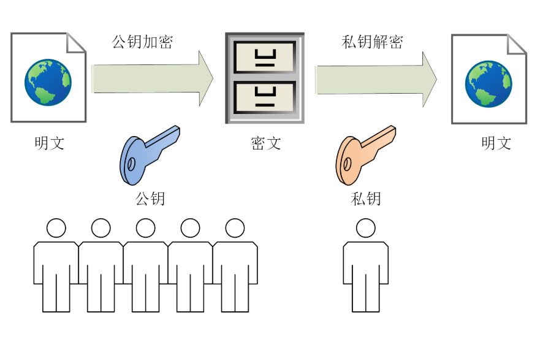
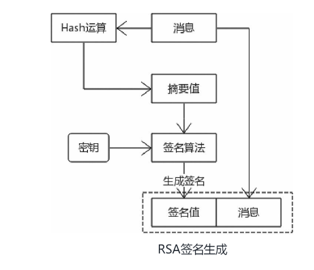
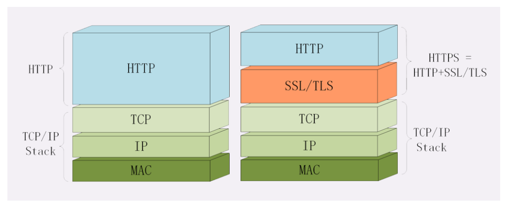

## HTTP通信的问题
HTTP在设计之初根本没有考虑安全问题，它的设计目的是数据传输和共享。安全问题主要有三点原因，这三点也是安全领域的根本问题，任何基于TCP/IP的应用都会遇到

1）数据没有加密

HTTP本身传递的是明文，不会加密这些信息，只要攻击者能够获取这些明文，用户的隐私就完全暴露了

2）无法验证身份

HTTP是无状态的协议，客户端和服务器并不能确认对方的身份，在HTTP标准中，没有校验对端身份的标准。对于服务器来说，它接收的HTTP请求格式只要正确，就发送响应信息。对于客户端来说同样如此

3）数据易篡改

HTTP数据在传输过程中，会经过很多节点，这些节点都可以修改原始数据，而对于客户端和服务器来说，没有任何技术来确保接收的数据就是发送者发送的原始数据。由于没有机制确保数据的完整性，客户端和服务器只能无条件信任接收到的数据，这也产生了很多安全问题，篡改数据也叫作中间人攻击

## 密码学

在讲HTTPS之前需要先了解一些基本的密码学知识

### 密码学的基本认知

1）密码学是科学

密码学是科学，有着严格的规范，设计密码学算法需要具备深厚的数学知识

2）密码学理论是公开的

密码学算法的实现原理是公开的，流行的密码学算法其算法实现是公开的，经过了长时间的考验

3）**密码学算法是相对安全的**

4）密码学攻击方法是多样化的

大部分密码学算法需要密钥，最简单的破解方法就是获取密钥，除此之外攻击方式非常多，由于算法实现是公开的，一般不会攻击算法本身。

5）密码学应用标准很重要

很多开发者可能了解某个密码学算法的用途，但由于密码学算法应用有很多陷阱，一旦使用不当，会出现很多问题，为了正确地应用密码学算法，制定了很多应用标准（比如PKCS标准）。**开发者可以不了解密码学算法的原理，但是必须掌握应用标准，这样才能编写出更安全的软件**

6）不具备很强的数学知识也能掌握密码学

密码学是基于数学模型的，要真正明白密码学原理，必须具备很好的数学知识，很多密码学算法的创建者都是数学家而非计算机编码专家，就说明了这一点。对于开发者来说，没有掌握密码学算法的原理并不妨碍应用密码学算法。

7）解决特定问题的密码学算法

世界上不存在一种密码学算法，能够解决所有的安全问题，每种算法有特定的应用场景，只能解决特定的问题。在思考安全解决方案的时候，必须具体问题具体分析，比如解决HTTP安全问题的时候，首先分析它存在的核心问题，然后思考每个问题是否能够通过某个算法解决，最终结合这些算法提出了一个解决方案，这个解决方案就是HTTPS，它是协议而非算法，是对多种密码学算法的工程应用。

###  密码学的四个目标

在基于互联网通信的应用中，密码学主要解决四个问题，HTTP出现的三个核心问题就是要解决的目标，而掌握了HTTPS的原理，基本上就掌握了密码学知识。

1）机密性（隐私性）

在网络中传递的数据如果具备机密性，那么传输的数据就是一串无意义的数字，只有拥有密钥的才能解释这些数据，密钥是加密算法的关键。在密码学中，对称加密算法和公开密钥算法都能够保证机密性。

2）完整性

完整性表示接收方能够确保接收到的数据就是发送方发送的原始数据，假设数据被中间人篡改，接收方如果有策略知晓数据被篡改了，那么传递的数据就具备完整性。

在密码学中，**主要使用消息验证码（MAC）算法保证完整性**。需要注意的是互联网传输的数据即使是加密的也无法保证完整性。

3）身份验证

互联网应用一般都有发送方和接收方，对于接收方来说，必须确认发送方的身份，才能确保收到的数据就是真实发送方发送的。反之对于发送方来说也是一样的，通信双方必须确保对端就是要通信的对象。**在密码学中，一般使用数字签名技术确认身份**。后续部分也会解释消息验证和身份验证的区别。

4）不可否认性

不可否认性也叫不可抵赖性，举个例子，A向B借钱了，并写了张借条，当B希望A还钱的时候，A抵赖说这张借条不是他写的，理由就是有人冒充他写了这张借条，A的行为可以抵赖。**在密码学中，数字签名技术能够避免抵赖**。

密码学原理是公开的，在工程上需要实现各种算法，最著名的就是OpenSSL项目，包括了底层密码库和命令行工具，大部分Linux发行版都预装了OpenSSL库。

### 随机数

### Hash算法

密码学Hash算法的使用非常简单，可以用下列的公式描述：

`摘要/散列值/指纹=hash（消息）`

#### hash算法的特性

**Hash算法的主要特性**如下：

+ 相同的消息总是能得到同样的摘要值，特定的Hash算法，不管消息长度是多少，最终的摘要值长度是相同的。

+ 不管多长的消息，Hash运算非常快速，这是非常重要的特性。
+ 通过摘要值很难逆向计算出原始消息，Hash算法具备单向性，摘要值是不可逆的，这也是非常重要的特性。为了逆向计算出原始消息，唯一的方法就是采用暴力攻击、字典攻击、彩虹表，对不同的消息组合进行迭代运算，运算的结果如果匹配该消息的摘要值，表示该Hash算法不应该用于密码学。
+ 原始消息一旦修改，即使是很轻微的修改，最终的摘要值也会产生变化。
+ 很难找出两个不同的消息，并且它们的摘要值是相同的。从密码学的角度考虑，Hash算法能够实现密码学的某个目标，那就是消息防篡改

#### 什么是安全的密码学Hash算法

普通的Hash算法会遇到各类的密码学攻击，而密码学Hash算法除了常规Hash算法的特性，还应该具备下面三个特性。

1）**强抗碰撞性**（Collision Resistance）

如果两个不相同的值能够得到同样的摘要值，表示产生了Hash碰撞。密码学中，Hash算法必须具备强抗碰撞性，否则不应该使用。

2）**弱抗碰撞性**（Second pre-image Resistance）

给定一个消息和这个消息对应的摘要值，很难找到一条不同的消息也具有相同的摘要值。在密码学中，选用的Hash算法至少也要具备弱抗碰撞性，**具备弱抗碰撞性的算法必然也具备强抗碰撞性**。需要注意的是，强抗碰撞性和弱抗碰撞性是相对的概念，强弱并不代表算法的安全程度。

3）单向性（Pre-image Resistance）

**给定一个摘要值很难找出它的原始消息**

#### 密码学Hash算法的分类

1. MD5

MD5是一种比较常用的Hash算法，摘要值长度固定是128比特，MD5算法目前被证明已经不安全了，MD5算法违反了强抗碰撞性原则，但是还没有破坏单一性原则

2. SHA

SHA（Secure Hash Algorithms）算法是美国国家标准与技术研究院（NIST）指定的算法，SHA算法不是一个算法，而是一组算法，主要分为三类算法。

​		（1）SHA-1

​			SHA-1算法类似于MD5算法，输出的长度固定是160比特。目前SHA-1算法在严谨的加密学中已经被证明是			不安全的

​		（2）SHA-2

​			SHA-2算法是目前建议使用的Hash算法，截至目前是安全的，主要有四种算法，分别是SHA-256、SHA-			512、SHA-224、SHA-384，输出的长度分别是256比特、512比特、224比特、384比特。

​		（3）SHA-3

​			SHA-3算法并不是为了取代SHA-2算法，而是一种在设计上和SHA-2完全不同的算法，主要有四种算法，分			别是SHA3-256、SHA3-512、SHA3-224、SHA3-384，输出的长度分别是256比特、512比特、224比特、			384比特。

### 加密算法

所谓**数据加密，就是将一段数据处理成无规则的数据**，除非有关键的密钥，否则谁也无法得知无规则数据的真实含义

在密码学中，用于数据加密的算法主要有两种，分别是对称加密算法（Symmetric-keyAlgorithms）和非对称加密算法（Asymmetrical Cryptography）。

不管是对称加密算法还是非对称加密算法主要用来保证数据的机密性

#### 对称加密算法


对称加密算法可以用下列公式简单表述：

```密文=E（明文，算法，密钥）
密文=E（明文，算法，密钥）
明文=D（密文，算法，密钥）
```


E和D分别表示加密和解密，通过公式可以了解几个关键点：

+ 密钥是关键，密钥是一串数字，加密和解密使用同样的一个密钥，如果没有密钥，基于密文是无法获取明文的。
+ 加密和解密操作（算法）是一个互逆过程，算法的背后就是复杂的数学知识

对称加密算法有很多，**AES算法是对称加密算法标准**

#### 公开密钥算法

公开密钥算法（Public Key Cryptography），也称为非对称加密算法（Asymmetrical Cryptography），公开密钥算法不是一个算法而是一组算法，如果公开密钥算法用于加密解密运算，习惯上称为非对称加密算法

）功能不一样对称加密算法虽然有很多的算法和加密机制，但主要用于加密和解密。而公开密钥算法的功能比较多，可以进行加密解密、密钥协商、数字签名。

2）公开密钥算法的密钥是一对，对称加密算法中，密钥是一串数字，加密者和解密者使用同样的一个密钥。

公开密钥算法之所以包含公开两字，表示密钥可以部分公开，公开密钥算法的密钥是一对，分别是公钥（publickey）和私钥（private key），一般私钥由密钥对的生成方（比如服务器端）持有，避免泄露，而公钥任何人都可以持有，也不怕泄露。

3）运算速度很慢

相比对称加密算法来说，公开密钥算法尤其是RSA算法运算非常缓慢，一般情况下，需要加密的明文数据都非常大，如果使用公开密钥算法进行加密，运算性能会惨不忍睹。公**开密钥算法在密码学中一般进行密钥协商或者数字签名**，因为这两者运算的数据相对较小。



非对称加密算法有DH、DSA、RSA、ECC等。

RSA可能是其中最著名的一个，几乎可以说是非对称加密的代名词，它的安全性基于“**整数分解**”的数学难题，使用两个超大素数的乘积作为生成密钥的材料，想要从公钥推算出私钥是非常困难的

ECC（Elliptic Curve Cryptography）是非对称加密里的“后起之秀”，它基于“**椭圆曲线离散对数**”的数学难题，使用特定的曲线方程和基点生成公钥和私钥，子算法ECDHE用于密钥交换，ECDSA用于数字签名。

### 消息验证码

**Hash算法能够完成密码学目标之一的完整性校验，但却不能避免消息被篡改**，为避免消息被篡改，需要用到消息验证码。消息验证码非常重要，一般结合加密算法一起使用。

消息验证码算法的特点：◎证明消息没有被篡改，这和Hash算法类似。◎消息是正确的发送者发送的，也就是说消息是经过验证的。注意，消息验证和身份验证是不同的概念

### 数字签名

公开密钥算法的另外一种用途就是数字签名技术

前面介绍了密码学的四个目标。到目前为止，防抵赖这个目标还没有涉及，也就是说已经讲解的对称加密算法、公开密钥算法都不能防止抵赖。

先解释为什么消息可能被篡改，比如A、B、C三个人共享一个对称加密算法密钥，现在A和B互相通信，A和B一直认为是双方在发送消息。由于C也有同样的密钥，它可以拦截A发往B的消息，然后篡改消息并用同样的密钥加密后发送给B, B能够正确解密，但是该消息其实已经被篡改。

接下来解释为什么不能防止抵赖，还是用同样的例子说明，A、B、C三个人共享一个对称加密算法密钥，A向B发送了一条消息，但是A可以抵赖说这条消息并不是他发送的，理由就是C也有同样的密钥，这条加密消息可能是C发送给B的，B无法向第三方证明是A给他发送了消息。在公开密钥算法中，如果算法用于加密解密，也同样不能防止抵赖，以RSA加密算法举例，由于RSA的公钥是完全公开的，RSA私钥拥有者虽然能够解密，但是并不能确认是哪个客户端发送的消息，同理任何人都可以抵赖。**抵赖出现的根本原因就在于通信双方无法确认对方的身份，也就是不能进行身份验证，那么在密码学中有没有对应的解决方案呢？可以使用数字签名技术防抵赖**

不管是RSA数字签名算法还是后续讲解的DSA数字签名算法，**数字签名处理流程是差不多的，主要分为签名生成和签名验证**

签名生成流程如图



+ 发送者对消息计算摘要值。

+ 发送者用私钥对摘要值进行签名得到签名值。
+ 发送者将原始消息和签名值一同发给接收者。


+ 接收者接收到消息后，拆分出消息和消息签名值A。
+ 接收者使用公钥对消息进行运算得到摘要值B。
+ 接收者对摘要值B和签名值A进行比较，如果相同表示签名验证成功，否则就是验证失败。

## HTTPS

### 什么是HTTPS

HTTPS其实是一个“非常简单”的协议，RFC文档很小，里面规定了**新的协议名“https”，默认端口号443**，至于其他的什么请求-应答模式、报文结构、请求方法、URI、头字段、连接管理等等都完全沿用HTTP，没有任何新的东西



## SSL/TLS

我们来看看SSL/TLS。

SSL即安全套接层（Secure Sockets Layer），在OSI模型中处于第5层（会话层），由网景公司于1994年发明，有v2和v3两个版本，而v1因为有严重的缺陷从未公开过。

SSL发展到v3时已经证明了它自身是一个非常好的安全通信协议，于是互联网工程组IETF在1999年把它改名为TLS（传输层安全，Transport Layer Security），正式标准化，版本号从1.0重新算起，所以TLS1.0实际上就是SSLv3.1。

到今天TLS已经发展出了三个版本，每个新版本都紧跟密码学的发展和互联网的现状，持续强化安全和性能，已经成为了信息安全领域中的权威标准。

目前应用的最广泛的TLS是1.2，而之前的协议（TLS1.1/1.0、SSLv3/v2）都已经被认为是不安全的，各大浏览器即将在2020年左右停止支持，所以接下来的讲解都针对的是TLS1.2。

TLS由记录协议、握手协议、警告协议、变更密码规范协议、扩展协议等几个子协议组成**，综合使用了对称加密、非对称加密、身份认证等许多密码学前沿技术**。

浏览器和服务器在使用TLS建立连接时需要选择一组恰当的加密算法来实现安全通信，这些算法的组合被称为“密码套件”（cipher suite，也叫加密套件）

“ECDHE-RSA-AES256-GCM-SHA384”。

其实TLS的密码套件命名非常规范，格式很固定。基本的形式是“密钥交换算法+签名算法+对称加密算法+摘要算法”，比如刚才的密码套件的意思就是：

“握手时使用ECDHE算法进行密钥交换，用RSA签名和身份认证，握手后的通信使用AES对称算法，密钥长度256位，分组模式是GCM，摘要算法SHA384用于消息认证和产生随机数。”

SSL/TLS是怎么为HTTP增加了机密性、完整性，身份认证和不可否认等特性的呢

先说说机密性。它是信息安全的基础

实现机密性最常用的手段是“**加密**”（encrypt），就是把消息用某种方式转换成谁也看不懂的乱码，只有掌握特殊“钥匙”的人才能再转换出原始文本。

这里的“钥匙”就叫做“**密钥**”（key），加密前的消息叫“**明文**”（plain text/clear text），加密后的乱码叫“**密文**”（cipher text），使用密钥还原明文的过程叫“**解密**”（decrypt），是加密的反操作，加密解密的操作过程就是“**加密算法**”。

按照密钥的使用方式，加密可以分为两大类：**对称加密和非对称加密**。
