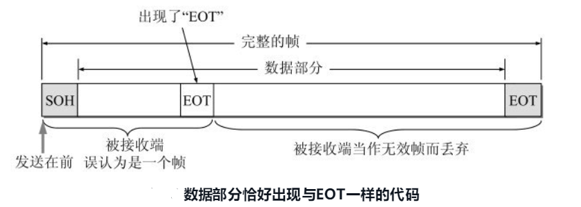
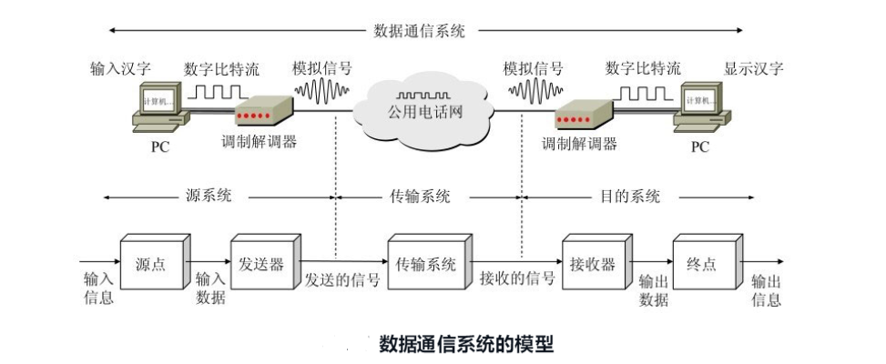
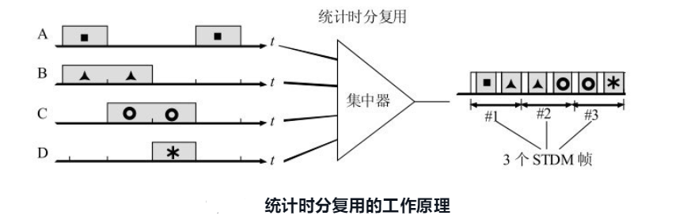
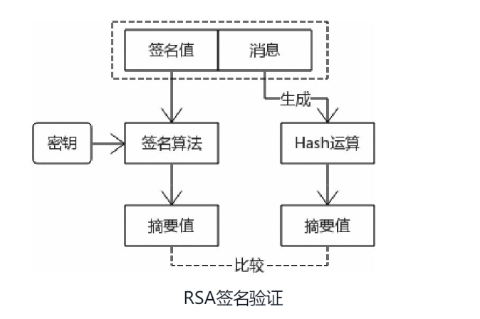

# 计算机网络
> 谢希仁慈计算机网络第6版笔记

**`快速指南`**

* [计算机网络性能](#计算机网络性能)
* [计算机网络体系结构](#计算机网络体系结构)
* [物理层](#物理层)
* [数据链路层](#数据链路层)
* 网络层
* [运输层](#TCP)
   * [TCP](#TCP)
   * [UDP](#UDP)
* 应用层
* DNS
* http
* [https](#https)

# 计算机网络性能
## 计算机网络性能指标
计算机网络的性能一般是指它的几个重要的性能指标
1. 速率
比特（bit）是计算机中数据量的单位，也是信息论中使用的信息量的单位。
英文单词bit来源于binary digit，意思是一个“二进制数字”，因此一个比特就是二进制数字中的一个1或0。
网络技术中的速率指的**是连接在计算机网络上的主机在数字信道上传送数据的速率**，
它也称为数据率(data rate)或比特率(bit rate)

速率的单位是b/s（比特每秒）(或bit/s，有时也写为bps，即bit per second)。
当数据率较高时，就可以用kb/s（k = <sup>3</sup> =千）、Mb/s（M = 10<sup>6</sup> =兆）、Gb/s（G = 10<sup>9</sup> = 吉）或Tb/s（T = 10<sup>12</sup> = 太）
> 在通信领域和计算机领域，应特别注意数量单位“千”、“兆”和“吉”等的英文缩写所代表的数值。
如计算机中的数据量往往用字节作为度量的单位。
一个字节(byte，记为大写的B)代表8个比特。“千字节”的“千”用大写K表示，它等于2<sup>10</sup>，即1024，而不是10<sup>3</sup>。
同样，在计算机中，1 MB或1 GB也并非表示10<sup>6</sup>或109个字节，
而是表示2<sup>20</sup>（1048 576）或2<sup>30</sup>（1073741 824）个字节。在通信领域小写的k表示10<sup>3</sup>而不是1024

2. 带宽  
(1) 带宽本来是指某个信号具有的频带宽度。

信号的带宽是指该信号所包含的各种不同频率成份所占据的频率范围。
例如，在传统的通信线路上传送的电话信号的标准带宽是3.1kHz （从300Hz到3.4kHz，即话音的主要成分的频率范围）。
这种意义的带宽的单位是赫（或千赫、兆赫、吉赫等）。
在过去很长的一段时间，通信的主干线路传送的是模拟信号（即连续变化的信号）。
因此，表示通信线路允许通过的信号频带范围就称为线路的带宽（或通频带）。

(2) **在计算机网络中，带宽用来表示网络的通信线路传送数据的能力**，
因此**网络带宽表示在单位时间内从网络中的某一点到另一点所能通过的“最高数据率”**。
这种意义的带宽的单位是“比特每秒”，记为b/s

3. 吞吐量

吞吐量(throughput)表示在单位时间内通过某个网络（或信道、接口）的数据量。
吞吐量更经常地用于对现实世界中的网络的一种测量，以便知道实际上到底有多少数据量能够通过网络。
显然，吞吐量受网络的带宽或网络的额定速率的限制。例如，对于一个100Mb/s的以太网，
其额定速率是100Mb/s，那么这个数值也是该以太网吞吐量的绝对上限值。
因此，对于100Mb/s的以太网，其典型的吞吐量可能只有70Mb/s

4. 时延

时延(delay或latency)是**指数据（一个报文或分组，甚至比特）从网络（或链路）的一端传送到另一端所需的时间**。
时延是个很重要的性能指标，它有时也称为延迟或迟延

（1）发送时延 

发送时延(transmission delay)是主机或路由器发送数据帧所需要的时间
$$
发送时延 =  \frac{数据帧长度(b)}{发送速率(b/s)}
$$
(2) 传播时延 

传播时延(propagation delay)
是电磁波在信道中传播一定的距离需要花费的时间。
传播时延的计算公式是
$$
传播时延 = \frac{信道长度(m)}{电磁波在信道上的传播速率（m/s)}
$$
电磁波在自由空间的传播速率是光速，即3.0×105km/s。电磁波在网络传输媒体中的传播速率比在自由空间要略低一些：在铜线电缆中的传播速率约为2.3×105km/s，在光纤中的传播速率约为2.0×105km/s。例如，1000km长的光纤线路产生的传播时延大约为5ms

(3) 处理时延 

主机或路由器在收到分组时要花费一定的时间进行处理，
例如分析分组的首部、从分组中提取数据部分、进行差错检验或查找适当的路由等等，
这就产生了处理时延。

(4) 排队时延 

分组在经过网络传输时，要经过许多路由器。但分组在进入路由器后要先在输入队列中排队等待处理

数据在网络中经历的总时延就是以上四种时延之和：

```markdown
总时延 = 发送时延 + 传播时延 + 处理时延 + 排队时延
```


必须指出，在总时延中，究竟是哪一种时延占主导地位必须具体分析。现在我们暂时忽略处理时延和排队时延。
假定有一个长度为100 MB的数据块（这里的M显然不是指10<sup>6</sup>而是指2<sup>20</sup>，即1048 576。B是字节，1字节 = 8比特），
在带宽为1Mb/s的信道上（这里的M是10<sup>6</sup>）连续发送，其发送时延是
```markdown
100×1048576×8÷106 = 838.9 s
```
即大约要用14分钟才能把这样大的数据块发送完毕。然而，若将这样的数据块用光纤传送到1000km远的计算机，那么每一个比特在1000km的光纤上只需用5ms就能到达目的地。因此对于这种情况，发送时延占主导地位
如果我们把传播距离减小到1km，那么传播时延也会相应地减小到原来数值的千分之一。然而，由于传播时延在总时延中的比重是微不足道的，因此总时延的数值基本上还是由发送时延来决定的。

5. 时延带宽积

把以上讨论的网络性能的两个度量——传播时延和带宽——相乘，就得到另一个很有用的度量：传播时延带宽积

链路的时延带宽积又称为以比特为单位的链路长度。


6. 往返时间

在计算机网络中，**往返时间RTT (Round-Trip Time)也是一个重要的性能指标，它表示从发送方发送数据开始，到发送方收到来自接收方的确认（接收方收到数据后便立即发送确认），总共经历的时间**

当使用卫星通信时，往返时间RTT相对较长，是很重要的一个性能指标

7. 利用率

 **利用率有信道利用率和网络利用率两种**。**信道利用率指出某信道有百分之几的时间是被利用的（有数据通过）**。完全空闲的信道的利用率是零。网络利用率则是全网络的信道利用率的加权平均值。信道利用率并非越高越好。这是因为，根据排队论的理论，当某信道的利用率增大时，该信道引起的时延也就迅速增加
 这和高速公路的情况有些相似。当高速公路上的车流量很大时，由于在公路上的某些地方会出现堵塞，因此行车所需的时间就会增长
信道或网络利用率过高会产生非常大的时延

## 计算机网络的非性能指标
简单了解，有如下几个方面

费用 质量 标准化 可靠性 可扩展性和可升级性 易于管理和维护

# 计算机网络体系结构
## 协议与划分层次
为进行网络中的数据交换而建立的规则、标准或约定称为网络协议(networkprotocol)。网络协议也可简称为协议。

网络协议主要由以下三个要素组成：

(1) 语法，即数据与控制信息的结构或格式；

(2) 语义，即需要发出何种控制信息，完成何种动作以及做出何种响应；

(3) 同步，即事件实现顺序的详细说明。

(1) 应用层(application layer)

应用层是体系结构中的最高层。

应用层的任务是通过应用进程间的交互来完成特定网络应用。

应用层协议定义的是应用进程间通信和交互的规则。这里的进程(process)就是指主机中正在运行的程序。对于不同的网络应用需要有不同的应用层协议。在因特网中的应用层协议很多，如支持万维网应用的HTTP协议，支持电子邮件的SMTP协议，支持文件传送的FTP协议，等等。

我们将应用层交互的数据单元称为报文(message)。

(2) 运输层(transport layer)

**运输层的任务就是负责向两个主机中进程之间的通信提供通用的数据传输服务**。应用进程利用该服务传送应用层报文。所谓通用，是指并不针对某个特定网络应用，而是多种应用可以使用同一个运输层服务。由于一台主机可同时运行多个进程，因此运输层有复用和分用的功能。复用就是多个应用层进程可同时使用下面运输层的服务，分用与复用相反，是运输层把收到的信息分别交付上面应用层中的相应进程。

运输层主要使用以下两种协议：

● 传输控制协议TCP (Transmission Control Protocol)——提供面向连接的、可靠的数据传输服务，其数据传输的单位是报文段(segment)。

● 用户数据报协议 UDP (User Datagram Protocol)——提供无连接的、尽最大努力(best-effort)的数据传输服务（不保不保证数据传输的可靠性），其数据传输的单位是用户数据报。

(3) 网络层(network layer)

**网络层负责为分组交换网上的不同主机提供通信服务**。**在发送数据时，网络层把运输层产生的报文段或用户数据报封装成分组或包(packet)进行传送**。在TCP/IP体系中，由于网络层使用IP协议，因此分组也叫作 IP数据报，或简称为数据报(datagram)。

注意：不要将运输层的“用户数据报UDP”和网络层的“IP数据报”弄混。此外，无论在哪一层传送的数据单元，都可笼统地用“分组”来表示。

网络层的另一个任务就是要选择合适的路由，使源主机运输层所传下来的分组能够通过网络中的路由器找到目的主机。

(4) 数据链路层(data link layer)

数据链路层常简称为链路层。

两台主机之间的数据传输，总是在一段一段的链路上传送的，这就需要使用专门的链路层的协议。

**在两个相邻结点之间传送数据时，数据链路层将网络层交下来的IP数据报组装成帧（framing），在两个相邻结点间的链路上传送帧（frame）**。每一帧包括数据和必要的控制信息（如同步信息、地址信息、差错控制等）。在接收数据时，控制信息使接收端能够知道一个帧从哪个比特开始和到哪个比特结束。这样，数据链路层在收到一个帧后，就可从中提取出数据部分，上交给网络层。控制信息还使接收端能够检测到所收到的帧中有无差错。如发现有差错，数据链路层就简单地丢弃这个出了差错的帧，以免继续在网络中传送下去白白浪费网络资源。如果需要改正数据在数据链路层传输时出现的差错（这就是说，数据链路层不仅要检错，而且要纠错），那么就要采用可靠传输协议来纠正出现的差错。

(5) 物理层(physical layer)

**在物理层上所传数据的单位是比特**。

发送方发送1（或0）时，接收方应当收到1（或0）而不是0（或1）。因此物理层要考虑用多大的电压代表“1”或“0”，以及接收方如何识别出发送方所发送的比特。物理层还要确定连接电缆的插头应当有多少根引脚以及各条引脚应如何连接

## 实体、协议、服务和服务访问点

研究开放系统中的信息交换时，往往使用**实体(entity)这一较为抽象的名词表示任何可发送或接收信息的硬件或软件进程**。在许多情况下，实体就是一个特定的软件模块。协议是控制两个对等实体（或多个实体）进行通信的规则的集合

协议在语法方面的规则定义了所交换的信息的格式；而协议在语义方面的规则就定义了发送者或接收者所要完成的操作，例如，在何种条件下数据必须重传或丢弃；协议在同步方面的规则定义了收发双方的时序关系，即在一定条件下应当发生什么事件。

**在协议的控制下，两个对等实体间的通信使得本层能够向上一层提供服务。要实现本层协议，还需要使用下面一层所提供的服务**。

一定要弄清楚，协议和服务在概念上是很不一样的。

首先，协议的实现保证了能够向上一层提供服务。使用本层服务的实体只能看见服务而无法看见下面的协议。也就是说，下面的协议对上面的实体是透明的。

其次，**协议是“水平的”**，即**协议是控制对等实体之间通信的规则**。**但服务是“垂直的”，即服务是由下层向上层通过层间接口提供的**。另外，并非在一个层内完成的全部功能都称为服务。只有那些能够被高一层实体“看得见”的功能才能称之为“服务”
# 数据链路层
数据链路层使用的信道主要有以下两种类型：

(1) **点对点信道**。这种信道使用一对一的点对点通信方式。

(2) **广播信道**。这种信道使用一对多的广播通信方式，因此过程比较复杂。
广播信道上连接的主机很多，因此必须使用专用的共享信道协议来协调这些主机的数据发送。

本篇主要内容
(1) 数据链路层的点对点信道和广播信道的特点，以及这两种信道所使用的协议（PPP协议以及CSMA/CD协议）的特点。

(2) **数据链路层的三个基本问题：封装成帧、透明传输和差错检测**。

(3) 以太网MAC层的硬件地址。

(4) 适配器、转发器、集线器、网桥、以太网交换机的作用以及使用场合。

## 数据链路和帧

**“链路”和“数据链路”并不是一回事**。

**所谓链路(link)就是从一个结点到相邻结点的一段物理线路（有线或无线），而中间没有任何其他的交换结点**。

在进行数据通信时，两个计算机之间的通信路径往往要经过许多段这样的链路。可见链路只是一条路径的组成部分。

**数据链路(data link)则是另一个概念。这是因为当需要在一条线路上传送数据时，除了必须有一条物理线路外，还必须有一些必要的通信协议来控制这些数据的传输。若把实现这些协议的硬件和软件加到链路上，就构成了数据链路**。现在最常用的方法是使用网络适配器（既有硬件，也包括软件）来实现这些协议。一般的适配器都包括了数据链路层和物理层这两层的功能

## 三个基本问题
#### 1 封装成帧

封装成帧(framing)就是在一段数据的前后分别添加首部和尾部，这样就构成了一个帧

首部和尾部的一个重要作用就是进行帧定界（即确定帧的界限）。此外，首部和尾部还包括许多必要的控制信息

**每一种链路层协议都规定了所能传送的帧的数据部分长度上限——最大传送单元MTU** (Maximum Transfer Unit)


帧定界符的作用更加明显。假定发送端在尚未发送完一个帧时突然出故障，中断了发送。但随后很快又恢复正常，于是重新从头开始发送刚才未发送完的帧。由于使用了帧定界符，在接收端就知道前面收到的数据是个不完整的帧（只有首部开始符SOH而没有传输结束符EOT），必须丢弃

#### 2 透明传输

由于帧的开始和结束的标记是使用专门指明的控制字符，因此，所传输的数据中的任何8比特的组合一定不允许和用作帧定界的控制字符的比特编码一样，否则就会出现帧定界的错误



为了解决透明传输问题，就必须设法使数据中可能出现的控制字符“SOH”和“EOT”在接收端不被解释为控制字符。具体的方法是：**发送端的数据链路层在数据中出现控制字符“SOH”或“EOT”的前面插入一个转义字符“ESC”**(其十六进制编码是1B，二进制是00011011)。而在接收端的数据链路层在把数据送往网络层之前删除这个插入的转义字符。这种方法称为字节填充(byte stuffing)或字符填充(character stuffing)

#### 3 差错校验

实的通信链路都不会是理想的。这就是说，比特在传输过程中可能会产生差错：1可能会变成0，而0也可能变成1。这就叫做比特差错。比特差错是传输差错中的一种

**目前在数据链路层广泛使用了循环冗余检验CRC (Cyclic Redundancy Check)的检错技术**


“可靠传输”就是：数据链路层的发送端发送什么，在接收端就收到什么。

**传输差错可分为两大类：一类就是前面所说的最基本的比特差错，而另一类传输差错则更复杂些，这就是收到的帧并没有出现比特差错，但却出现了帧丢失、帧重复或帧失序**。

例如，发送方连续传送三个帧：[#1]-[#2]-[#3]。假定接收端收到的每一个帧都没有比特差错，但却出现下面的几种情况：

```
帧丢失：收到[#1]-[#3]（丢失[#2]）。
帧丢失：收到[#1]-[#3]（丢失[#2]）。
帧重复：收到[#1]-[#2]-[#2]-[#3]（收到两个[#2]）。
帧失序：收到[#1]-[#3]-[#2]（后发送的帧反而先到达了接收端，这与一般数据链路层的传输概念不一样）。
```


以上三种情况都属于“出现传输差错”，但都不是这些帧里有“比特差错”。帧丢失很容易理解。但出现帧重复和帧失序的情况则较为复杂


在数据链路层使用CRC检验，能够实现无比特差错的传输，但这还不是可靠传输。

# 物理层
**物理层考虑的是怎样才能在连接各种计算机的传输媒体上传输数据比特流，而不是指具体的传输媒体**

现有的计算机网络中的硬件设备和传输媒体的种类非常繁多，而通信手段也有许多不同方式。物理层的作用正是要尽可能地屏蔽掉这些传输媒体和通信手段的差异，使物理层上面的数据链路层感觉不到这些差异，这样就可使数据链路层只需要考虑如何完成本层的协议和服务，而不必考虑网络具体的传输媒体和通信手段是什么。用于物理层的协议也常称为物理层规程(procedure)
**可以将物理层的主要任务描述为确定与传输媒体的接口有关的一些特性**，即：

(1) 机械特性 指明接口所用接线器的形状和尺寸，引脚数目和排列，固定和锁定装置，等等。平时常见的各种规格的接插件都有严格的标准化的规定。

(2) 电气特性 指明在接口电缆的各条线上出现的电压的范围。

(3) 功能特性 指明某条线上出现的某一电平的电压表示何种意义。

(4) 过程特性 指明对于不同功能的各种可能事件的出现顺序。

数据在计算机中多采用并行传输方式。但数据在通信线路（传输媒体）上的传输方式一般都是串行传输（这是出于经济上的考虑），即逐个比特按照时间顺序传输。因此物理层还要完成传输方式的转换

## 数据通信系统的模型



## 物理层下面的传输媒体
**传输媒体也称为传输介质或传输媒介，它就是数据传输系统中在发送器和接收器之间的物理通路**。
传输媒体可分为两大类，即导引型传输媒体和非导引型传输媒体

在导引型传输媒体中，电磁波被导引沿着固体媒体（铜线或光纤）传播；而非导引型传输媒体就是指自由空间，在非导引型传输媒体中电磁波的传输常称为无线传输
## 信道
信道一般都是用来表示向某一个方向传送信息的媒体。因此，一条通信电路往往包含一条发送信道和一条接收信道。从通信的双方信息交互的方式来看，可以有以下三种基本方式：

(1) 单向通信 又称为单工通信，即只能有一个方向的通信而没有反方向的交互。无线电广播或有线电广播以及电视广播就属于这种类型。

(2) 双向交替通信 又称为半双工通信，即通信的双方都可以发送信息，但不能双方同时发送（当然也就不能同时接收）。这种通信方式是一方发送另一方接收，过一段时间后再反过来。

(3) 双向同时通信 又称为全双工通信，即通信的双方可以同时发送和接收信息。
## 信道复用
复用(multiplexing)是通信技术中的基本概念

### 频分复用 时分复用

频分复用的所有用户在同样的时间占用不同的带宽资源

时分复用的所有用户是在不同的时间占用同样的频带宽度


在进行通信时，复用器(multiplexer)总是和分用器(demultiplexer)成对地使用。在复用器和分用器之间是用户共享的高速信道。分用器的作用正好和复用器的作用相反，它把高速信道传送过来的数据进行分用，分别送交到相应的用户。

### 统计时分复用

统计时分复用STDM (Statistic TDM)是一种改进的时分复用，它能明显地提高信道的利用率。



### 波分复用

波分复用WDM (Wavelength Division Multiplexing)就是光的频分复用

### 码分复用

码分复用CDM (Code Division Multiplexing)是另一种共享信道的方法。实际上，人们更常用的名词是码分多址CDMA (Code Division Multiple Access)。每一个用户可以在同样的时间使用同样的频带进行通信。由于各用户使用经过特殊挑选的不同码型，因此各用户之间不会造成干扰。码分复用最初是用于军事通信的，因为这种系统发送的信号有很强的抗干扰能力，其频谱类似于白噪声，不易被敌人发现

# 运输层

运输层是整个网络体系结构中的关键层次之一。一定要弄清以下一些重要概念：

(1) 运输层为相互通信的应用进程提供逻辑通信。

(2) 端口和套接字的意义。

(3) 无连接的UDP的特点。

(4) 面向连接的TCP的特点。

(5) 在不可靠的网络上实现可靠传输的工作原理，停止等待协议和ARQ协议。

(6) TCP的滑动窗口、流量控制、拥塞控制和连接管理。

**运输层有一个很重要的功能——复用(multiplexing)和分用(demultiplexing)**。这里的“复用”是指在发送方不同的应用进程都可以使用同一个运输层协议传送数据（当然需要加上适当的首部），而“分用”是指接收方的运输层在剥去报文的首部后能够把这些数据正确交付目的应用进程

**网络层是为主机之间提供逻辑通信，而运输层为应用进程之间提供端到端的逻辑通信**

 运输层的两个主要协议

(1) 用户数据报协议UDP (User Datagram Protocol) 

(2) 传输控制协议TCP (Transmission Control Protocol) 


 ## UDP
 (1) UDP是无连接的，即发送数据之前不需要建立连接（当然，发送数据结束时也没有连接可释放），因此减少了开销和发送数据之前的时延。

(2) UDP使用尽最大努力交付，即不保证可靠交付，因此主机不需要维持复杂的连接状态表（这里面有许多参数）。

(3) UDP是面向报文的。发送方的UDP对应用程序交下来的报文，在添加首部后就向下交付IP层。UDP对应用层交下来的报文，既不合并，也不拆分，而是保留这些报文的边界


(4) UDP没有拥塞控制，因此网络出现的拥塞不会使源主机的发送速率降低

(5) UDP支持一对一、一对多、多对一和多对多的交互通信

(6) UDP的首部开销小，只有8个字节，比TCP的20个字节的首部要短

### UDP的首部


(1) 源端口 源端口号。在需要对方回信时选用。不需要时可用全0。
(2) 目的端口 目的端口号。这在终点交付报文时必须要使用到。
(3) 长度 UDP用户数据报的长度，其最小值是8（仅有首部）。
(4) 检验和 检测UDP用户数据报在传输中是否有错。有错就丢弃

## TCP

### TCP最主要的特点(important)

(1) **TCP是面向连接的运输层协议。这就是说，应用程序在使用TCP协议之前，必须先建立TCP连接。在传送数据完毕后，必须释放已经建立的TCP连接**

(2) 每一条TCP连接只能有两个端点(endpoint)，每一条TCP连接只能是点对点的（一对一）

(3) TCP提供可靠交付的服务。通过TCP连接传送的数据，无差错、不丢失、不重复、并且按序到达。

(4) TCP提供全双工通信。TCP允许通信双方的应用进程在任何时候都能发送数据。TCP连接的两端都设有发送缓存和接收缓存，用来临时存放双向通信的数据。在发送时，应用程序在把数据传送给TCP的缓存后，就可以做自己的事，而TCP在合适的时候把数据发送出去。在接收时，TCP把收到的数据放入缓存，上层的应用进程在合适的时候读取缓存中的数据。

(5) **面向字节流**。TCP中的“流”(stream)指的是流入到进程或从进程流出的字节序列。“面向字节流”的含义是：虽然应用程序和TCP的交互是一次一个数据块（大小不等），但TCP把应用程序交下来的数据看成仅仅是一连串的无结构的字节流。TCP并不知道所传送的字节流的含义。**TCP不保证接收方应用程序所收到的数据块和发送方应用程序所发出的数据块具有对应大小的关系（例如，发送方应用程序交给发送方的TCP共10个数据块，但接收方的TCP可能只用了4个数据块就把收到的字节流交付上层的应用程序）**。但接收方应用程序收到的字节流必须和发送方应用程序发出的字节流完全一样。当然，接收方的应用程序必须有能力识别收到的字节流，把它还原成有意义的应用层数据


TCP和UDP在发送报文时所采用的方式完全不同。**TCP并不关心应用进程一次把多长的报文发送到TCP的缓存中，而是根据对方给出的窗口值和当前网络拥塞的程度来决定一个报文段应包含多少个字节（UDP发送的报文长度是应用进程给出的）**。如果应用进程传送到TCP缓存的数据块太长，TCP就可以把它划分短一些再传送。如果应用进程一次只发来一个字节，TCP也可以等待积累有足够多的字节后再构成报文段发送出去

### TCP的连接

TCP把连接作为最基本的抽象。TCP的许多特性都与TCP是面向连接的这个基本特性有关

**每一条TCP连接有两个端点。那么，TCP连接的端点是什么呢？不是主机，不是主机的IP地址，不是应用进程，也不是运输层的协议端口，TCP连接的端点叫做套接字(socket)或插口**。根据RFC 793的定义：端口号拼接到(contatenated with) IP地址即构成了套接字

**每一条TCP连接唯一地被通信两端的两个端点（即两个套接字）所确定**

TCP 连接的端点是个很抽象的套接字，即（IP 地址：端口号）。也还应记住：同一个IP地址可以有多个不同的TCP连接，而同一个端口号也可以出现在多个不同的TCP连接中。

### 可靠传输的工作原理（todo)

TCP发送的报文段是交给IP层传送的。但IP层只能提供尽最大努力服务，也就是说，TCP下面的网络所提供的是不可靠的传输。因此，TCP必须采用适当的措施才能使得两个运输层之间的通信变得可靠。

理想的传输条件有以下两个特点：

(1) 传输信道不产生差错。

(2) 不管发送方以多快的速度发送数据，接收方总是来得及处理收到的数据。

#### 停止等待协议

双工通信的双方既是发送方也是接收方。下面为了讨论问题的方便，我们仅考虑A发送数据而B接收数据并发送确认。因此A叫做发送方，而B叫做接收方。因为这里是讨论可靠传输的原理，因此把传送的数据单元都称为分组，而并不考虑数据是在哪一个层次上传送的

**“停止等待”就是每发送完一个分组就停止发送，等待对方的确认。在收到确认后再发送下一个分组。**

#### 连续ARQ协议


1. 无差错情况

   
   
2. 差错情况

A只要超过了一段时间仍然没有收到确认，就认为刚才发送的分组丢失了，因而重传前面发送过的分组。这就叫做超时重传。**要实现超时重传，就要在每发送完一个分组设置一个超时计时器。如果在超时计时器到期之前收到了对方的确认，就撤销已设置的超时计时器**

这里应注意以下三点。

第一，A在发送完一个分组后，必须暂时保留已发送的分组的副本（为发生超时重传时使用）。只有在收到相应的确认后才能清除暂时保留的分组副本。

第二，分组和确认分组都必须进行编号[插图]。这样才能明确是哪一个发送出去的分组收到了确认，而哪一个分组还没有收到确认。

第三，超时计时器设置的重传时间应当比数据在分组传输的平均往返时间更长一些。显然，如果重传时间设定得很长，那么通信的效率就会很低。但如果重传时间设定得太短，以致产生不必要的重传，浪费了网络资源

### TCP首部

TCP报文段首部的前20个字节是固定的，后面有4n字节是根据需要而增加的选项(n是整数)。因此TCP首部的最小长度是20字节。


首部固定部分各字段的意义如下

(1) 源端口和目的端口 各占2个字节，分别写入源端口号和目的端口号。和前面图5-6所示的UDP的分用相似，TCP的分用功能也是通过端口实现的。

(2) 序号 占4字节。序号范围是[0, 2<SUP>32</SUP> - 1]，共2<SUP>32</SUP>个序号。序号增加到2<SUP>32</SUP>- 1后，下一个序号就又回到0。TCP是面向字节流的。**在一个TCP连接中传送的字节流中的每一个字节都按顺序编号**。整个要传送的字节流的起始序号必须在连接建立时设置。首部中的序号字段值则指的是本报文段所发送的数据的第一个字节的序号。例如，一报文段的序号字段值是301，而携带的数据共有100字节。这就表明：本报文段的数据的第一个字节的序号是301，最后一个字节的序号是400。显然，下一个报文段（如果还有的话）的数据序号应当从401开始，即下一个报文段的序号字段值应为401。这个字段的名称也叫做“报文段序号”。

(3) 确认号 占4字节，**是期望收到对方下一个报文段的第一个数据字节的序号**。例如，B正确收到了A发送过来的一个报文段，其序号字段值是501，而数据长度是200字节（序号501～700），这表明B正确收到了A发送的到序号700为止的数据。因此，B期望收到A的下一个数据序号是701

若确认号 = N，则表明：到序号N - 1为止的所有数据都已正确收到。

(5) 数据偏移 占4位，它指出TCP报文段的数据起始处距离TCP报文段的起始处有多远,。这个字段实际上是指出TCP报文段的首部长度. 由于首部中还有长度不确定的选项字段，因此数据偏移字段是必要的

(6) 保留 占6位，保留为今后使用，但目前应置为0

下面有6个控制位说明本报文段的性质

(7) 紧急URG  当URG = 1时，表明紧急指针字段有效。它告诉系统此报文段中有紧急数据，应尽快传送(相当于高优先级的数据)，而不要按原来的排队顺序来传送。

(8) **确认ACK (ACKnowlegment) 仅当ACK = 1时确认号字段才有效。当ACK = 0时，确认号无效**。

**TCP规定，在连接建立后所有传送的报文段都必须把ACK置1**。

(9) 推送 PSH 当两个应用进程进行交互式的通信时，有时在一端的应用进程希望在键入一个命令后立即就能够收到对方的响应。在这种情况下，TCP就可以使用推送(push)操作。这时，发送方TCP把PSH置1，并立即创建一个报文段发送出去

(10) 复位RST  **当RST = 1时，表明TCP连接中出现严重差错**（如由于主机崩溃或其他原因），必须释放连接，然后再重新建立运输连接。RST置1还用来拒绝一个非法的报文段或拒绝打开一个连接。RST也可称为重建位或重置位。

(11) **同步SYN  在连接建立时用来同步序号**。**当SYN = 1而ACK = 0时，表明这是一个连接请求报文段。对方若同意建立连接，则应在响应的报文段中使SYN = 1和ACK =1**。**因此，SYN置为1就表示这是一个连接请求或连接接受报文**。

(12) 终止FIN (FINis，意思是“完”、“终”) 用来释放一个连接。**当FIN = 1时，表明此报文段的发送方的数据已发送完毕，并要求释放运输连接。**

(13) 窗口 占2字节。窗口值是[0, 2<SUP>16</SUP> - 1]之间的整数。**窗口指的是发送本报文段的一方的接收窗口（而不是自己的发送窗口）**。**窗口值告诉对方：从本报文段首部中的确认号算起，接收方目前允许对方发送的数据量**。**之所以要有这个限制，是因为接收方的数据缓存空间是有限的。总之，窗口值作为接收方让发送方设置其发送窗口的依据**。例如，设确认号是701，窗口字段是1000。这就表明，从701号算起，发送此报文段的一方还有接收1000个字节数据（字节序号是701～1 700）的接收缓存空间。总之，应当记住：窗口字段明确指出了现在允许对方发送的数据量。窗口值是经常在动态变化着。

(14) 检验和 占2字节。**检验和字段检验的范围包括首部和数据这两部分**。和UDP用户数据报一样，在计算检验和时，要在TCP报文段的前面加上12字节的伪首部。伪首部的格式与UDP用户数据报的伪首部一样。

(15) 紧急指针 占2字节。紧急指针仅在URG = 1时才有意义，它指出本报文段中的紧急数据的字节数（紧急数据结束后就是普通数据）

16) 选项 长度可变，最长可达40字节。**当没有使用“选项”时，TCP的首部长度是20字节**

**MSS是每一个TCP报文段中的数据字段的最大长度。数据字段加上TCP首部才等于整个的TCP报文段。所以MSS并不是整个TCP报文段的最大长度，而是“TCP报文段**长度减去TCP首部长度”。

> 为什么要规定一个最大报文段长度MSS呢？这并不是考虑接收方的接收缓存可能放不下TCP报文段中的数据。实际上，MSS与接收窗口值没有关系。我们知道，TCP报文段的数据部分，至少要加上40字节的首部（TCP首部20字节和IP首部20字节，这里都还没有考虑首部中的选项部分），才能组装成一个IP数据报。若选择较小的MSS长度，网络的利用率就降低。设想在极端的情况下，当TCP报文段只含有1字节的数据时，在IP层传输的数据报的开销至少有40字节(包括TCP报文段的首部和IP数据报的首部)。这样，对网络的利用率就不会超过1/41。到了数据链路层还要加上一些开销。但反过来，若TCP报文段非常长，那么在IP层传输时就有可能要分解成多个短数据报片。在终点要把收到的各个短数据报片装配成原来的TCP报文段。当传输出错时还要进行重传。这些也都会使开销增大。因此，MSS应尽可能大些，只要在IP层传输时不需要再分片就行。由于IP数据报所经历的路径是动态变化的，因此在这条路径上确定的不需要分片的MSS，如果改走另一条路径就可能需要进行分片。因此最佳的MSS是很难确定的。在连接建立的过程中，双方都把自己能够支持的MSS写入这一字段，以后就按照这个数值传送数据，两个传送方向可以有不同的MSS值[插图]。若主机未填写这一项，则MSS的默认值是536字节长。因此，所有在因特网上的主机都应能接受的报文段长度是536 + 20（固定首部长度）= 556字节。-- 了解

### TCP的流量控制

### TCP的拥塞控制

### TCP的运输连接管理

# https
## HTTP通信的问题
HTTP在设计之初根本没有考虑安全问题，它的设计目的是数据传输和共享。安全问题主要有三点原因，这三点也是安全领域的根本问题，任何基于TCP/IP的应用都会遇到

1）数据没有加密

HTTP本身传递的是明文，不会加密这些信息，只要攻击者能够获取这些明文，用户的隐私就完全暴露了

2）无法验证身份

HTTP是无状态的协议，客户端和服务器并不能确认对方的身份，在HTTP标准中，没有校验对端身份的标准。对于服务器来说，它接收的HTTP请求格式只要正确，就发送响应信息。对于客户端来说同样如此

3）数据易篡改

HTTP数据在传输过程中，会经过很多节点，这些节点都可以修改原始数据，而对于客户端和服务器来说，没有任何技术来确保接收的数据就是发送者发送的原始数据。由于没有机制确保数据的完整性，客户端和服务器只能无条件信任接收到的数据，这也产生了很多安全问题，篡改数据也叫作中间人攻击

## 密码学

在讲HTTPS之前需要先了解一些基本的密码学知识

### 密码学的基本认知

1）密码学是科学

密码学是科学，有着严格的规范，设计密码学算法需要具备深厚的数学知识

2）密码学理论是公开的

密码学算法的实现原理是公开的，流行的密码学算法其算法实现是公开的，经过了长时间的考验

3）**密码学算法是相对安全的**

4）密码学攻击方法是多样化的

大部分密码学算法需要密钥，最简单的破解方法就是获取密钥，除此之外攻击方式非常多，由于算法实现是公开的，一般不会攻击算法本身。

5）密码学应用标准很重要

很多开发者可能了解某个密码学算法的用途，但由于密码学算法应用有很多陷阱，一旦使用不当，会出现很多问题，为了正确地应用密码学算法，制定了很多应用标准（比如PKCS标准）。**开发者可以不了解密码学算法的原理，但是必须掌握应用标准，这样才能编写出更安全的软件**

6）不具备很强的数学知识也能掌握密码学

密码学是基于数学模型的，要真正明白密码学原理，必须具备很好的数学知识，很多密码学算法的创建者都是数学家而非计算机编码专家，就说明了这一点。对于开发者来说，没有掌握密码学算法的原理并不妨碍应用密码学算法。

7）解决特定问题的密码学算法

世界上不存在一种密码学算法，能够解决所有的安全问题，每种算法有特定的应用场景，只能解决特定的问题。在思考安全解决方案的时候，必须具体问题具体分析，比如解决HTTP安全问题的时候，首先分析它存在的核心问题，然后思考每个问题是否能够通过某个算法解决，最终结合这些算法提出了一个解决方案，这个解决方案就是HTTPS，它是协议而非算法，是对多种密码学算法的工程应用。

###  密码学的四个目标

在基于互联网通信的应用中，密码学主要解决四个问题，HTTP出现的三个核心问题就是要解决的目标，而掌握了HTTPS的原理，基本上就掌握了密码学知识。

1）机密性（隐私性）

在网络中传递的数据如果具备机密性，那么传输的数据就是一串无意义的数字，只有拥有密钥的才能解释这些数据，密钥是加密算法的关键。在密码学中，对称加密算法和公开密钥算法都能够保证机密性。

2）完整性

完整性表示接收方能够确保接收到的数据就是发送方发送的原始数据，假设数据被中间人篡改，接收方如果有策略知晓数据被篡改了，那么传递的数据就具备完整性。

在密码学中，**主要使用消息验证码（MAC）算法保证完整性**。需要注意的是互联网传输的数据即使是加密的也无法保证完整性。

3）身份验证

互联网应用一般都有发送方和接收方，对于接收方来说，必须确认发送方的身份，才能确保收到的数据就是真实发送方发送的。反之对于发送方来说也是一样的，通信双方必须确保对端就是要通信的对象。**在密码学中，一般使用数字签名技术确认身份**。后续部分也会解释消息验证和身份验证的区别。

4）不可否认性

不可否认性也叫不可抵赖性，举个例子，A向B借钱了，并写了张借条，当B希望A还钱的时候，A抵赖说这张借条不是他写的，理由就是有人冒充他写了这张借条，A的行为可以抵赖。**在密码学中，数字签名技术能够避免抵赖**。

密码学原理是公开的，在工程上需要实现各种算法，最著名的就是OpenSSL项目，包括了底层密码库和命令行工具，大部分Linux发行版都预装了OpenSSL库。

### 随机数

### Hash算法

密码学Hash算法的使用非常简单，可以用下列的公式描述：

`摘要/散列值/指纹=hash（消息）`

#### hash算法的特性

**Hash算法的主要特性**如下：

+ 相同的消息总是能得到同样的摘要值，特定的Hash算法，不管消息长度是多少，最终的摘要值长度是相同的。

+ 不管多长的消息，Hash运算非常快速，这是非常重要的特性。
+ 通过摘要值很难逆向计算出原始消息，Hash算法具备单向性，摘要值是不可逆的，这也是非常重要的特性。为了逆向计算出原始消息，唯一的方法就是采用暴力攻击、字典攻击、彩虹表，对不同的消息组合进行迭代运算，运算的结果如果匹配该消息的摘要值，表示该Hash算法不应该用于密码学。
+ 原始消息一旦修改，即使是很轻微的修改，最终的摘要值也会产生变化。
+ 很难找出两个不同的消息，并且它们的摘要值是相同的。从密码学的角度考虑，Hash算法能够实现密码学的某个目标，那就是消息防篡改

#### 什么是安全的密码学Hash算法

普通的Hash算法会遇到各类的密码学攻击，而密码学Hash算法除了常规Hash算法的特性，还应该具备下面三个特性。

1）**强抗碰撞性**（Collision Resistance）

如果两个不相同的值能够得到同样的摘要值，表示产生了Hash碰撞。密码学中，Hash算法必须具备强抗碰撞性，否则不应该使用。

2）**弱抗碰撞性**（Second pre-image Resistance）

给定一个消息和这个消息对应的摘要值，很难找到一条不同的消息也具有相同的摘要值。在密码学中，选用的Hash算法至少也要具备弱抗碰撞性，**具备弱抗碰撞性的算法必然也具备强抗碰撞性**。需要注意的是，强抗碰撞性和弱抗碰撞性是相对的概念，强弱并不代表算法的安全程度。

3）单向性（Pre-image Resistance）

**给定一个摘要值很难找出它的原始消息**

#### 密码学Hash算法的分类

1. MD5

MD5是一种比较常用的Hash算法，摘要值长度固定是128比特，MD5算法目前被证明已经不安全了，MD5算法违反了强抗碰撞性原则，但是还没有破坏单一性原则

2. SHA

SHA（Secure Hash Algorithms）算法是美国国家标准与技术研究院（NIST）指定的算法，SHA算法不是一个算法，而是一组算法，主要分为三类算法。

​		（1）SHA-1

​			SHA-1算法类似于MD5算法，输出的长度固定是160比特。目前SHA-1算法在严谨的加密学中已经被证明是			不安全的

​		（2）SHA-2

​			SHA-2算法是目前建议使用的Hash算法，截至目前是安全的，主要有四种算法，分别是SHA-256、SHA-			512、SHA-224、SHA-384，输出的长度分别是256比特、512比特、224比特、384比特。

​		（3）SHA-3

​			SHA-3算法并不是为了取代SHA-2算法，而是一种在设计上和SHA-2完全不同的算法，主要有四种算法，分			别是SHA3-256、SHA3-512、SHA3-224、SHA3-384，输出的长度分别是256比特、512比特、224比特、			384比特。

### 加密算法

所谓**数据加密，就是将一段数据处理成无规则的数据**，除非有关键的密钥，否则谁也无法得知无规则数据的真实含义

在密码学中，用于数据加密的算法主要有两种，分别是对称加密算法（Symmetric-keyAlgorithms）和非对称加密算法（Asymmetrical Cryptography）。

不管是对称加密算法还是非对称加密算法主要用来保证数据的机密性

#### 对称加密算法


对称加密算法可以用下列公式简单表述：

```密文=E（明文，算法，密钥）
密文=E（明文，算法，密钥）
明文=D（密文，算法，密钥）
```


E和D分别表示加密和解密，通过公式可以了解几个关键点：

+ 密钥是关键，密钥是一串数字，加密和解密使用同样的一个密钥，如果没有密钥，基于密文是无法获取明文的。
+ 加密和解密操作（算法）是一个互逆过程，算法的背后就是复杂的数学知识

对称加密算法有很多，**AES算法是对称加密算法标准**

#### 公开密钥算法

公开密钥算法（Public Key Cryptography），也称为非对称加密算法（Asymmetrical Cryptography），公开密钥算法不是一个算法而是一组算法，如果公开密钥算法用于加密解密运算，习惯上称为非对称加密算法

）功能不一样对称加密算法虽然有很多的算法和加密机制，但主要用于加密和解密。而公开密钥算法的功能比较多，可以进行加密解密、密钥协商、数字签名。

2）公开密钥算法的密钥是一对，对称加密算法中，密钥是一串数字，加密者和解密者使用同样的一个密钥。

公开密钥算法之所以包含公开两字，表示密钥可以部分公开，公开密钥算法的密钥是一对，分别是公钥（publickey）和私钥（private key），一般私钥由密钥对的生成方（比如服务器端）持有，避免泄露，而公钥任何人都可以持有，也不怕泄露。

3）运算速度很慢

相比对称加密算法来说，公开密钥算法尤其是RSA算法运算非常缓慢，一般情况下，需要加密的明文数据都非常大，如果使用公开密钥算法进行加密，运算性能会惨不忍睹。公**开密钥算法在密码学中一般进行密钥协商或者数字签名**，因为这两者运算的数据相对较小。


非对称加密算法有DH、DSA、RSA、ECC等。

RSA可能是其中最著名的一个，几乎可以说是非对称加密的代名词，它的安全性基于“**整数分解**”的数学难题，使用两个超大素数的乘积作为生成密钥的材料，想要从公钥推算出私钥是非常困难的

ECC（Elliptic Curve Cryptography）是非对称加密里的“后起之秀”，它基于“**椭圆曲线离散对数**”的数学难题，使用特定的曲线方程和基点生成公钥和私钥，子算法ECDHE用于密钥交换，ECDSA用于数字签名。

### 消息验证码

**Hash算法能够完成密码学目标之一的完整性校验，但却不能避免消息被篡改**，为避免消息被篡改，需要用到消息验证码。消息验证码非常重要，一般结合加密算法一起使用。

消息验证码算法的特点：◎证明消息没有被篡改，这和Hash算法类似。◎消息是正确的发送者发送的，也就是说消息是经过验证的。注意，消息验证和身份验证是不同的概念

### 数字签名

公开密钥算法的另外一种用途就是数字签名技术

前面介绍了密码学的四个目标。到目前为止，防抵赖这个目标还没有涉及，也就是说已经讲解的对称加密算法、公开密钥算法都不能防止抵赖。

先解释为什么消息可能被篡改，比如A、B、C三个人共享一个对称加密算法密钥，现在A和B互相通信，A和B一直认为是双方在发送消息。由于C也有同样的密钥，它可以拦截A发往B的消息，然后篡改消息并用同样的密钥加密后发送给B, B能够正确解密，但是该消息其实已经被篡改。

接下来解释为什么不能防止抵赖，还是用同样的例子说明，A、B、C三个人共享一个对称加密算法密钥，A向B发送了一条消息，但是A可以抵赖说这条消息并不是他发送的，理由就是C也有同样的密钥，这条加密消息可能是C发送给B的，B无法向第三方证明是A给他发送了消息。在公开密钥算法中，如果算法用于加密解密，也同样不能防止抵赖，以RSA加密算法举例，由于RSA的公钥是完全公开的，RSA私钥拥有者虽然能够解密，但是并不能确认是哪个客户端发送的消息，同理任何人都可以抵赖。**抵赖出现的根本原因就在于通信双方无法确认对方的身份，也就是不能进行身份验证，那么在密码学中有没有对应的解决方案呢？可以使用数字签名技术防抵赖**

不管是RSA数字签名算法还是后续讲解的DSA数字签名算法，**数字签名处理流程是差不多的，主要分为签名生成和签名验证**

签名生成流程如图


+ 发送者对消息计算摘要值。

+ 发送者用私钥对摘要值进行签名得到签名值。
+ 发送者将原始消息和签名值一同发给接收者。




+ 接收者接收到消息后，拆分出消息和消息签名值A。
+ 接收者使用公钥对消息进行运算得到摘要值B。
+ 接收者对摘要值B和签名值A进行比较，如果相同表示签名验证成功，否则就是验证失败。

## HTTPS

### 什么是HTTPS

HTTPS其实是一个“非常简单”的协议，RFC文档很小，里面规定了**新的协议名“https”，默认端口号443**，至于其他的什么请求-应答模式、报文结构、请求方法、URI、头字段、连接管理等等都完全沿用HTTP，没有任何新的东西


### SSL/TLS

我们来看看SSL/TLS。

SSL即安全套接层（Secure Sockets Layer），在OSI模型中处于第5层（会话层），由网景公司于1994年发明，有v2和v3两个版本，而v1因为有严重的缺陷从未公开过。

SSL发展到v3时已经证明了它自身是一个非常好的安全通信协议，于是互联网工程组IETF在1999年把它改名为TLS（传输层安全，Transport Layer Security），正式标准化，版本号从1.0重新算起，所以TLS1.0实际上就是SSLv3.1。

到今天TLS已经发展出了三个版本，每个新版本都紧跟密码学的发展和互联网的现状，持续强化安全和性能，已经成为了信息安全领域中的权威标准。

目前应用的最广泛的TLS是1.2，而之前的协议（TLS1.1/1.0、SSLv3/v2）都已经被认为是不安全的，各大浏览器即将在2020年左右停止支持，所以接下来的讲解都针对的是TLS1.2。

TLS由记录协议、握手协议、警告协议、变更密码规范协议、扩展协议等几个子协议组成**，综合使用了对称加密、非对称加密、身份认证等许多密码学前沿技术**。

浏览器和服务器在使用TLS建立连接时需要选择一组恰当的加密算法来实现安全通信，这些算法的组合被称为“密码套件”（cipher suite，也叫加密套件）

“ECDHE-RSA-AES256-GCM-SHA384”。

其实TLS的密码套件命名非常规范，格式很固定。基本的形式是“密钥交换算法+签名算法+对称加密算法+摘要算法”，比如刚才的密码套件的意思就是：

“握手时使用ECDHE算法进行密钥交换，用RSA签名和身份认证，握手后的通信使用AES对称算法，密钥长度256位，分组模式是GCM，摘要算法SHA384用于消息认证和产生随机数。”

SSL/TLS是怎么为HTTP增加了机密性、完整性，身份认证和不可否认等特性的呢

先说说机密性。它是信息安全的基础

实现机密性最常用的手段是“**加密**”（encrypt），就是把消息用某种方式转换成谁也看不懂的乱码，只有掌握特殊“钥匙”的人才能再转换出原始文本。

这里的“钥匙”就叫做“**密钥**”（key），加密前的消息叫“**明文**”（plain text/clear text），加密后的乱码叫“**密文**”（cipher text），使用密钥还原明文的过程叫“**解密**”（decrypt），是加密的反操作，加密解密的操作过程就是“**加密算法**”。

按照密钥的使用方式，加密可以分为两大类：**对称加密和非对称加密**。
