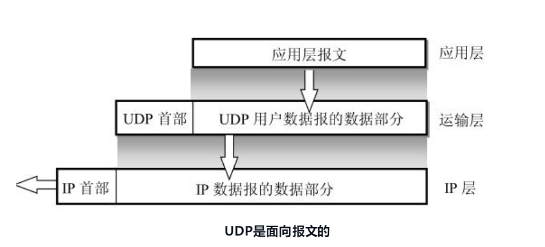
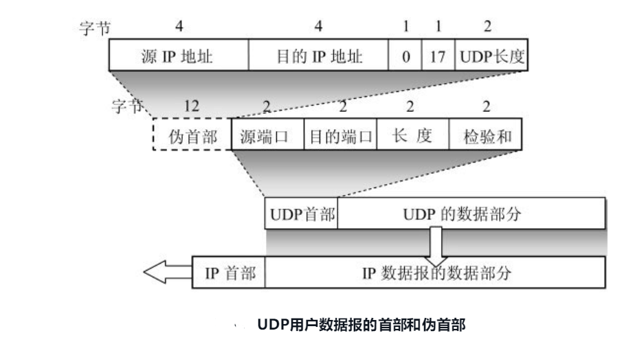
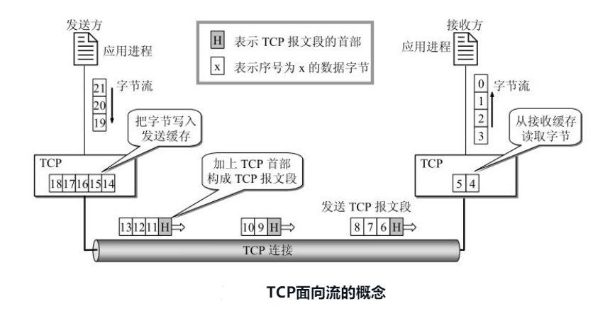
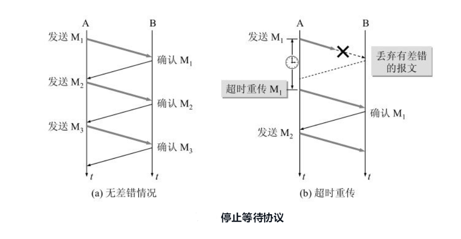
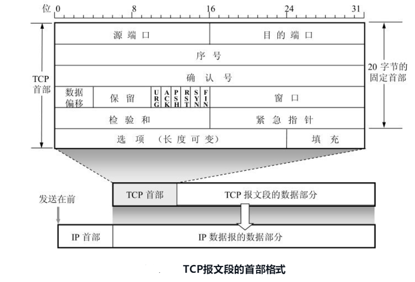
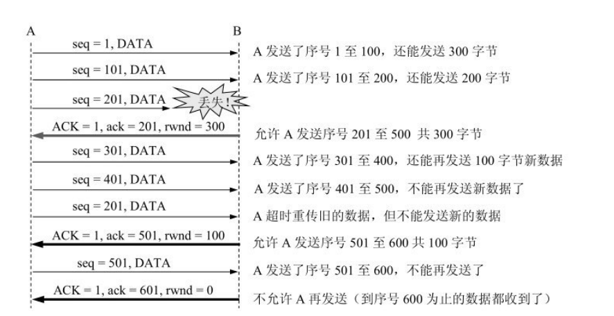

# 运输层

运输层是整个网络体系结构中的关键层次之一。一定要弄清以下一些重要概念：

(1) 运输层为相互通信的应用进程提供逻辑通信。

(2) 端口和套接字的意义。

(3) 无连接的UDP的特点。

(4) 面向连接的TCP的特点。

(5) 在不可靠的网络上实现可靠传输的工作原理，停止等待协议和ARQ协议。

(6) TCP的滑动窗口、流量控制、拥塞控制和连接管理。

**运输层有一个很重要的功能——复用(multiplexing)和分用(demultiplexing)**。这里的“复用”是指在发送方不同的应用进程都可以使用同一个运输层协议传送数据（当然需要加上适当的首部），而“分用”是指接收方的运输层在剥去报文的首部后能够把这些数据正确交付目的应用进程

**网络层是为主机之间提供逻辑通信，而运输层为应用进程之间提供端到端的逻辑通信**

 运输层的两个主要协议

(1) 用户数据报协议UDP (User Datagram Protocol) 

(2) 传输控制协议TCP (Transmission Control Protocol) 

 ## UDP
(1) UDP是无连接的，即发送数据之前不需要建立连接（当然，发送数据结束时也没有连接可释放），因此减少了开销和发送数据之前的时延。

(2) UDP使用尽最大努力交付，即不保证可靠交付，因此主机不需要维持复杂的连接状态表（这里面有许多参数）。

(3) UDP是面向报文的。发送方的UDP对应用程序交下来的报文，在添加首部后就向下交付IP层。UDP对应用层交下来的报文，既不合并，也不拆分，而是保留这些报文的边界

(4) UDP没有拥塞控制，因此网络出现的拥塞不会使源主机的发送速率降低  

(5) UDP支持一对一、一对多、多对一和多对多的交互通信  

(6) UDP的首部开销小，只有8个字节，比TCP的20个字节的首部要短

### UDP的首部

(1) 源端口 源端口号。在需要对方回信时选用。不需要时可用全0。

(2) 目的端口 目的端口号。这在终点交付报文时必须要使用到。

(3) 长度 UDP用户数据报的长度，其最小值是8（仅有首部）。 

(4) 检验和 检测UDP用户数据报在传输中是否有错。有错就丢弃

## TCP

### TCP最主要的特点

(1) **TCP是面向连接的运输层协议。这就是说，应用程序在使用TCP协议之前，必须先建立TCP连接。在传送数据完毕后，必须释放已经建立的TCP连接**

(2) 每一条TCP连接只能有两个端点(endpoint)，每一条TCP连接只能是点对点的（一对一）

(3) TCP提供可靠交付的服务。**通过TCP连接传送的数据，无差错、不丢失、不重复、并且按序到达**。

(4) TCP提供全双工通信。TCP允许通信双方的应用进程在任何时候都能发送数据。TCP连接的两端都设有发送缓存和接收缓存，用来临时存放双向通信的数据。在发送时，应用程序在把数据传送给TCP的缓存后，就可以做自己的事，而TCP在合适的时候把数据发送出去。在接收时，TCP把收到的数据放入缓存，上层的应用进程在合适的时候读取缓存中的数据。

(5) **面向字节流**。TCP中的“流”(stream)指的是流入到进程或从进程流出的字节序列。“面向字节流”的含义是：虽然应用程序和TCP的交互是一次一个数据块（大小不等），但TCP把应用程序交下来的数据看成仅仅是一连串的无结构的字节流。TCP并不知道所传送的字节流的含义。**TCP不保证接收方应用程序所收到的数据块和发送方应用程序所发出的数据块具有对应大小的关系（例如，发送方应用程序交给发送方的TCP共10个数据块，但接收方的TCP可能只用了4个数据块就把收到的字节流交付上层的应用程序）**。但接收方应用程序收到的字节流必须和发送方应用程序发出的字节流完全一样。当然，接收方的应用程序必须有能力识别收到的字节流，把它还原成有意义的应用层数据

TCP和UDP在发送报文时所采用的方式完全不同。**TCP并不关心应用进程一次把多长的报文发送到TCP的缓存中，而是根据对方给出的窗口值和当前网络拥塞的程度来决定一个报文段应包含多少个字节（UDP发送的报文长度是应用进程给出的）**。如果应用进程传送到TCP缓存的数据块太长，TCP就可以把它划分短一些再传送。如果应用进程一次只发来一个字节，TCP也可以等待积累有足够多的字节后再构成报文段发送出去

### TCP的连接

TCP把连接作为最基本的抽象。TCP的许多特性都与TCP是面向连接的这个基本特性有关

**每一条TCP连接有两个端点。那么，TCP连接的端点是什么呢？不是主机，不是主机的IP地址，不是应用进程，也不是运输层的协议端口，TCP连接的端点叫做套接字(socket)或插口**。根据RFC 793的定义：端口号拼接到IP地址即构成了套接字

**每一条TCP连接唯一地被通信两端的两个端点（即两个套接字）所确定**

TCP 连接的端点是个很抽象的套接字，即（IP 地址：端口号）。也还应记住：同一个IP地址可以有多个不同的TCP连接，而同一个端口号也可以出现在多个不同的TCP连接中。

### 可靠传输的工作原理

TCP发送的报文段是交给IP层传送的。但IP层只能提供尽最大努力服务，也就是说，TCP下面的网络所提供的是不可靠的传输。因此，TCP必须采用适当的措施才能使得两个运输层之间的通信变得可靠。

理想的传输条件有以下两个特点：

(1) 传输信道不产生差错。

(2) 不管发送方以多快的速度发送数据，接收方总是来得及处理收到的数据。

#### 停止等待协议

双工通信的双方既是发送方也是接收方。下面为了讨论问题的方便，我们仅考虑A发送数据而B接收数据并发送确认。因此A叫做发送方，而B叫做接收方。因为这里是讨论可靠传输的原理，因此把传送的数据单元都称为分组，而并不考虑数据是在哪一个层次上传送的

**“停止等待”就是每发送完一个分组就停止发送，等待对方的确认。在收到确认后再发送下一个分组。**

停止等待协议的优点是简单，缺点是信道利用率吧太低

1. 无差错情况

   
   
2. 差错情况

A只要超过了一段时间仍然没有收到确认，就认为刚才发送的分组丢失了，因而重传前面发送过的分组。这就叫做超时重传。**要实现超时重传，就要在每发送完一个分组设置一个超时计时器。如果在超时计时器到期之前收到了对方的确认，就撤销已设置的超时计时器**

这里应注意以下三点。

第一，A在发送完一个分组后，必须暂时保留已发送的分组的副本（为发生超时重传时使用）。只有在收到相应的确认后才能清除暂时保留的分组副本。

第二，分组和确认分组都必须进行编号。这样才能明确是哪一个发送出去的分组收到了确认，而哪一个分组还没有收到确认。

第三，超时计时器设置的重传时间应当比数据在分组传输的平均往返时间更长一些。显然，如果重传时间设定得很长，那么通信的效率就会很低。但如果重传时间设定得太短，以致产生不必要的重传，浪费了网络资源

#### 连续ARQ协议
滑动窗口

连续发送和累计确认

### TCP首部

TCP报文段首部的前20个字节是固定的，后面有4n字节是根据需要而增加的选项(n是整数)。因此TCP首部的最小长度是20字节。

首部固定部分各字段的意义如下

(1) 源端口和目的端口 各占2个字节，分别写入源端口号和目的端口号。和前面图5-6所示的UDP的分用相似，TCP的分用功能也是通过端口实现的。

(2) 序号 占4字节。序号范围是[0, 232 - 1]，共232个序号。序号增加到232- 1后，下一个序号就又回到0。TCP是面向字节流的。**在一个TCP连接中传送的字节流中的每一个字节都按顺序编号**。整个要传送的字节流的起始序号必须在连接建立时设置。首部中的序号字段值则指的是本报文段所发送的数据的第一个字节的序号。例如，一报文段的序号字段值是301，而携带的数据共有100字节。这就表明：本报文段的数据的第一个字节的序号是301，最后一个字节的序号是400。显然，下一个报文段（如果还有的话）的数据序号应当从401开始，即下一个报文段的序号字段值应为401。这个字段的名称也叫做“报文段序号”。

(3) 确认号 占4字节，**是期望收到对方下一个报文段的第一个数据字节的序号**。例如，B正确收到了A发送过来的一个报文段，其序号字段值是501，而数据长度是200字节（序号501～700），这表明B正确收到了A发送的到序号700为止的数据。因此，B期望收到A的下一个数据序号是701

若确认号 = N，则表明：到序号N - 1为止的所有数据都已正确收到。

(5) 数据偏移 占4位，它指出TCP报文段的数据起始处距离TCP报文段的起始处有多远,。这个字段实际上是指出TCP报文段的首部长度. 由于首部中还有长度不确定的选项字段，因此数据偏移字段是必要的

(6) 保留 占6位，保留为今后使用，但目前应置为0

下面有6个控制位说明本报文段的性质

(7) 紧急URG  当URG = 1时，表明紧急指针字段有效。它告诉系统此报文段中有紧急数据，应尽快传送(相当于高优先级的数据)，而不要按原来的排队顺序来传送。

(8) **确认ACK (ACKnowlegment) 仅当ACK = 1时确认号字段才有效。当ACK = 0时，确认号无效**。

**TCP规定，在连接建立后所有传送的报文段都必须把ACK置1**。

(9) 推送 PSH 当两个应用进程进行交互式的通信时，有时在一端的应用进程希望在键入一个命令后立即就能够收到对方的响应。在这种情况下，TCP就可以使用推送(push)操作。这时，发送方TCP把PSH置1，并立即创建一个报文段发送出去

(10) 复位RST  **当RST = 1时，表明TCP连接中出现严重差错**（如由于主机崩溃或其他原因），必须释放连接，然后再重新建立运输连接。RST置1还用来拒绝一个非法的报文段或拒绝打开一个连接。RST也可称为重建位或重置位。

(11) **同步SYN  在连接建立时用来同步序号**。**当SYN = 1而ACK = 0时，表明这是一个连接请求报文段。对方若同意建立连接，则应在响应的报文段中使SYN = 1和ACK =1**。**因此，SYN置为1就表示这是一个连接请求或连接接受报文**。

(12) 终止FIN (FINis，意思是“完”、“终”) 用来释放一个连接。**当FIN = 1时，表明此报文段的发送方的数据已发送完毕，并要求释放运输连接。**

(13) 窗口 占2字节。窗口值是[0, 216 - 1]之间的整数。**窗口指的是发送本报文段的一方的接收窗口（而不是自己的发送窗口）**。**窗口值告诉对方：从本报文段首部中的确认号算起，接收方目前允许对方发送的数据量**。**之所以要有这个限制，是因为接收方的数据缓存空间是有限的。总之，窗口值作为接收方让发送方设置其发送窗口的依据**。例如，设确认号是701，窗口字段是1000。这就表明，从701号算起，发送此报文段的一方还有接收1000个字节数据（字节序号是701～1 700）的接收缓存空间。总之，应当记住：窗口字段明确指出了现在允许对方发送的数据量。窗口值是经常在动态变化着。

(14) 检验和 占2字节。**检验和字段检验的范围包括首部和数据这两部分**。和UDP用户数据报一样，在计算检验和时，要在TCP报文段的前面加上12字节的伪首部。伪首部的格式与UDP用户数据报的伪首部一样。

(15) 紧急指针 占2字节。紧急指针仅在URG = 1时才有意义，它指出本报文段中的紧急数据的字节数（紧急数据结束后就是普通数据）

16) 选项 长度可变，最长可达40字节。**当没有使用“选项”时，TCP的首部长度是20字节**

**MSS是每一个TCP报文段中的数据字段的最大长度。数据字段加上TCP首部才等于整个的TCP报文段。所以MSS并不是整个TCP报文段的最大长度，而是“TCP报文段**长度减去TCP首部长度”。

> 为什么要规定一个最大报文段长度MSS呢？这并不是考虑接收方的接收缓存可能放不下TCP报文段中的数据。实际上，MSS与接收窗口值没有关系。我们知道，TCP报文段的数据部分，至少要加上40字节的首部（TCP首部20字节和IP首部20字节，这里都还没有考虑首部中的选项部分），才能组装成一个IP数据报。若选择较小的MSS长度，网络的利用率就降低。设想在极端的情况下，当TCP报文段只含有1字节的数据时，在IP层传输的数据报的开销至少有40字节(包括TCP报文段的首部和IP数据报的首部)。这样，对网络的利用率就不会超过1/41。到了数据链路层还要加上一些开销。但反过来，若TCP报文段非常长，那么在IP层传输时就有可能要分解成多个短数据报片。在终点要把收到的各个短数据报片装配成原来的TCP报文段。当传输出错时还要进行重传。这些也都会使开销增大。因此，MSS应尽可能大些，只要在IP层传输时不需要再分片就行。由于IP数据报所经历的路径是动态变化的，因此在这条路径上确定的不需要分片的MSS，如果改走另一条路径就可能需要进行分片。因此最佳的MSS是很难确定的。在连接建立的过程中，双方都把自己能够支持的MSS写入这一字段，以后就按照这个数值传送数据，两个传送方向可以有不同的MSS值[插图]。若主机未填写这一项，则MSS的默认值是536字节长。因此，所有在因特网上的主机都应能接受的报文段长度是536 + 20（固定首部长度）= 556字节。-- 了解

### TCP的流量控制
所谓流量控制(flow control)就是让发送方的发送速率不要太快，要让接收方来得及接收。

利用滑动窗口机制可以很方便地在TCP连接上实现对发送方的流量控制。

我们应注意，接收方的主机B进行了三次流量控制。第一次把窗口减小到rwnd = 300，第二次又减到rwnd = 100，最后减到rwnd = 0，即不允许发送方再发送数据了。这种使发送方暂停发送的状态将持续到主机B重新发出一个新的窗口值为止。我们还应注意到，B向A发送的三个报文段都设置了ACK = 1，只有在ACK = 1时确认号字段才有意义。现在我们考虑一种情况。在图5-22中，B向A发送了零窗口的报文段后不久，B的接收缓存又有了一些存储空间。于是B向A发送了rwnd = 400的报文段。然而这个报文段在传送过程中丢失了。A一直等待收到B发送的非零窗口的通知，而B也一直等待A发送的数据。如果没有其他措施，这种互相等待的死锁局面将一直延续下去。

为了解决这个问题，TCP为每一个连接设有一个持续计时器(persistence timer)。只要TCP连接的一方收到对方的零窗口通知，就启动持续计时器。若持续计时器设置的时间到期，就发送一个零窗口探测报文段（仅携带1字节的数据），而对方就在确认这个探测报文段时给出了现在的窗口值。如果窗口仍然是零，那么收到这个报文段的一方就重新设置持续计时器。如果窗口不是零，那么死锁的僵局就可以打破了。

### TCP的拥塞控制
在计算机网络中的链路容量（即带宽）、交换结点中的缓存和处理机等，都是网络的资源。在某段时间，若对网络中某一资源的需求超过了该资源所能提供的可用部分，网络的性能就要变坏。这种情况就叫做拥塞(congestion)。

所谓拥塞控制就是防止过多的数据注入到网络中，这样可以使网络中的路由器或链路不致过载。拥塞控制所要做的都有一个前提，就是网络能够承受现有的网络负荷

相反，流量控制往往指点对点通信量的控制，是个端到端的问题（接收端控制发送端）。流量控制所要做的就是抑制发送端发送数据的速率，以便使接收端来得及接收。

因特网建议标准定义了进行拥塞控制的四种算法，即**慢开始(slow-start)、拥塞避免(congestion avoidance)、快重传(fast retransmit)和快恢复(fast recovery)**

#### 慢开始和拥塞避免

发送方维持一个叫做拥塞窗口cwnd (congestion window)的状态变量。拥塞窗口的大小取决于网络的拥塞程度，并且动态地在变化。发送方让自己的发送窗口等于拥塞窗口。以后我们就知道，如果再考虑到接收方的接收能力，那么发送窗口还可能小于拥塞窗口。发送方控制拥塞窗口的原则是：只要网络没有出现拥塞，拥塞窗口就再增大一些，以便把更多的分组发送出去。但只要网络出现拥塞，拥塞窗口就减小一些，以减少注入到网络中的分组数。发送方又是如何知道网络发生了拥塞呢？我们知道，当网络发生拥塞时，路由器就要丢弃分组。因此只要发送方没有按时收到应当到达的确认报文，就可以猜想网络可能出现了拥塞。现在通信线路的传输质量一般都很好，因传输出差错而丢弃分组的概率是很小的（远小于1 %）

慢开始算法的思路是这样的。当主机开始发送数据时，如果立即把大量数据字节注入到网络，那么就有可能引起网络拥塞，因为现在并不清楚网络的负荷情况。经验证明，较好的方法是先探测一下，即由小到大逐渐增大发送窗口，也就是说，由小到大逐渐增大拥塞窗口数值。通常在刚刚开始发送报文段时，先把拥塞窗口cwnd设置为一个最大报文段MSS的数值[插图]。而在每收到一个对新的报文段的确认后，把拥塞窗口增加至多一个MSS的数值。用这样的方法逐步增大发送方的拥塞窗口cwnd，可以使分组注入到网络的速率更加合理。
为了防止拥塞窗口cwnd增长过大引起网络拥塞，还需要设置一个慢开始门限 ssthresh状态变量（如何设置ssthresh，后面还要讲）。慢开始门限ssthresh的用法如下：当cwnd < ssthresh时，使用上述的慢开始算法。当cwnd > ssthresh时，停止使用慢开始算法而改用拥塞避免算法。当cwnd = ssthresh时，既可使用慢开始算法，也可使用拥塞避免算法

拥塞避免算法的思路是让拥塞窗口cwnd缓慢地增大，即每经过一个往返时间RTT就把发送方的拥塞窗口cwnd加1，而不是加倍。这样，拥塞窗口cwnd 按线性规律缓慢增长，比慢开始算法的拥塞窗口增长速率缓慢得多

无论在慢开始阶段还是在拥塞避免阶段，只要发送方判断网络出现拥塞（其根据就是没有按时收到确认），就要把慢开始门限ssthresh设置为出现拥塞时的发送方窗口值的一半（但不能小于2。然后把拥塞窗口cwnd重新设置为1，执行慢开始算法。这样做的目的就是要迅速减少主机发送到网络中的分组数，使得发生拥塞的路由器有足够时间把队列中积压的分组处理完毕。

#### 快重传和快恢复
快重传算法首先要求接收方每收到一个失序的报文段后就立即发出重复确认（为的是使发送方及早知道有报文段没有到达对方）而不要等待自己发送数据时才进行捎带确认

与快重传配合使用的还有快恢复算法，其过程有以下两个要点：
(1) 当发送方连续收到三个重复确认时，就执行“乘法减小”算法，把慢开始门限ssthresh减半。这是为了预防网络发生拥塞。请注意，接下去不执行慢开始算法。

(2) 由于发送方现在认为网络很可能没有发生拥塞（如果网络发生了严重的拥塞，就不会一连有好几个报文段连续到达接收方，也就不会导致接收方连续发送重复确认），因此与慢开始不同之处是现在不执行慢开始算法（即拥塞窗口cwnd现在不设置为1），而是把cwnd值设置为慢开始门限ssthresh减半后的数值，然后开始执行拥塞避免算法（“加法增大”），使拥塞窗口缓慢地线性增大。

### TCP的运输连接管理

B的TCP服务器进程先创建传输控制块 TCB[插图]，准备接受客户进程的连接请求。然后服务器进程就处于LISTEN（收听）状态，等待客户的连接请求。如有，即作出响应。

A的TCP客户进程也是首先创建传输控制模块TCB，然后向B发出连接请求报文段，这时首部中的同步位SYN = 1，同时选择一个初始序号seq = x。TCP规定，SYN报文段（即SYN = 1的报文段）不能携带数据，但要消耗掉一个序号。这时，TCP客户进程进入SYN-SENT（同步已发送）状态。

B收到连接请求报文段后，如同意建立连接，则向A发送确认。在确认报文段中应把SYN位和ACK位都置1，确认号是ack = x + 1，同时也为自己选择一个初始序号seq = y。请注意，这个报文段也不能携带数据，但同样要消耗掉一个序号。这时TCP服务器进程进入SYN-RCVD（同步收到）状态。

TCP客户进程收到B的确认后，还要向B给出确认。确认报文段的ACK置1，确认号ack = y + 1，而自己的序号seq = x + 1。TCP的标准规定，ACK报文段可以携带数据。但如果不携带数据则不消耗序号，在这种情况下，下一个数据报文段的序号仍是seq = x + 1。这时，TCP连接已经建立，A进入ESTABLISHED（已建立连接）状态。当B收到A的确认后，也进入ESTABLISHED状态。

上面给出的连接建立过程叫做三次握手(three-way handshake)。

**为什么A还要发送一次确认呢？**

**这主要是为了防止已失效的连接请求报文段突然又传送到了服务器B，因而产生错误。**

所谓“已失效的连接请求报文段”是这样产生的。考虑一种正常情况。A发出连接请求，但因连接请求报文丢失而未收到确认。于是A再重传一次连接请求。后来收到了确认，建立了连接。数据传输完毕后，就释放了连接。A共发送了两个连接请求报文段，其中第一个丢失，第二个到达了B。没有“已失效的连接请求报文段”。

现假定出现一种异常情况，即A发出的第一个连接请求报文段并没有丢失，而是在某些网络结点长时间滞留了，以致延误到连接释放以后的某个时间才到达B。本来这是一个早已失效的报文段。但B收到此失效的连接请求报文段后，就误认为是A又发出一次新的连接请求。于是就向A发出确认报文段，同意建立连接。假定不采用三次握手，那么只要B发出确认，新的连接就建立了。

由于现在A并没有发出建立连接的请求，因此不会理睬B的确认，也不会向B发送数据。但B却以为新的运输连接已经建立了，并一直等待A发来数据。B的许多资源就这样白白浪费了。采用三次握手的办法可以防止上述现象的发生。采用三次握手的办法可以防止上述现象的发生。例如在刚才的情况下，A不会向B的确认发出确认。B由于收不到确认，就知道A并没有要求建立连接。

**那为什么需要三次握手呢？**

请看如下的过程：

1. A向B发起建立连接请求：A——>B；
2. B收到A的发送信号，并且向A发送确认信息：B——>A；
3. A收到B的确认信号，并向B发送确认信号：A——>B。

三次握手大概就是这么个过程。
 通过第一次握手，B知道A能够发送数据。通过第二次握手，A知道B能发送数据。结合第一次握手和第二次握手，A知道B能接收数据。结合第三次握手，B知道A能够接收数据。

至此，完成了握手过程，A知道B能收能发，B知道A能收能发，通信连接至此建立。三次连接是保证可靠的最小握手次数，再多次握手也不能提高通信成功的概率，反而浪费资源。

####  TCP的连接释放

数据传输结束后，通信的双方都可释放连接。现在A和B都处于ESTABLISHED状态（图5-32）。

A的应用进程先向其TCP发出连接释放报文段，并停止再发送数据，主动关闭TCP连接。A把连接释放报文段首部的终止控制位FIN置1，其序号seq = u，它等于前面已传送过的数据的最后一个字节的序号加1。这时A进入FIN-WAIT-1（终止等待1）状态，等待B的确认。请注意，TCP规定，FIN报文段即使不携带数据，它也消耗掉一个序号

B收到连接释放报文段后即发出确认，确认号是ack = u + 1，而这个报文段自己的序号是v，等于B前面已传送过的数据的最后一个字节的序号加1。然后B就进入CLOSE-WAIT（关闭等待）状态。TCP服务器进程这时应通知高层应用进程，因而从A到B这个方向的连接就释放了，这时的TCP连接处于半关闭(half-close)状态，即A已经没有数据要发送了，但B若发送数据，A仍要接收。也就是说，从B到A这个方向的连接并未关闭，这个状态可能会持续一些时间。A收到来自B的确认后，就进入FIN-WAIT-2（终止等待2）状态，等待B发出的连接释放报文段。

若B已经没有要向A发送的数据，其应用进程就通知TCP释放连接。这时B发出的连接释放报文段必须使FIN = 1。现假定B的序号为w（在半关闭状态B可能又发送了一些数据）。B还必须重复上次已发送过的确认号ack = u + 1。这时B就进入LAST-ACK（最后确认）状态，等待A的确认。

A在收到B的连接释放报文段后，必须对此发出确认。在确认报文段中把ACK置1，确认号ack =w + 1，而自己的序号是seq = u + 1（根据TCP标准，前面发送过的FIN报文段要消耗一个序号）。然后进入到TIME-WAIT（时间等待）状态。请注意，现在TCP连接还没有释放

请注意，现在TCP连接还没有释放掉。**必须经过时间等待计时器(TIME-WAIT timer)设置的时间2MSL后，A才进入到CLOSED状态**。时间MSL叫做最长报文段寿命(Maximum Segment Lifetime)，RFC 793建议设为2分钟。但这完全是从工程上来考虑，对于现在的网络，MSL = 2分钟可能太长了一些。因此TCP允许不同的实现可根据具体情况使用更小的MSL值。因此，从A进入到TIME-WAIT状态后，要经过4分钟才能进入到CLOSED状态，才能开始建立下一个新的连接。当A撤销相应的传输控制块TCB后，就结束了这次的TCP连接。

**为什么A在TIME-WAIT状态必须等待2MSL的时间呢**？这有两个理由。

第一，为了保证A发送的最后一个ACK报文段能够到达B。这个ACK报文段有可能丢失，因而使处在LAST-ACK状态的B收不到对已发送的FIN + ACK报文段的确认。B会超时重传这个FIN +ACK报文段，而A就能在2MSL时间内收到这个重传的FIN + ACK报文段。接着A重传一次确认，重新启动2MSL计时器。最后，A和B都正常进入到CLOSED状态。如果A在TIME-WAIT状态不等待一段时间，而是在发送完ACK报文段后立即释放连接，那么就无法收到B重传的FIN + ACK报文段，因而也不会再发送一次确认报文段。这样，B就无法按照正常步骤进入CLOSED状态。

第二，防止上一节提到的“已失效的连接请求报出现在本连接中。A在发送完最后一个ACK报文段后，再经过时间2MSL，就可以使本连接持续的时间内所产生的所有报文段都从网络中消失。这样就可以使下一个新的连接中不会出现这种旧的连接请求报文段。

B只要收到了A发出的确认，就进入CLOSED状态。同样，B在撤销相应的传输控制块TCB后，就结束了这次的TCP连接。我们注意到，B结束TCP连接的时间要比A早一些。上述的TCP连接释放过程是四次握手。

除时间等待计时器外，TCP还设有一个保活计时器(keepalive timer)。设想有这样的情况：客户已主动与服务器建立了TCP连接。但后来客户端的主机突然出故障。显然，服务器以后就不能再收到客户发来的数据。因此，应当有措施使服务器不要再白白等待下去。这就是使用保活计时器。服务器每收到一次客户的数据，就重新设置保活计时器，时间的设置通常是两小时。若两小时没有收到客户的数据，服务器就发送一个探测报文段，以后则每隔75分钟发送一次。若一连发送10个探测报文段后仍无客户的响应，服务器就认为客户端出了故障，接着就关闭这个连接。

**为什么需要四次挥手**

因为TCP是一个全双工协议，必须单独拆除每一条信道
