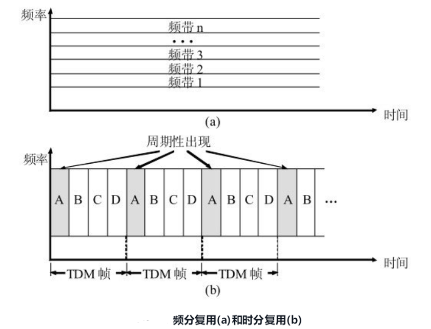

# 物理层
**物理层考虑的是怎样才能在连接各种计算机的传输媒体上传输数据比特流，而不是指具体的传输媒体**

现有的计算机网络中的硬件设备和传输媒体的种类非常繁多，而通信手段也有许多不同方式。物理层的作用正是要尽可能地屏蔽掉这些传输媒体和通信手段的差异，使物理层上面的数据链路层感觉不到这些差异，这样就可使数据链路层只需要考虑如何完成本层的协议和服务，而不必考虑网络具体的传输媒体和通信手段是什么。用于物理层的协议也常称为物理层规程(procedure)
**可以将物理层的主要任务描述为确定与传输媒体的接口有关的一些特性**，即：

(1) 机械特性 指明接口所用接线器的形状和尺寸，引脚数目和排列，固定和锁定装置，等等。平时常见的各种规格的接插件都有严格的标准化的规定。

(2) 电气特性 指明在接口电缆的各条线上出现的电压的范围。

(3) 功能特性 指明某条线上出现的某一电平的电压表示何种意义。

(4) 过程特性 指明对于不同功能的各种可能事件的出现顺序。

数据在计算机中多采用并行传输方式。但数据在通信线路（传输媒体）上的传输方式一般都是串行传输（这是出于经济上的考虑），即逐个比特按照时间顺序传输。因此物理层还要完成传输方式的转换

## 数据通信系统的模型

## 物理层下面的传输媒体
**传输媒体也称为传输介质或传输媒介，它就是数据传输系统中在发送器和接收器之间的物理通路**。
传输媒体可分为两大类，即导引型传输媒体和非导引型传输媒体

在导引型传输媒体中，电磁波被导引沿着固体媒体（铜线或光纤）传播；而非导引型传输媒体就是指自由空间，在非导引型传输媒体中电磁波的传输常称为无线传输
## 信道
信道一般都是用来表示向某一个方向传送信息的媒体。因此，一条通信电路往往包含一条发送信道和一条接收信道。从通信的双方信息交互的方式来看，可以有以下三种基本方式：

(1) 单向通信 又称为单工通信，即只能有一个方向的通信而没有反方向的交互。无线电广播或有线电广播以及电视广播就属于这种类型。

(2) 双向交替通信 又称为半双工通信，即通信的双方都可以发送信息，但不能双方同时发送（当然也就不能同时接收）。这种通信方式是一方发送另一方接收，过一段时间后再反过来。

(3) 双向同时通信 又称为全双工通信，即通信的双方可以同时发送和接收信息。
## 信道复用
复用(multiplexing)是通信技术中的基本概念

### 频分复用 时分复用

频分复用的所有用户在同样的时间占用不同的带宽资源

时分复用的所有用户是在不同的时间占用同样的频带宽度

在进行通信时，复用器(multiplexer)总是和分用器(demultiplexer)成对地使用。在复用器和分用器之间是用户共享的高速信道。分用器的作用正好和复用器的作用相反，它把高速信道传送过来的数据进行分用，分别送交到相应的用户。

### 统计时分复用

统计时分复用STDM (Statistic TDM)是一种改进的时分复用，它能明显地提高信道的利用率。

### 波分复用

波分复用WDM (Wavelength Division Multiplexing)就是光的频分复用

### 码分复用

码分复用CDM (Code Division Multiplexing)是另一种共享信道的方法。实际上，人们更常用的名词是码分多址CDMA (Code Division Multiple Access)。每一个用户可以在同样的时间使用同样的频带进行通信。由于各用户使用经过特殊挑选的不同码型，因此各用户之间不会造成干扰。码分复用最初是用于军事通信的，因为这种系统发送的信号有很强的抗干扰能力，其频谱类似于白噪声，不易被敌人发现
