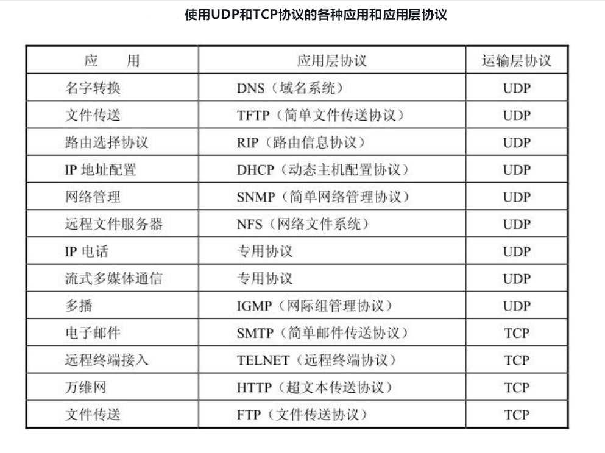

# 运输层

运输层是整个网络体系结构中的关键层次之一。一定要弄清以下一些重要概念：

(1) 运输层为相互通信的应用进程提供逻辑通信。

(2) 端口和套接字的意义。

(3) 无连接的UDP的特点。

(4) 面向连接的TCP的特点。

(5) 在不可靠的网络上实现可靠传输的工作原理，停止等待协议和ARQ协议。

(6) TCP的滑动窗口、流量控制、拥塞控制和连接管理。

**运输层有一个很重要的功能——复用(multiplexing)和分用(demultiplexing)**。这里的“复用”是指在发送方不同的应用进程都可以使用同一个运输层协议传送数据（当然需要加上适当的首部），而“分用”是指接收方的运输层在剥去报文的首部后能够把这些数据正确交付目的应用进程

**网络层是为主机之间提供逻辑通信，而运输层为应用进程之间提供端到端的逻辑通信**

 运输层的两个主要协议

(1) 用户数据报协议UDP (User Datagram Protocol) 

(2) 传输控制协议TCP (Transmission Control Protocol) 

 ## UDP
 (1) UDP是无连接的，即发送数据之前不需要建立连接（当然，发送数据结束时也没有连接可释放），因此减少了开销和发送数据之前的时延。

(2) UDP使用尽最大努力交付，即不保证可靠交付，因此主机不需要维持复杂的连接状态表（这里面有许多参数）。

(3) UDP是面向报文的。发送方的UDP对应用程序交下来的报文，在添加首部后就向下交付IP层。UDP对应用层交下来的报文，既不合并，也不拆分，而是保留这些报文的边界

(4) UDP没有拥塞控制，因此网络出现的拥塞不会使源主机的发送速率降低

(5) UDP支持一对一、一对多、多对一和多对多的交互通信

(6) UDP的首部开销小，只有8个字节，比TCP的20个字节的首部要短

### UDP的首部

(1) 源端口 源端口号。在需要对方回信时选用。不需要时可用全0。
(2) 目的端口 目的端口号。这在终点交付报文时必须要使用到。
(3) 长度 UDP用户数据报的长度，其最小值是8（仅有首部）。
(4) 检验和 检测UDP用户数据报在传输中是否有错。有错就丢弃

## TCP

### TCP最主要的特点(important)

(1) **TCP是面向连接的运输层协议。这就是说，应用程序在使用TCP协议之前，必须先建立TCP连接。在传送数据完毕后，必须释放已经建立的TCP连接**

(2) 每一条TCP连接只能有两个端点(endpoint)，每一条TCP连接只能是点对点的（一对一）

(3) TCP提供可靠交付的服务。通过TCP连接传送的数据，无差错、不丢失、不重复、并且按序到达。

(4) TCP提供全双工通信。TCP允许通信双方的应用进程在任何时候都能发送数据。TCP连接的两端都设有发送缓存和接收缓存，用来临时存放双向通信的数据。在发送时，应用程序在把数据传送给TCP的缓存后，就可以做自己的事，而TCP在合适的时候把数据发送出去。在接收时，TCP把收到的数据放入缓存，上层的应用进程在合适的时候读取缓存中的数据。

(5) **面向字节流**。TCP中的“流”(stream)指的是流入到进程或从进程流出的字节序列。“面向字节流”的含义是：虽然应用程序和TCP的交互是一次一个数据块（大小不等），但TCP把应用程序交下来的数据看成仅仅是一连串的无结构的字节流。TCP并不知道所传送的字节流的含义。**TCP不保证接收方应用程序所收到的数据块和发送方应用程序所发出的数据块具有对应大小的关系（例如，发送方应用程序交给发送方的TCP共10个数据块，但接收方的TCP可能只用了4个数据块就把收到的字节流交付上层的应用程序）**。但接收方应用程序收到的字节流必须和发送方应用程序发出的字节流完全一样。当然，接收方的应用程序必须有能力识别收到的字节流，把它还原成有意义的应用层数据

TCP和UDP在发送报文时所采用的方式完全不同。**TCP并不关心应用进程一次把多长的报文发送到TCP的缓存中，而是根据对方给出的窗口值和当前网络拥塞的程度来决定一个报文段应包含多少个字节（UDP发送的报文长度是应用进程给出的）**。如果应用进程传送到TCP缓存的数据块太长，TCP就可以把它划分短一些再传送。如果应用进程一次只发来一个字节，TCP也可以等待积累有足够多的字节后再构成报文段发送出去

### TCP的连接

TCP把连接作为最基本的抽象。TCP的许多特性都与TCP是面向连接的这个基本特性有关

**每一条TCP连接有两个端点。那么，TCP连接的端点是什么呢？不是主机，不是主机的IP地址，不是应用进程，也不是运输层的协议端口，TCP连接的端点叫做套接字(socket)或插口**。根据RFC 793的定义：端口号拼接到(contatenated with) IP地址即构成了套接字

**每一条TCP连接唯一地被通信两端的两个端点（即两个套接字）所确定**

TCP 连接的端点是个很抽象的套接字，即（IP 地址：端口号）。也还应记住：同一个IP地址可以有多个不同的TCP连接，而同一个端口号也可以出现在多个不同的TCP连接中。

### 可靠传输的工作原理（todo)

TCP发送的报文段是交给IP层传送的。但IP层只能提供尽最大努力服务，也就是说，TCP下面的网络所提供的是不可靠的传输。因此，TCP必须采用适当的措施才能使得两个运输层之间的通信变得可靠。

理想的传输条件有以下两个特点：

(1) 传输信道不产生差错。

(2) 不管发送方以多快的速度发送数据，接收方总是来得及处理收到的数据。

#### 停止等待协议

双工通信的双方既是发送方也是接收方。下面为了讨论问题的方便，我们仅考虑A发送数据而B接收数据并发送确认。因此A叫做发送方，而B叫做接收方。因为这里是讨论可靠传输的原理，因此把传送的数据单元都称为分组，而并不考虑数据是在哪一个层次上传送的

**“停止等待”就是每发送完一个分组就停止发送，等待对方的确认。在收到确认后再发送下一个分组。**

#### 连续ARQ协议

1. 无差错情况

   
   
2. 差错情况

A只要超过了一段时间仍然没有收到确认，就认为刚才发送的分组丢失了，因而重传前面发送过的分组。这就叫做超时重传。**要实现超时重传，就要在每发送完一个分组设置一个超时计时器。如果在超时计时器到期之前收到了对方的确认，就撤销已设置的超时计时器**

这里应注意以下三点。

第一，A在发送完一个分组后，必须暂时保留已发送的分组的副本（为发生超时重传时使用）。只有在收到相应的确认后才能清除暂时保留的分组副本。

第二，分组和确认分组都必须进行编号[插图]。这样才能明确是哪一个发送出去的分组收到了确认，而哪一个分组还没有收到确认。

第三，超时计时器设置的重传时间应当比数据在分组传输的平均往返时间更长一些。显然，如果重传时间设定得很长，那么通信的效率就会很低。但如果重传时间设定得太短，以致产生不必要的重传，浪费了网络资源

### TCP首部

TCP报文段首部的前20个字节是固定的，后面有4n字节是根据需要而增加的选项(n是整数)。因此TCP首部的最小长度是20字节。

首部固定部分各字段的意义如下

(1) 源端口和目的端口 各占2个字节，分别写入源端口号和目的端口号。和前面图5-6所示的UDP的分用相似，TCP的分用功能也是通过端口实现的。

(2) 序号 占4字节。序号范围是[0, 232 - 1]，共232个序号。序号增加到232- 1后，下一个序号就又回到0。TCP是面向字节流的。**在一个TCP连接中传送的字节流中的每一个字节都按顺序编号**。整个要传送的字节流的起始序号必须在连接建立时设置。首部中的序号字段值则指的是本报文段所发送的数据的第一个字节的序号。例如，一报文段的序号字段值是301，而携带的数据共有100字节。这就表明：本报文段的数据的第一个字节的序号是301，最后一个字节的序号是400。显然，下一个报文段（如果还有的话）的数据序号应当从401开始，即下一个报文段的序号字段值应为401。这个字段的名称也叫做“报文段序号”。

(3) 确认号 占4字节，**是期望收到对方下一个报文段的第一个数据字节的序号**。例如，B正确收到了A发送过来的一个报文段，其序号字段值是501，而数据长度是200字节（序号501～700），这表明B正确收到了A发送的到序号700为止的数据。因此，B期望收到A的下一个数据序号是701

若确认号 = N，则表明：到序号N - 1为止的所有数据都已正确收到。

(5) 数据偏移 占4位，它指出TCP报文段的数据起始处距离TCP报文段的起始处有多远,。这个字段实际上是指出TCP报文段的首部长度. 由于首部中还有长度不确定的选项字段，因此数据偏移字段是必要的

(6) 保留 占6位，保留为今后使用，但目前应置为0

下面有6个控制位说明本报文段的性质

(7) 紧急URG  当URG = 1时，表明紧急指针字段有效。它告诉系统此报文段中有紧急数据，应尽快传送(相当于高优先级的数据)，而不要按原来的排队顺序来传送。

(8) **确认ACK (ACKnowlegment) 仅当ACK = 1时确认号字段才有效。当ACK = 0时，确认号无效**。

**TCP规定，在连接建立后所有传送的报文段都必须把ACK置1**。

(9) 推送 PSH 当两个应用进程进行交互式的通信时，有时在一端的应用进程希望在键入一个命令后立即就能够收到对方的响应。在这种情况下，TCP就可以使用推送(push)操作。这时，发送方TCP把PSH置1，并立即创建一个报文段发送出去

(10) 复位RST  **当RST = 1时，表明TCP连接中出现严重差错**（如由于主机崩溃或其他原因），必须释放连接，然后再重新建立运输连接。RST置1还用来拒绝一个非法的报文段或拒绝打开一个连接。RST也可称为重建位或重置位。

(11) **同步SYN  在连接建立时用来同步序号**。**当SYN = 1而ACK = 0时，表明这是一个连接请求报文段。对方若同意建立连接，则应在响应的报文段中使SYN = 1和ACK =1**。**因此，SYN置为1就表示这是一个连接请求或连接接受报文**。

(12) 终止FIN (FINis，意思是“完”、“终”) 用来释放一个连接。**当FIN = 1时，表明此报文段的发送方的数据已发送完毕，并要求释放运输连接。**

(13) 窗口 占2字节。窗口值是[0, 216 - 1]之间的整数。**窗口指的是发送本报文段的一方的接收窗口（而不是自己的发送窗口）**。**窗口值告诉对方：从本报文段首部中的确认号算起，接收方目前允许对方发送的数据量**。**之所以要有这个限制，是因为接收方的数据缓存空间是有限的。总之，窗口值作为接收方让发送方设置其发送窗口的依据**。例如，设确认号是701，窗口字段是1000。这就表明，从701号算起，发送此报文段的一方还有接收1000个字节数据（字节序号是701～1 700）的接收缓存空间。总之，应当记住：窗口字段明确指出了现在允许对方发送的数据量。窗口值是经常在动态变化着。

(14) 检验和 占2字节。**检验和字段检验的范围包括首部和数据这两部分**。和UDP用户数据报一样，在计算检验和时，要在TCP报文段的前面加上12字节的伪首部。伪首部的格式与UDP用户数据报的伪首部一样。

(15) 紧急指针 占2字节。紧急指针仅在URG = 1时才有意义，它指出本报文段中的紧急数据的字节数（紧急数据结束后就是普通数据）

16) 选项 长度可变，最长可达40字节。**当没有使用“选项”时，TCP的首部长度是20字节**

**MSS是每一个TCP报文段中的数据字段的最大长度。数据字段加上TCP首部才等于整个的TCP报文段。所以MSS并不是整个TCP报文段的最大长度，而是“TCP报文段**长度减去TCP首部长度”。

> 为什么要规定一个最大报文段长度MSS呢？这并不是考虑接收方的接收缓存可能放不下TCP报文段中的数据。实际上，MSS与接收窗口值没有关系。我们知道，TCP报文段的数据部分，至少要加上40字节的首部（TCP首部20字节和IP首部20字节，这里都还没有考虑首部中的选项部分），才能组装成一个IP数据报。若选择较小的MSS长度，网络的利用率就降低。设想在极端的情况下，当TCP报文段只含有1字节的数据时，在IP层传输的数据报的开销至少有40字节(包括TCP报文段的首部和IP数据报的首部)。这样，对网络的利用率就不会超过1/41。到了数据链路层还要加上一些开销。但反过来，若TCP报文段非常长，那么在IP层传输时就有可能要分解成多个短数据报片。在终点要把收到的各个短数据报片装配成原来的TCP报文段。当传输出错时还要进行重传。这些也都会使开销增大。因此，MSS应尽可能大些，只要在IP层传输时不需要再分片就行。由于IP数据报所经历的路径是动态变化的，因此在这条路径上确定的不需要分片的MSS，如果改走另一条路径就可能需要进行分片。因此最佳的MSS是很难确定的。在连接建立的过程中，双方都把自己能够支持的MSS写入这一字段，以后就按照这个数值传送数据，两个传送方向可以有不同的MSS值[插图]。若主机未填写这一项，则MSS的默认值是536字节长。因此，所有在因特网上的主机都应能接受的报文段长度是536 + 20（固定首部长度）= 556字节。-- 了解

### TCP的流量控制

### TCP的拥塞控制

### TCP的运输连接管理

# [Go To Top](#运输层)
# [Go Back](./README.md)
# [Go Back ROOT Index](../README.md)
