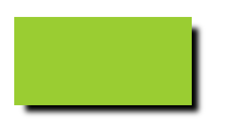
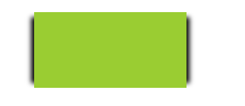
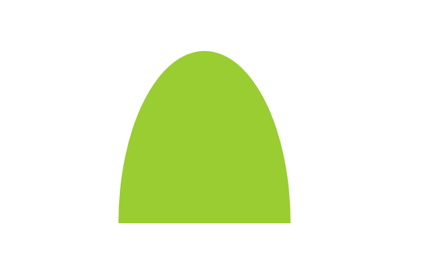
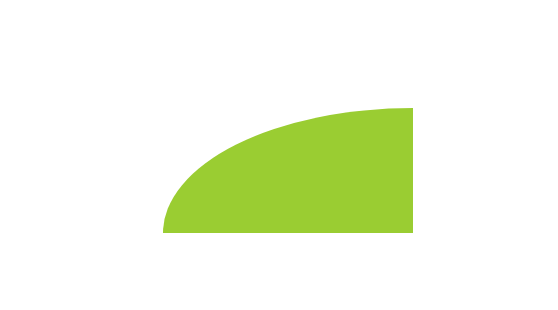

# interview
### 两边固定，中间自适应布局

#### 圣杯布局

宽度收缩到一定程度，盒子会掉下来

dom结构

```html
<div class="container">
    <div class="main">main</div>
    <div class="left">left</div>
    <div class="right">right</div>
</div>
```


```css
 .container {
            padding: 0 300px 0 200px;

        }
        .container > div {
            height: 400px;
            float: left;
        }
        .left {
            margin-left:-100%;
            width: 200px;
            background: yellow;
            position: relative;
            left:-200px;
        }
        .right {
            margin-left:-300px;
            width: 300px;
            background: green;
            position: relative;
            right:-300px;
        }
        .main {
            width: 100%;
            background: red;
        }
```

#### 双飞翼布局

宽度收缩盒子不会换行

dom结构

```html
<div class="container">
    <div class="wrapper">
        <div class="main">main</div>
    </div>
    <div class="left">left</div>
    <div class="right">right</div>
</div>
```


```css
 .container > div {
            height: 400px;
            float: left;
        }
.left {
    margin-left:-100%;
    width: 200px;
    background: yellow;
}
.right {
    margin-left: -300px;
    width: 300px;
    background: green;
}
.wrapper {
    width: 100%;
    background: red;
}
.main {
    margin: 0 300px 0 200px;
}
```

#### flex布局

dom布局和圣杯布局一样，不用指定盒子的高度，三栏高度都是高度最大的盒子的高度（`height:max-content`)，宽度收缩盒子不会换行

```css
.container {
            display: flex;
}

.container > div {
    /*height: 400px;*/
}

.left {
    order: -1;
    flex: 0 0 200px;
    background: yellow;
}

.right {
    flex: 0 0 300px;
    background: green;
}

.main {
    background: red;
    flex: 1;
}
```

### 多列等高布局

dom布局

```html
<div class="container">
    <div class="left">left</div>
    <div class="middle">middle</div>
    <div class="right">right</br>right</div>
</div>
```

#### 1 table布局

```css
.container {
    display: table;
}
.container > div {
    display: table-cell;
}
```

#### 2 padding+负margin

```css
.container {
    overflow: hidden;
}
.container> div {
    float: left;
    padding-bottom: 9000px;
    margin-bottom: -9000px;
   
}
```

#### 3 flex布局

```css
.container {
    display: flex;
}
.container > div {
    flex:1
}
```


### 紧贴底部的页脚

紧贴底部的页脚，也就是粘性footer，粘性footer：页面不足一屏的时候，footer紧贴”在视口的最底部，紧跟在内容的下方
```html
<body>
<header>header</header>
<main>main content</main>
<footer>footer</footer>
</body>
```
1. 页头和页脚高度已知，假设分别为100px

```css
main {
    min-height: calc(100vh - 200px);
    /* 这一行必须加上，否则padding和border影响高度的计算*/
    box-sizing: border-box;
}

```
2. 页脚高度已知

改变html结构，header和内容再包一层

```html
<body>
<div class="wrapper">
    <header>header</header>
    <main>main content</main>
</div>
<footer>footer</footer>
</body>
```
```css
.wrapper {
    min-height: calc(100vh - 100px);
}
```
方法1和方法2:每当我们改变页脚的尺寸时，都需要跟着调整min-height值（也就是说，这不够DRY）；此外，除非我们愿意给页头和内容主体套一层额外的HTML元素，否则还要跟着页头的尺寸修改

3. 页脚高度未知
```css
body {
    display: flex;
    flex-direction:column;
    min-height: 100vh;
}
main {
    flex:1;
}

```

### 垂直居中
1. 表格布局
2. 行内块法
**`3. 基于绝对定位的解决方案`**

要求元素具有固定的宽高

```css
main {
    position: absolute;
    width: 400px;
    height: 200px;
    left:50%;
    top:50%;
    margin-left: -200px; /* 400/2 = 200*/
    margin-top:-100px; /* 200/2 = 100*/
}
```
这段代码在本质上做了这样几件事情：先把这个元素的左上角放置在视口（或最近的、具有定位属性的祖先元素）的正中心，
然后再利用负外边距把它向左、向上移动（移动距离相当于它自身宽高的一半），从而把元素的正中心放置在视口的正中心

借助强大的calc()函数，这段代码还可以省掉两行声明：
```css
main {
    position: absolute;
    width: 400px;
    height: 200px;
    left:calc(50% - 200px);
    top:calc(50% - 100px);
}
```
显然，这个方法最大的局限在于它要求元素的宽高是固定的。在通常情况下，对那些需要居中的元素来说，其尺寸往往是由其内容来决定的。如果能找到一个属性的百分比值以元素自身的宽高作为解析基准，那我们的难题就迎刃而解了！遗憾的是，对于绝大多数CSS属性（包括margin）来说，百分比都是以其父元素的尺寸为基准进行解析的。

**translate()变形函数中使用百分比值时，是以这个元素自身的宽度和高度为基准进行换算和移动**
接下来，只要换用基于百分比的CSS变形来对元素进行偏移，就不需要在偏移量中把元素的尺寸写死了。这样我们就可以彻底解除对固定尺寸的依赖
```css
main {
    position: absolute;
    left:50%;
    top:50%;
    transform: translate(-50%, -50%);
}
```
当然，没有任何技巧是十全十美的，上面这个方法也有一些需要注意的地方。
+ 我们有时不能选用绝对定位，因为它对整个布局的影响太过强烈。
+ 如果需要居中的元素已经在高度上超过了视口，那它的顶部会被视口裁切掉。有一些办法可以绕过这个问题，但hack味道过浓。
+ 在某些浏览器中，这个方法可能会导致元素的显示有一些模糊，因为元素可能被放置在半个像素上。这个问题可以用transform-style:preserve-3d来修复，
不过这个修复手段也可以认为是一个hack，而且很难保证它在未来不会出问题。

**`4. flex`**

```css
body {
    min-height:100vh;
    display: flex;
    margin:0;
}
main {
    margin: auto;
}

```
当我们使用Flexbox时，margin: auto不仅在水平方向上将元素居中，垂直方向上也是如此。
还有一点，我们甚至不需要指定任何宽度（当然，如果需要的话，也是可以指定的）：这个居中元素分配到的宽度等于`max-content`

flex布局的另外一种写法
```css
body {
    min-height:100vh;
    margin:0;
    display: flex;
    justify-content: center;
    align-items: center;
}

```
### 满幅的背景，定宽的内容
```css
body {
    min-height:100vh;
    display: flex;
    /*margin:0;*/
}
main {
    margin: auto;
}

```
```css
body {
    min-height:100vh;
    display: flex;
}

```
3. 左右两侧固定宽度，中间自适应

3. flex布局详解
4. grid布局详解 
5. 左右两侧固定，中间自适应布局

### 半透明边框
默认情况下，背景会延伸到边框所在的区域下层
我们可以通过background-clip属性来调整上述默认行为所带来的不便。
这个属性的初始值是border-box，意味着背景会被元素的border box（边框的外沿框）裁切掉。
如果不希望背景侵入边框所在的范围，我们要做的就是把它的值设为padding-box，
这样浏览器就会用内边距的外沿来把背景裁切掉
```css
main {
    background: #fff;
    background-clip: padding-box;
    border: 10px solid hsla(0, 0%, 100%, .5)
}
```
### 多重边框
box-shadow
> CSS box-shadow 属性用于在元素的框架上添加阴影效果。你可以在同一个元素上设置多个阴影效果，并用逗号将他们分隔开。该属性可设置的值包括阴影的X轴偏移量、Y轴偏移量、模糊半径、扩散半径和颜色。

你几乎可以在任何元素上使用box-shadow来添加阴影效果。如果元素同时设置了 border-radius属性 ，那么阴影也会有圆角效果。多个阴影在z轴上的顺序和多个 text shadows 规则相同(第一个阴影在最上面)。

语法
```
/* x偏移量 | y偏移量 | 阴影颜色 */
box-shadow: 60px -16px teal;

/* x偏移量 | y偏移量 | 阴影模糊半径 | 阴影颜色 */
box-shadow: 10px 5px 5px black;

/* x偏移量 | y偏移量 | 阴影模糊半径 | 阴影扩散半径 | 阴影颜色 */
box-shadow: 2px 2px 2px 1px rgba(0, 0, 0, 0.2);

/* 插页(阴影向内) | x偏移量 | y偏移量 | 阴影颜色 */
box-shadow: inset 5em 1em gold;

/* 任意数量的阴影，以逗号分隔 */
box-shadow: 3px 3px red, -1em 0 0.4em olive;
```
取值
```
inset
如果没有指定inset，默认阴影在边框外，即阴影向外扩散。
使用 inset 关键字会使得阴影落在盒子内部，这样看起来就像是内容被压低了。 此时阴影会在边框之内 (即使是透明边框）、背景之上、内容之下。
<offset-x> <offset-y>
这是头两个 <length> 值，用来设置阴影偏移量。x,y 是按照数学二维坐标系来计算的，只不过y垂直方向向下。  <offset-x> 设置水平偏移量，正值阴影则位于元素右边，负值阴影则位于元素左边。 <offset-y> 设置垂直偏移量，正值阴影则位于元素下方，负值阴影则位于元素上方。可用单位请查看 <length> 。
如果两者都是0，那么阴影位于元素后面。这时如果设置了<blur-radius> 或<spread-radius> 则有模糊效果。需要考虑 inset 
<blur-radius>
这是第三个 <length> 值。值越大，模糊面积越大，阴影就越大越淡。 不能为负值。默认为0，此时阴影边缘锐利。本规范不包括如何计算模糊半径的精确算法，但是，它详细说明如下：
对于长而直的阴影边缘，它会创建一个过渡颜色用于模糊 以阴影边缘为中心、模糊半径为半径的局域，过渡颜色的范围在完整的阴影颜色到它最外面的终点的透明之间。 （译者注：对此有兴趣的可以了解下数字图像处理的模糊算法。）
<spread-radius>
这是第四个 <length> 值。取正值时，阴影扩大；取负值时，阴影收缩。默认为0，此时阴影与元素同样大。需要考虑 inset 
<color>
相关事项查看 <color> 。如果没有指定，则由浏览器决定——通常是color的值，不过目前Safari取透明。
```

```css
main {
    width: 200px;
    height: 200px;
    background: yellowgreen;
    box-shadow: 0 0 0 10px #655, 0 0 0 15px deeppink;
}
```
### 单侧投影
box-shadow
box-shadow的绘制原理
以下面这段代码为例
```
box-shadow: 2px 3px 4px rgba(0,0,0, .5)
```
(1) 以该元素相同的尺寸和位置，画一个rgba(0,0,0, .5)的矩形。

(2) 把它向右移2px，向下移3px。

(3) 使用高斯模糊算法（或类似算法）将它进行4px的模糊处理。这在本质上表示在阴影边缘发生阴影色和纯透明色之间的颜色过渡长度近似于模糊半径的两倍（比如在这里是8px）。

(4) 接下来，模糊后的矩形与原始元素的交集部分会被切除掉，因此它看起来像是在该元素的“后面”。这跟大多数开发者所理解的情况（元素叠在模糊后矩形的上层）可能稍有不同。不过，在某些场景下，意识到没有任何投影绘制在元素的下层十分重要。举例来说，如果给元素设置一层半透明的背景，我们就看不到它下层有任何投影。这一点跟text-shadow不同，因为文字下层的投影不会被裁切。

单侧投影


```
box-shadow: 0 10px 6px -6px black;
```

邻边投影



```
box-shadow: 10px 10px 6px -3px black;
```

双侧投影

将单侧投影的技巧运用两次



```
box-shadow: 10px 0 6px -6px black,  -10px 0 6px -6px black;
```


### 边框内圆角

目标： 用一个元素实现内圆角的效果


```
 border-radius: 0.8em;
 box-shadow: 0 0 0 .6em #655;
 outline: .6em solid #655;
```


### 椭圆

椭圆
```css
main {
    width: 200px;
    height: 100px;
    background: yellowgreen;
    border-radius: 50%;
}
```
半椭圆
```css
main {
    width: 200px;
    height: 200px;
    background: yellowgreen;
    border-radius: 50% 50% 0 0/ 100% 100% 0 0;
}
```
高度设置成宽度的一半，就可以形成一个半圆
```css
 main {
            margin: auto;
            width: 200px;
            height: 100px;
            background: yellowgreen;
            border-radius: 50% 50% 0 0/ 100% 100% 0 0;
        }
```
半椭圆



```css
 main {
            margin: auto;
            width: 200px;
            height: 200px;
            background: yellowgreen;
            border-radius: 100% 0 0 0 ;
        }
```
1/4椭圆



```css
 main {
            margin: auto;
            width: 200px;
            height: 100px;
            background: yellowgreen;
            border-radius: 50% 50% 0 0/ 100% 100% 0 0;
        }
```
border-radius

border-radius是对元素的borderbox进行切圆角处理的。当元素没有边框时，可能还看不出差异；当它有边框时，则以边框外侧的拐角作为切圆角的基准

■ border-top-left-radius

■ border-top-right-radius

■ border-bottom-right-radius

■ border-bottom-left-radius

### 移动端1px像素

#### 1 rem + flexible布局

这篇文章的解决方案是使用`viewport`+`rem`+`js`来实现的, 链接走起 [《移动端1像素边框问题的解决方案》](http://blog.csdn.net/bbnbf/article/details/51580569)，里边还引入了张鑫旭大神的文章 [《设备像素比devicePixelRatio简单介绍》](http://www.zhangxinxu.com/wordpress/2012/08/window-devicepixelratio/)，优点是可以直接设置1px就行了，剩下的就交给js了，而且圆角什么的都没问题。

#### 2 伪元素+ scale

```css
.border-1px {
            position: relative;
        }
.border-1px:after {
    position: absolute;
    content: '';
    top: -50%;
    bottom: -50%;
    left: -50%;
    right: -50%;
    -webkit-transform: scale(0.5);
    transform: scale(0.5);
    border: 1px solid red;
}

```

#### 3 background-image+linear-gradient

```css
 .border-bg {
            background-image:linear-gradient(180deg, red, red 50%, transparent 50%),
            linear-gradient(270deg, red, red 50%, transparent 50%),
            linear-gradient(0deg, red, red 50%, transparent 50%),
            linear-gradient(90deg, red, red 50%, transparent 50%);
            background-size: 100% 1px,1px 100% ,100% 1px, 1px 100%;
            background-repeat: no-repeat;
            background-position: top, right top,  bottom, left top;
        }
```


