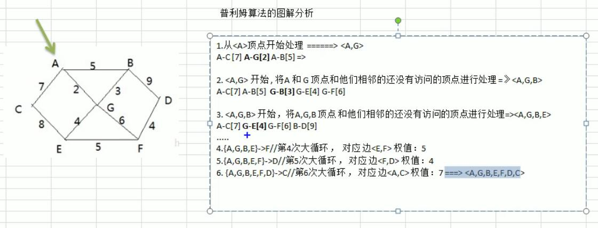

https://www.bilibili.com/video/av54029771

一共195集，目标45天，目前进度33

# 数据结构与算法

## 如何攻克算法

目标：这一次，彻底拿下数据结构与算法
精确一个领域：拆分知识点，对某个知识反复刻意练习，学习反馈和总结

+ 刻意练习 五毒神掌，至少五遍
+ 对弱点，缺陷反复练习

leetcode刷题，英文和中文先刷一遍

**第一遍**
+ 5分钟读题审题
+ 思考可能的解法
+ 每种可能的算法都写出来，比较每种解法的时空复杂度，
+ 最终选择最优的方法
+ 如果一个题目已经思考了30分钟还是毫无头绪，直接看解法，不要想一整天想破脑袋，算法是理解和运用的，不是发明创造的
+ 背诵和默好的解法

**第二遍**
  自己在IDE里面写

**第三遍**
  24小时后再去练习

**第4遍**
  一周后再练习

**第5遍**
   一个月后回顾

## 时间复杂度和空间复杂度
- **时间复杂度**
- **空间复杂度**

时间复杂度的全称是**渐进时间复杂度，表示算法的执行时间与数据规模之间的增长关系**。
类比一下，空间复杂度全称就是**渐进空间复杂度**，表示算法的存储空间与数据规模之间的增长关系。
#### 递归：主要分析出递归树

## 数组 链表 跳表

线性结构：数据元素之间存在一对一的线性关系，

有两种不同的存储方法：顺序存储结构和链式存储结构表，常见的数组，队列，栈，链表

非线性结构：多维数组，树，图	

### 数组

#### 稀疏数组

数组是一种线性表的数据结构，用**连续的内存空间**，来存储一组具有**相同类型**的数据, 正是因为这个两个限制，数组才有了杀手锏的特性： 数组支持随机访问，通过下标随机访问的时间复杂度是O(1)，但是插入，删除比较低效，平均时间复杂度O(n)

leetcode解析

- **`三数之和`**

```markdown
给定一个包含 n 个整数的数组nums，判断 nums 中是否存在三个元素 a，b，c ，使得 a + b + c = 0 ？找出有满足条件且不重复的三元组。

注意：答案中不可以包含重复的三元组。
给定数组 nums = [-1, 0, 1, 2, -1, -4]，满足要求的三元组集合为：
[
  [-1, 0, 1],
  [-1, -1, 2]
]
```
题解：
先排序，然后运用双指针
<!-- tabs:start -->
    
### **javascript**

```javascript
/**
 * @param {number[]} nums
 * @return {number[][]}
 */
var threeSum = function(nums) {
    if(!nums || nums.length  < 3) {
        return []
    }
    nums.sort((a, b) => a - b)
    let res = []
    let i = 0
    while(i < nums.length) {
        if(nums[i] > 0) break
        if(i > 0 && nums[i] === nums[i-1]) continue
        let l = i+1;
        let r = nums.length - 1
        while(l < r) {
           let sum = nums[i] + nums[l] + nums[r]
           if(sum === 0) {
             res.push([nums[i], nums[l], nums[l]])
             while(l < r && nums[l] === nums[l+1]) l++
             while(l < r && nums[r] === nums[r-1]) r--
             l++
             r--
           } else if(sum < 0) {
               l++
           } else {
               r--
           }
        }
        i++
    }
    return res
};

```

### **java**

```java
class Solution {
    public List<List<Integer>> threeSum(int[] nums) {
         List<List<Integer>> res = new ArrayList<>();
        if(nums == null || nums.length  < 3) {
            return res;
        }
        Arrays.sort(nums);
        int i = 0;
        while(i < nums.length) {
            if(nums[i] > 0) break;
            if(i > 0 && nums[i] == nums[i-1]) continue;
            int l = i+1;
            int r = nums.length - 1;
            while(l < r) {
               int sum = nums[i] + nums[l] + nums[r];
               if(sum == 0) {
                 res.add(Arrays.asList(nums[i], nums[l], nums[l]));
                 while( l < r && nums[l] == nums[l+1]) l++;
                 while( l < r && nums[r] == nums[r-1]) r--;
                 l++;
                 r--;
               } else if(sum < 0) {
                   l++;
               } else {
                   r--;
               }
            }
            i++;
        }
        return res;
    }
}
```
### **python**

```python
class Solution:
    def threeSum(self, nums: List[int]) -> List[List[int]]:
       res=[]
       if not nums or len(nums) < 3:
           return res
       i, n = 0, len(nums)
       nums.sort()
       for i in range(n):
           if nums[i] > 0:
               break
           if i > 0 and nums[i] == nums[i-1]:
               continue
           l = i+1
           r = n - 1
           while l < r:
               sum = nums[i] + nums[l] + nums[r]
               if sum == 0:
                   res.append([nums[i], nums[l], nums[r]])
                   while l < r and nums[l] == nums[l+1]:
                       l+=1
                   while l < r and nums[r] == nums[r-1]:
                       r-=1
                   l+=1
                   r-=1
               elif sum < 0:
                   l+=1
               else:
                   r-=1
       return res   
```

<!-- tabs:end -->

-**`合并两个有序数组`**


### 链表

链表是以节点的方式来存储

每个节点包含data域和next域，next指向下一个节点

节点在内存中不一定是连续存储的

#### 设计链表

1 单链表

```java
class ListNode {
    public int val;
    public ListNode next;
    Public ListNode(v) {
        val = v;
    }
}
class SLinkedList{
    int size;
    ListNode head;
    public SlinkedList() {
        size = 0;
        head = new ListNode(0);
    }
    public int getIndex(int val) {
        if(val < 0 && val >= size) {
            return -1;
        }
        ListNode curr = head.next;
        int index = 0;
        while(curr != null) {
            curr = curr.next;
            index++;
            if(index == val) {
                return
            }
        }
    }
    public void addAtHead(int val) {
        
    }
    public void addAtTail(int val) {
        
    }
    public void addAtIndex(int val) {
        
    }
    public void deleteAtIndex(int val) {
        
    }
    public void add(int val) {
        
    }
    public void remvoe(int val) {
        
    }
}
```


2 双链表

#### 合并两个有序链表

1 递归法

两个链表头部较小的一个与剩下元素的 merge 操作结果合并

```java
/**
 * Definition for singly-linked list.
 * public class ListNode {
 *     int val;
 *     ListNode next;
 *     ListNode(int x) { val = x; }
 * }
 */
class Solution {
    public ListNode mergeTwoLists(ListNode l1, ListNode l2) {
        if(l1 == null) {
            return l2;
        } else if(l2 == null) {
            return l1;
        } else if(l1.val < l2.val) {
            l1.next = mergeTwoLists(l1.next, l2);
            return l1;
        } else {
            l2.next = mergeTwoLista(l2.next, l1);
            return l2;
        }
    }
}
```


2 迭代法

```java
/**
 * Definition for singly-linked list.
 * public class ListNode {
 *     int val;
 *     ListNode next;
 *     ListNode(int x) { val = x; }
 * }
 */
class Solution {
    public ListNode mergeTwoLists(ListNode l1, ListNode l2) {
        if(l1 == null) {
            return l2;
        } 
        if(l2 == null) {
            return l1;
        }
        ListNode prevHead = new ListNode(0);
        ListNode prev = prevHead;
        while(l1 != null && l2 != null) {
            if(l1.val <l2.val) {
                prev.next = l1;
                l1 = l1.next;
            }else {
                prev.next = l2;
                l2 = l2.next;
            }
            prev = prev.next;
        }
        prev.next = l1 == null ? l2: l1;
        return prevHead.next;
    }
}
```


#### 单链表反转

1 递归

```java
public ListNode reverseList(ListNode head) {
    if(head== null || head.next == null) return head;
    ListNode p = reverseList(head.next);
    head.next.next = head;
    head.next = null;
    return p;
}
```


2 迭代

```java
public ListNode reverseList(ListNode head) {
    if(head == null || head.next == null) return head;
    ListNode prev = null;
    ListNode curr = head;
    while(curr != null) {
        ListNode nextTemp = curr.next;
        curr.next = prev;
        prev = curr;
        curr = nextTemp; 
    }
}
```


####  链表中环的检测

```java
public boolean isHasCircle(ListNode head) {
    ListNode dummy = new ListNode(0);
    if(head == null) {
        return false;
    }
    ListNode fast = head;
    ListNode slow = head;
    while(fast.next != null) {
        fast = fast.next.next;
        slow = slow.next;
        if(fast == slow) {
            return true;
        }
    }
    return false;
}
```


####  删除倒数第N个节点

```java
/**
 * Definition for singly-linked list.
 * public class ListNode {
 *     int val;
 *     ListNode next;
 *     ListNode(int x) { val = x; }
 * }
 */
class Solution {
    public ListNode removeNthFromEnd(ListNode head, int n) {
        ListNode dummy = new ListNode(0);
        ListNode fast = dummy.next;
        ListNode slow = dummy.next; // 倒数n-1个节点
        for(int i = 0; i < n + 1; i++) {
            fast = fast.next;
        }
        while(fast!= null) {
            fast = fast.next;
            slow = slow.next;
        }
        slow.next = slow.next.next;
        return dummy.next;
    }
}
```

####  查找中间节点

#### k个一组反转链表

1. 尾插法
   举例说明， k = 3

```markdown
pre    start
end
dummy->  1  ->  2  ->  3  ->  4

// end移到要翻转的部分最后一个元素
pre    
       start          end
dummy->  1  ->  2  ->  3  ->  4

// 尾插法的意思就是,依次把curr(prev.next)移到end后面
pre             end   start   
dummy->  2  ->   3  ->  1  ->  4


pre     end          start               
dummy->  3  ->  2  ->  1  ->  4
// 将pre, end移动到start的位置，开始下一轮翻转
.....
```

代码：

```javascript
function listNode(val) {
    this.val = val
    this.next = null
function reverseKGroup(head, k) {
    let dummy = new ListNode(-1)
    dummy.next = head
    let pre = dummy;
    let end = dummy
    while(true) {
        let count = 0;
        while(end != null && count < k) {
            end = end.next
            count++
        }
        if(end == null) break
        let start = pre.next
        while(pre.next != end) {
            let curr = pre.next // 本次要插入到end节点后面的节点
            pre.next = curr.next // pre连接到curr.next, curr游离出来
            curr.next = end.next // curr插入到end的后面
            end.next = curr // end连接到curr
        }
        // 移动到待翻转链表的前一个节点
        pre = start
        end = start
    }
    return dummy.next
}
```

2. 递归

   我无法理解

#### 约瑟夫问题

```
约瑟夫问题是个有名的问题：N个人围成一圈，从第一个开始报数，
第M个将被杀掉，最后剩下一个，其余人都将被杀掉。例如N=6，M=5，被杀掉的顺序是：5，4，6，2，3，1。
```

构建环形链表

```java
// 创建一个环形单向链表
class CircleSingleLinkedList {
    private Node first = null; // 第一个节点
    public void addNode(int nums) {
        if(nums < 1) {
            return;
        }
        // 辅助指针，帮助构建环形链表
        Node curr = null;
        for (int i = 1; i <= nums; i++) {
            Node node = new Node(i);
            if(i == 1) {
                first = node;
                first.setNext(first); // 构成环,自己指向自己
                curr = first;
            } else {
                curr.setNext(node);
                node.setNext(first); // 指向第一个节点
                curr = node; // 移动curr
            }
        }
    }
    // 遍历环形链表
    public void show() {
        // 判断非空
        if(first == null) {
            return;
        }
        Node curr = first;
        while(true) {
           System.out.println(curr.getNo());
           curr = curr.getNext();
           if(curr == first) {
               break;
           }
        }
    }
}
// 节点
class Node {
    private int no;
    private Node next;
    public Node(int no) {
        this.no = no;
    }
    public int getNo() {
        return no;
    }
    public void setNext(Node node) {
        next = node;
    }
    public Node getNext() {
        return next;
    }
}
```

根据输入，输出死人编号顺序


```java
 public void countKills(int startNo, int countNum, int nums) {
        if(first == null || startNo < 1 || startNo > nums) {
            return;
        }
        // 构造一个辅助节点，始终指向firs后面的节点
        Node helper = first;
        while(true) {
            if(helper.getNext() == first) {
                break;
            }
            helper = helper.getNext();
        }
        // 首先找到计数起点
        for (int i = 0; i < startNo - 1; i++) {
            first = first.getNext();
            helper = helper.getNext();
        }
        while(true) {
            // 说明圈中只有一个人
            if(helper == first) {
                System.out.println(first.getNo());
                break;
            }
            // first和helper移动 countNum- 1 次
            for (int i = 0; i < countNum - 1; i++) {
                first = first.getNext();
                helper = helper.getNext();
            }
            // 此时first指向要出圈的节点
            System.out.println(first.getNo());
            // first出圈
            first = first.getNext();
            helper.setNext(first);
        }
    }
```


### leetCode

- [x] [两个有序链表合并](https://leetcode-cn.com/problems/merge-two-sorted-lists/)
- [ ] [删除链表的倒数第N个节点](https://leetcode-cn.com/problems/remove-nth-node-from-end-of-list/)
- [ ] [设计链表](https://leetcode-cn.com/problems/design-linked-list/)
- [ ] https://leetcode-cn.com/problems/container-with-most-water/
- [x] https://leetcode-cn.com/problems/climbing-stairs/
- [x] [https://leetcode-cn.com/problems/3sum/ ](https://leetcode-cn.com/problems/3sum/)(高频老题）
- [x] https://leetcode-cn.com/problems/reverse-linked-list/
- [ ] https://leetcode-cn.com/problems/swap-nodes-in-pairs
- [x] https://leetcode-cn.com/problems/linked-list-cycle
- [x] https://leetcode-cn.com/problems/linked-list-cycle-ii
- [ ] [k个一组反转链表](https://leetcode-cn.com/problems/reverse-nodes-in-k-group/)
- [ ] https://leetcode-cn.com/problems/remove-duplicates-from-sorted-array/
- [ ] https://leetcode-cn.com/problems/rotate-array/
- [ ] https://leetcode-cn.com/problems/merge-two-sorted-lists/
- [ ] https://leetcode-cn.com/problems/merge-sorted-array/
- [x] https://leetcode-cn.com/problems/two-sum/
- [x] https://leetcode-cn.com/problems/move-zeroes/
- [ ] https://leetcode-cn.com/problems/plus-one/

### leetCode题解

#### 707

1. 单链表

```java

```


1. 双链表

## [4 栈 队列](/dataStructure-and-algorithm/栈-队列/栈-队列.md)

## 5 哈希表 映射 集合

哈希表: 查询，添加，删除 o(1)

### leetCode题目

- https://leetcode-cn.com/problems/valid-anagram/description/
- https://leetcode-cn.com/problems/group-anagrams/
- https://leetcode-cn.com/problems/two-sum/description/

## 6 树 二叉树 二叉搜索树

### 二叉搜索树

>二叉查找树（Binary Search Tree），（又：二叉搜索树，二叉排序树）它或者是一棵空树，或者是具有下列性质的二叉树： 若它的左子树不空，则左子树上所有结点的值均小于它的根结点的值； 若它的右子树不空，则右子树上所有结点的值均大于它的根结点的值； 它的左、右子树也分别为二叉排序树。

查询,插入，删除:o(logn)，极端情况下退化为链表，复杂度变成o(n)

用代码实现BST的构造，插入，删除，查询，前，中，后遍历

## 7 分治 递归 回溯

八皇后，数独

### 递归

递归是一种非常高效、简洁的编码技巧，一种应用非常广泛的算法，比如DFS深度优先搜索、前中后序二叉树遍历等都是使用递归

递归需要满足三个条件

1. 一个问题的解可以分解为多个子问题的解，何为子问题？子问题就是数据规模更小的问题
2. 这个问题与分解之后的子问题，除了数据规模不同，求解思路完全一样
3. 存在递归终止条件

题目(TODO : 最后两个)

+ [pow(x, n)](https://leetcode-cn.com/problems/powx-n/)
+ [子集](https://leetcode-cn.com/problems/subsets/)
+  [组合总和](https://leetcode-cn.com/problems/combination-sum/)
+  [组合总和 II](https://leetcode-cn.com/problems/combination-sum-ii/)
+ [全排列](https://leetcode-cn.com/problems/permutations/)
+  [全排列 II](https://leetcode-cn.com/problems/permutations-ii/)
+ [子集](https://leetcode-cn.com/problems/subsets/)
+ [子集 II](https://leetcode-cn.com/problems/subsets-ii/)
+ [众数](https://leetcode-cn.com/problems/majority-element-ii/)
+ [电话号码的字母组合](https://leetcode-cn.com/problems/letter-combinations-of-a-phone-number/)

#### 组合总和

>给定一个无重复元素的数组 candidates 和一个目标数 target ，找出 candidates 中所有可以使数字和为 target 的组合。
>
>candidates 中的数字可以无限制重复被选取。
>
>说明：
>
>所有数字（包括 target）都是正整数。
>解集不能包含重复的组合。 
>示例 1:
>
>输入: candidates = [2,3,6,7], target = 7,
>所求解集为:
>[
>  [7],
>  [2,2,3]
>]
>示例 2:
>
>输入: candidates = [2,3,5], target = 8,
>所求解集为:
>[
>  [2,2,2,2],
>  [2,3,3],
>  [3,5]
>]

第一种方法，做减法

```java
class Solution {
     public List<List<Integer>> combinationSum(int[] candidates, int target) {
        Arrays.sort(candidates);
		List<List<Integer>> res = new ArrayList<>();
        List<Integer> path = new ArrayList<>();
        dfs(0, target, path, res, candidates);
        return res;
    }
    public void dfs(int i, int target, List<Integer> path, List<List<Integer>> res, int[] candidates) {
        if(target == 0) {
            res.add(new ArrayList<>(path));
            return;
        }
        for(int k = i; k < candidates.length; k++) {
            if(candidates[k] > target) {
                break;
            }
            path.add(candidates[k]);
            dfs(k, target - candidates[k], path, res, candidates);
            path.remove(path.size() -1);
        }
    }
}
```

第二种方法，做加法

```java
class Solution {
     public List<List<Integer>> combinationSum(int[] candidates, int target) {
        Arrays.sort(candidates);
		List<List<Integer>> res = new ArrayList<>();
        List<Integer> path = new ArrayList<>();
        dfs(0, 0, target, path, res, candidates);
        return res;
    }
    public void dfs(int i,int current, int target, List<Integer> path, List<List<Integer>> res, int[] candidates) {
        if(target == current) {
            res.add(new ArrayList<>(path));
            return;
        }
        for(int k = i; k < candidates.length; k++) {
            if(candidates[k] > target - current) {
                break;
            }
            path.add(candidates[k]);
            dfs(k, current + candidates[k], target, path, res, candidates);
            path.remove(path.size() -1);
        }
    }
}
```

#### [78. 子集](https://leetcode-cn.com/problems/subsets/)

难度  中等

给定一组**不含重复元素**的整数数组 *nums*，返回该数组所有可能的子集（幂集）。

**说明：**解集不能包含重复的子集。

**示例:**

```
输入: nums = [1,2,3]
输出:
[
  [3],
  [1],
  [2],
  [1,2,3],
  [1,3],
  [2,3],
  [1,2],
  []
]
```

```java
class Solution {
    public List<List<Integer>> subsets(int[] nums) {
        List<List<Integer>> res = new ArrayList<>();
        List<Integer> path = new ArrayList<>();
        
    }
    public void dfs(int k, List path, List<List<Integer>> res, int[] nums) {
        if(k == nums.length) {
            res.add(new ArrayList<path>);
            return;
        }
        for(int i = k ; i <nums.length; i++) {
            dfs(i+1, path, res, nums);
            path.add(nums[i]);
            dfs(i+1, path, res,nums);
            path.remove(path.size()-1);
        }
    }
}
```


### 回溯


## 8 广度优先搜索 深度优先搜索

dfs:

+ 递归写法
  
+ 非递归写法


bfs:用队列来实现


题目：

## 图论

## 最小生成树

最小生成树（MST):

1. 给定一个带权无向联通图，如何选取一颗生成树，使树上所有边上权的总和为最小，这叫做最小生成树
2. N个顶点，一定有N-1条边
3. 包含全部顶点
4. N-1条边都在图中

最小生成树的两种算法-Prim算法和Krusal算法

### Prim算法

算法描述

1).输入：一个加权连通图，其中顶点集合为V，边集合为E；

2).初始化：Vnew = {x}，其中x为集合V中的任一节点（起始点），Enew = {},为空；

3).重复下列操作，直到Vnew = V：

a.在集合E中选取权值最小的边<u, v>，其中u为集合Vnew中的元素，而v不在Vnew[集合](https://baike.baidu.com/item/集合/2908132)当中，并且v∈V（如果存在有多条满足前述条件即具有相同权值的边，则可任意选取其中之一）；

b.将v加入集合Vnew中，将<u, v>边加入集合Enew中；

4).输出：使用集合Vnew和Enew来描述所得到的[最小生成树](https://baike.baidu.com/item/最小生成树)

算法分析



算法代码

<!-- tabs:start -->

### **java**

```java
package lesson;

import java.util.Arrays;

// prim算法
public class Prim {
    private static final int INF = Integer.MAX_VALUE;

    public static void main(String[] args) {
        int[] data = new int[]{0,1,2,3,4,5,6};// 7个顶点
        // 二维数组表示邻接矩阵，用来描述顶点相连的边的权重
        int[][] edges = new int[][]{
                {INF, 5, 7, INF, INF, INF, 2},
                {5, INF, INF, 9, INF, INF, 3},
                {7, INF, INF, INF, 8, INF, INF},
                {INF, 9, INF, INF, INF, 4, INF},
                {INF, INF, 8, INF, INF, 5, 4},
                {INF, INF, INF, 4, 5, INF, 6},
                {2, 3, INF, INF, 4, 6, INF}
        };
        prim(data, edges, 0);// 从第二个顶点开始
        System.out.println();
        prim2(data, edges,0);
    }

    /**
     * 时间复杂度O(n^3)
     * @param data   存放顶点数据
     * @param edges  邻接矩阵存储边的权重
     * @param s      算法开始顶点
     */
    public static void prim(int[] data, int[][] edges, int s) {
        int n = data.length;
        int[] visited = new int[n];
        visited[s] = 1;
        // 用h1和h2记录两个顶点的下标
        int h1 = -1;
        int h2 = -1;
        int minWeight = INF;
        for (int k = 1; k < n; k++) {
            // 确定这次生成的子图和哪个顶点的距离最近
            for (int i = 0; i < n; i++) { // i表示被访问过的节点
                for (int j = 0; j < n; j++) { // j表示未被访问过的节点
                    if (visited[i] == 1 && visited[j] == 0 && edges[i][j] < minWeight) {
                        minWeight = edges[i][j];
                        h1 = i;
                        h2 = j;
                    }
                }
            }
            System.out.println("边<" + data[h1] + "," + data[h2] + "> 权值:" + edges[h1][h2]);
            visited[h2] = 1;
            minWeight = INF;
        }
    }
    // 时间复杂度O(n^2)
    public static void prim2(int[] data, int[][] edges, int s)//普利姆算法（参数：邻接矩阵，起点（即第一个生成的点，可随便取））
    {
        int n = data.length;
        int[] dist = new int[n];
        int[] closest = new int[n];
        int i, min, j, k;

        //初始化closest数组，dist数组
        for (i = 0; i < n; i++)//赋初值，即将closest数组都赋为节点s，dist数组赋为节点s到各节点的权重
        {
            closest[i] = s;
            dist[i] = edges[s][i];// edges[s][i]的值指的是节点s到i节点的权重
        }
        dist[s] = 0; // 自己到自己的距离初始化为0，标记初始节点为已选节点

        // 开始生成其他的节点
        for (i = 1; i < n; i++) //接下来找剩下的v-1个节点
        {
            k = i;
            // 找到一个节点，该节点到已选节点中的某一个节点的权值是当前最小的
            min = INF;//INF表示正无穷（每查找一个节点，min都会重新更新为INF，以便获取当前最小权重的节点）
            for (j = 0; j < n; j++)//遍历所有节点
            {
                if (dist[j] != 0 && dist[j] < min)//若该节点还未被选且权值小于之前遍历所得到的最小值
                {
                    min = dist[j];//更新min的值
                    k = j;//记录当前最小权重的节点的编号
                }
            }

            //输出被连接节点与连接节点，以及它们的权值
            System.out.printf("边(%d,%d)权为:%d\n", closest[k], k, min);

            dist[k] = 0;//表明k节点已被选了(作标记)
            // 选中一个节点完成连接之后，数组做相应的调整
            // 更新dist数组，closest数组，以便生成下一个节点
            for (j = 0; j < n; j++) //遍历所有节点
            {
                /* if语句条件的说明：
                 * （1）k！=j，即跳过自身的节点
                 * （2）edges[k][j]是指刚被选的节点k到节点j的权重，dist[j]是指之前遍历的所有节点与j节点的最小权重。
                 *  若edges[k][j] < dist[j],则说明当前刚被选的节点k与节点j之间存在更小的权重，则需要更新
                 * （3）有人会问：为什么只跳过掉自身的节点（即k==j），而不跳过所有的已选节点？
                 * 当然我们可以在if语句条件中增加跳过所有的已选节点的条件（dist[j] == 0），
                 * 而在本程序中我们只跳过了自身的节点？（注意：我们假设图中的边的权值大于0）
                 * 但其实不是，edges[k][j] < dist[j]条件已包含跳过所有的已选节点，
                 * 原因是在邻接矩阵中权值为0是最小的，即edges[k][j]>0，而已选节点满足dist[j] == 0，
                 * 则已选节点j是不满足edges[k][j] < dist[j]，则会被跳过
                 */
                if (k != j && edges[k][j] < dist[j]) {
                    //更新dist数组，closest数组
                    dist[j] = edges[k][j];//更新权重，使其当前最小
                    closest[j] = k;//进入到该if语句里，说明刚选的节点k与当前节点j有更小的权重，则closest[j]的被连接节点需作修改为k
                }
            }
        }
    }

}


```

### **javascript**

```javascript

```

<!-- tabs:end -->

### Kruskal算法
算法描述：

```java
class Kruskal {
    
}
```


## 最短路径

有权图（有向或者无向），试用于路径规划

dijkstra算法

时间复杂度O(Elog(V)),不可以有负权重


## 9 二分查找

能够使用二分查找的前提

+ 单调性
+ 存在上下界
+ 能够通过索引访问

代码模板

```python
left, right = 0, len(array) - 1
while left <= right>:
    mid = (left + right) / 2
    if array[mid] == target:
        return
    elif array[mid] < right>:
        left = mid + 1
    else:
        right= mid -1 
```

题目：

+ https://leetcode-cn.com/problems/sqrtx/
+ https://leetcode-cn.com/problems/valid-perfect-square/
+ https://leetcode-cn.com/problems/search-in-rotated-sorted-array/
+ https://leetcode-cn.com/problems/search-a-2d-matrix/
+ https://leetcode-cn.com/problems/find-minimum-in-rotated-sorted-array/

## 10 贪心

>贪心算法（又称贪婪算法）是指，在对问题求解时，总是做出在当前看来是最好的选择。也就是说，不从整体最优上加以考虑，他所做出的是在某种意义上的局部最优解。
>贪心算法不是对所有问题都能得到整体最优解，关键是贪心策略的选择，选择的贪心策略必须具备无后效性，即某个状态以前的过程不会影响以后的状态，只与当前状态有关。 -百度百科

应用： 最小生成树，霍夫曼编码
硬币问题： 必须是倍数关系

### leetCode

- https://leetcode-cn.com/problems/lemonade-change/description/
- https://leetcode-cn.com/problems/best-time-to-buy-and-sell-stock-ii/description/
- https://leetcode-cn.com/problems/assign-cookies/description/
- https://leetcode-cn.com/problems/walking-robot-simulation/description/
- [https://leetcode-cn.com/problems/jump-game/ ](https://leetcode-cn.com/problems/jump-game/)、[ https://leetcode-cn.com/problems/jump-game-ii/](https://leetcode-cn.com/problems/jump-game-ii/)

## 11 动态规划(DP)

斐波那契数列

1. 递归法（自顶向下） 时间复杂度 o(2^n)
2. 备忘录 o(n)，空间复杂度O(n)
3. 动态规划（自底向上递推）

### leetCode

+ [爬楼梯](https://leetcode-cn.com/problems/climbing-stairs/)
+ [不同路径](https://leetcode-cn.com/problems/unique-paths/)
+ [打家劫舍](https://leetcode-cn.com/problems/house-robber/)
+ [最小路径和](https://leetcode-cn.com/problems/minimum-path-sum/)
+ [股票买卖](https://leetcode-cn.com/problems/best-time-to-buy-and-sell-stock/)

+ [使用最小花费爬楼梯](https://leetcode-cn.com/problems/min-cost-climbing-stairs/)
+ [编辑距离](https://leetcode-cn.com/problems/edit-distance/)
+ https://leetcode-cn.com/problems/longest-increasing-subsequence/
+ https://leetcode-cn.com/problems/decode-ways/
+ https://leetcode-cn.com/problems/longest-valid-parentheses/
+ https://leetcode-cn.com/problems/maximal-rectangle/
+ https://leetcode-cn.com/problems/distinct-subsequences/
+ https://leetcode-cn.com/problems/race-car/

## 12 字典树（Trie) 并查集

### 字典树

要求 实现一个Trie树

leetCode:

+ [208 实现 Trie (前缀树)](https://leetcode-cn.com/problems/implement-trie-prefix-tree/)
+ [单词搜索](https://leetcode-cn.com/problems/word-search-ii/)

+ [211. 添加与搜索单词 - 数据结构设计](https://leetcode-cn.com/problems/add-and-search-word-data-structure-design/)

### 并查集

并查集是一种数据结构，它的主要用途有以下几点：

+ 检查多个相连且无方向无权值的点是否存在环
+ 检查多个相连且无方向无权值的点中有多少集合
  
  

### leetCode

+ [朋友圈问题](https://leetcode-cn.com/problems/friend-circles/solution/peng-you-quan-by-leetcode/)
+ [200岛屿问题]()

## 14 高级搜索

## 15 AVL树和红黑树

保证二维维度

平衡二叉树

> 它是一棵空树或它的左右两个子树的高度差的绝对值不超过1，并且左右两个子树都是一棵平衡二叉树。平衡二叉树的常用实现方法有红黑树、AVL、替罪羊树、Treap、伸展树等

旋转操作

1. 右右子树 - 左旋 


2. 左左子树 - 右旋

3. 左右子树 - 左右旋


4. 右左子树 - 右左旋


红黑树


## 16 位运算

位运算的运用


题目：

+ [191 位1的个数](https://leetcode-cn.com/problems/number-of-1-bits/)

## 17 布隆过滤器和LRU缓存

实现一个LRU缓存

题目：

+ [146. LRU缓存机制](https://leetcode-cn.com/problems/lru-cache/)

java

```java
import java.util.HashMap;
import java.util.Map;

public class LRU {
    private class Node {
        int key;
        int val;
        Node prev;
        Node next;
        public Node(int key, int val) {
            this.key = key;
            this.val = val;
        }
    }
    private int capacity;
    private Map<Integer, Node> map;
    private Node head;
    private Node tail;
    public LRU(int capacity) {
        this.capacity = capacity;
        map = new HashMap<>();
        head = new Node(-1, -1);
        tail = new Node(-1, -1);
        head.next = tail;
        tail.prev = head;
    }

    public int get(int key) {
        if(!map.containsKey(key)) {
            return -1;
        }
        Node node = map.get(key);
        node.prev.next = node.next;
        node.next.prev = node.prev;
        appendToTail(node);
        return node.val;
    }

    public void put(int key, int value) {
        if(get(key) != -1) {
            map.get(key).val = value;
            return;
        }
        Node node = new Node(key, value);
        appendToTail(node);
        map.put(key, node);
        if(map.size() > capacity) {
            map.remove(head.next.key);
            head.next = head.next.next;
            head.next.prev = head;
        }
    }
    private void appendToTail(Node node) {
        node.next = tail;
        node.prev = tail.prev;
        tail.prev.next = node;
        tail.prev = node;
    }

}
```


## 18 排序算法

#### 参考链接

- [十大经典排序算法](https://www.cnblogs.com/onepixel/p/7674659.html)
- [快速排序代码示例](https://shimo.im/docs/98KjvGwwGpTpYGKy/)
- [归并排序代码示例](https://shimo.im/docs/YqgG6vtdKwkXJkWx/)
- [堆排序代码示例](https://shimo.im/docs/6kRVHRphpgjHgCtx/)

- [十大经典排序算法](https://www.cnblogs.com/onepixel/p/7674659.html)
- [9 种经典排序算法可视化动画](https://www.bilibili.com/video/av25136272)
- [6 分钟看完 15 种排序算法动画展示](https://www.bilibili.com/video/av63851336)


### 1. 冒泡排序

#### 1.1 动画演示


#### 1.2 代码实现

javascript

```javascript
function bubbleSort(arr) {
      for(let i = 0; i < arr.length -1; i++) { // 外循环表示趟数 arr.length - 1次
            for(let j = 0; j < arr.length - i - 1; j++) { //内循环为每趟比较的次数，第i趟比较len-i次 
                if(arr[j] > arr[j+1]) {
                    let temp = arr[j+1];
                    arr[j+1] = arr[j];
                    arr[j] = temp;
                }
            }
        }
}
```

java

```java
class BubbleSort {
    public static void bubbleSort(int[] arr) {
        for(int i = 0; i < arr.length -1; i++) {
            for(int j = 0; j < arr.length - i - 1; j++) {
                if(arr[j] > arr[j+1]) {
                    int temp = arr[j+1];
                    arr[j+1] = arr[j];
                    arr[j] = temp;
                }
            }
        }
    }
}
```

python

```python
def bubbleSort(arr):
    n = len(arr)
    for i in range(n-1):
        for j in range(n-i-1):
            if arr[j] > arr [j+1]:
                arr[j], arr[j+1] = arr[j+1], arr[j]
        
```

问题：数据的顺序排好之后，冒泡算法仍然会继续进行下一轮的比较，直到arr.length-1次，后面的比较没有意义的。

改进：设置标志位flag，如果发生了交换flag设置为true；如果没有交换就设置为false。　这样当一轮比较结束后如果flag仍为false，即：这一轮没有发生交换，说明数据的顺序已经排好，没有必要继续进行下去。

以Java为例

```java
public static void bubbleSort(int[] arr) {
    for(int i = 0; i < arr.length -1; i++) {
        boolean flag = false;
        for(int j = arr.length - 1; j > i; j--) {
            if(arr[j] > arr[j-1]) {
                flag = true;
                int temp = arr[j];
                arr[j] = arr[j-1];
                arr[j-1] = temp;
            }
        }
        if(!flag) {
            break;
        }
    }
}

```

### 2. 选择排序

>选择排序是一种简单直观的排序算法。它的工作原理是：第一次从待排序的数据元素中选出最小（或最大）的一个元素，存放在序列的起始位置，然后再从剩余的未排序元素中寻找到最小（大）元素，然后放到已排序的序列的末尾。以此类推，直到全部待排序的数据元素的个数为零。选择排序是不稳定的排序方法。

```java
class SelectionSort{
    public static void selectionSort(int[] arr) {
        int minIndex = 0;
        for(int i = 0; i < arr.length - 1; i++) {
            minIndex = i;
            for(int j = i + 1; j < arr.length; j++) {
                if(arr[j] < arr[minIndex]) {
                    minIndex = j;
                }
            }
            if (minIndex != i) {
               int tmp = arr[minIndex];
               arr[minIndex] = arr[i];
               arr[i] = tmp;
            }             
        }
    }
}
```

```javascript
function selectionSort(arr) {
    for(let i = 0; i < arr.length - 1; i++) {
        let minIndex = i;
        for(let j = i+1;j < arr.length; j++) {
            if(arr[j] < arr[minIndex]) {
                minIndex = j;
            }
        }
        if(i !== minIndex) {
            arr[i] = arr[minIndex];
            arr[minIndex] = arr[i];
            arr[i] = tmp;
            
        }
    }
}
```

### 3. 插入排序

```java
class InsertSort{
    public static void insertSort(int[] arr) {
        for(int i = 1; i < arr.length; i++) {
            for(int j = i; j>0 && arr[j] > arr[j-1];j--) {
                int temp = arr[j+1];
                arr[j+1] = arr[j];
                arr[j] = temp;
            }
        }
    }
}
```

```javascript
function insertSort(arr) {
    // arr[0, i-1]有序，arr[i， n-1]无序
    for(let i = 1; i < arr.length; i++) {
        // 寻找arr[i]合适的插入位置，最多考察到j=1，也就是j=0
        for(let j = i; j > 0; j--) {
            if(arr[j] < arr[j-1]) {
                let temp = arr[j-1];
                arr[j-1] = arr[j];
                arr[j] = temp;
            } else {
                break;
            }
        }
    }
}
```

问题： 减少交换次数，只需要找到位置即可，不需要每次都交换
改进

```javascript
function insertSort2(arr) {
    // arr[0, i-1]有序，arr[i， n-1]无序
    for(let i = 1; i < arr.length; i++) {
        let e = arr[i];
        let j; //j 保存元素e应该插入的位置
        for(j = i; j > 0 && arr[j-1] > e; j--) {
            arr[j] = arr[j-1];
        }
        arr[j] = e;
    }
}
```

### 4. 归并排序

```java
public class MergeSort{
    public static void mergeSort(int[] arr, int l , int r) {
        if(l <= r) {
            int mid = (l + r) >> 1;
            mergeSor(arr, l, mid);
            mergeSor(arr, mid+1, r);
            merge(arr, l, mid, r);
    }
    private static void merge(arr, l, mid, r) {
        int[] temp = new int[r - l + 1];
        int k = 0;
        int i = l;
        int j = mid + 1;
        while(i <= mid && j <= r) {
          temp[k++] = arr[i] < arr[j] ? arr[i++]: arr[j++];  
        }
        while(i <= mid) {
            temp[k++] = arr[i++];
        }
        while(j <= r) {
            temp[k++] = arr[j++];
        }
        for(int p = 0; p < temp.length; p++) {
            arr[l+p] = temp[p];
        }
    }
}
```

### 5. 快速排序

```java
public class QuickSort {
    public static void quickSort(int[] arr) {
        
    }
    private int partition(int[] arr, int l, in r) {
        
    }
}
```

### 6. 堆排序

首先需要构造一个堆

### 7. 计数排序

>计数排序是一个非基于比较的[排序算法](https://baike.baidu.com/item/排序算法/5399605)，该算法于1954年由 Harold H. Seward 提出。它的优势在于在对一定范围内的整数排序时，它的复杂度为Ο(n+k)（其中k是整数的范围），快于任何比较排序算法。 [1] 当然这是一种牺牲空间换取时间的做法，而且当O(k)>O(n*log(n))的时候其效率反而不如基于比较的排序（基于比较的排序的时间复杂度在理论上的下限是O(n*log(n)), 如归并排序，堆排序）

## 19 字符串

### 字符串匹配算法

##### 暴力匹配算法

##### Rabin-karp


```typescript
class KMP {
     static indexPositions(str: string, pattern: string): number[] {
        let j = 0;
        let next: number[] = KMP.getNext(pattern)
        let positions: number[] = []
        for(let i = 0; i < str.length; i++) {
            if(j > 0 && pattern[j] !== str[i]) {
                j = next[j-1]
            }
            if(pattern[j] === pattern[i]) {
                j++
            }
            if(j === pattern.length) {
                positions.push(i - j + 1)
                j = 0
            }
        }
        return positions
    }
     static index(str: string, pattern: string): number {
            let j = 0;
            let next: number[] = KMP.getNext(pattern)
            for(let i = 0; i < str.length; i++) {
                if(j > 0 && pattern[j] !== str[i]) {
                    j = next[j-1]
                }
                if(pattern[j] === pattern[i]) {
                    j++
                }
                if(j === pattern.length) {
                   return i - j + 1
                }
            }
        }
    private static getNext(pattern: string): number[] {
        let n: number = pattern.length
        let count: number = 0
        let next:number[] = Array.from({length:pattern.length}).fill(0)
        for(let i = 1; i < n;i++) {
            while(count > 0 && pattern[i] !== pattern[count]) {
                count = next[count-1]
            }
            if(pattern[i] === pattern[count]) {
                count++
            }
            next[i] = count
        }
        return next
    }
}

```

```javascript
function KMP(str, pattern) {
    function _getNext(pattern) {
         let n= pattern.length
         let count = 0
         let next= Array.from({length:pattern.length}).fill(0)
         for(let i = 1; i < n;i++) {
             while(count > 0 && pattern[i] !== pattern[count]) {
                 count = next[count-1]
             }
             if(pattern[i] === pattern[count]) {
                 count++
             }
             next[i] = count
         }
         return next
    }
    function index(str, pattern) {
        let next = _getNext(pattern)
        let j = 0
        for(let i = 0; i < str.length; i++) {
            while(j > 0 && pattern[j] !== str[i]) {
                j = next[j-1]
            }
        }
        if(pattern[j] === str[i]) {
            j++
        }
        if(j === pattern.length) {
            return i - j + 1
        }
    }
    function indexPositions(str,pattern) {
            let j = 0
            let next = KMP.getNext(pattern)
            let positions= []
            for(let i = 0; i < str.length; i++) {
                if(j > 0 && pattern[j] !== str[i]) {
                    j = next[j-1]
                }
                if(pattern[j] === pattern[i]) {
                    j++
                }
                if(j === pattern.length) {
                    positions.push(i - j + 1)
                    j = 0
                }
            }
            return positions
        }
    return {
        index,
    }
    
}

```

```


## 需要强化

DFS, BFS, DP


```
