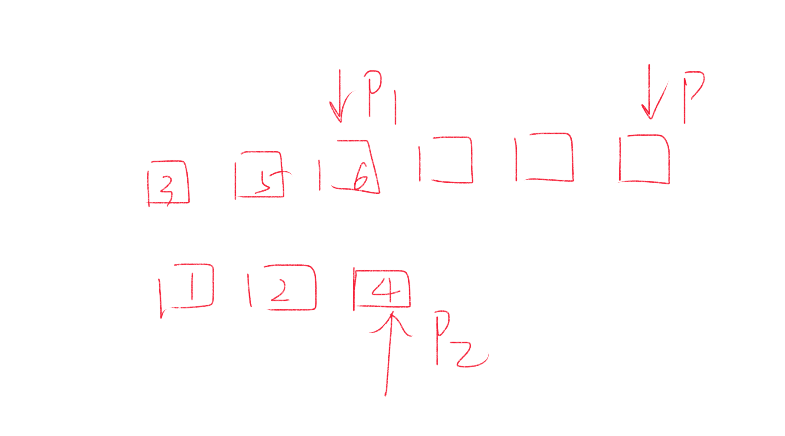

### 稀疏数组

数组是一种线性表的数据结构，用**连续的内存空间**，来存储一组具有**相同类型**的数据, 正是因为这个两个限制，数组才有了杀手锏的特性： 数组支持随机访问，通过下标随机访问的时间复杂度是O(1)，但是插入，删除比较低效，平均时间复杂度O(n)

leetcode解析

### 三数之和

```markdown
给定一个包含 n 个整数的数组nums，判断 nums 中是否存在三个元素 a，b，c ，使得 a + b + c = 0 ？找出有满足条件且不重复的三元组。

注意：答案中不可以包含重复的三元组。
给定数组 nums = [-1, 0, 1, 2, -1, -4]，满足要求的三元组集合为：
[
  [-1, 0, 1],
  [-1, -1, 2]
]
```

<!-- tabs:start -->

### **java**

```java
  class Solution {
      public List<List<Integer>> threeSum(int[] nums) {
           List<List<Integer>> res = new ArrayList<>();
          if(nums == null || nums.length  < 3) {
              return res;
          }
          Arrays.sort(nums);
          int i = 0;
          while(i < nums.length) {
              if(nums[i] > 0) break;
              if(i > 0 && nums[i] == nums[i-1]) continue;
              int l = i+1;
              int r = nums.length - 1;
              while(l < r) {
                 int sum = nums[i] + nums[l] + nums[r];
                 if(sum == 0) {
                   res.add(Arrays.asList(nums[i], nums[l], nums[l]));
                   while( l < r && nums[l] == nums[l+1]) l++;
                   while( l < r && nums[r] == nums[r-1]) r--;
                   l++;
                   r--;
                 } else if(sum < 0) {
                     l++;
                 } else {
                     r--;
                 }
              }
              i++;
          }
          return res;
      }
  }
```

### **javascript**

```javascript
/**
 * @param {number[]} nums
 * @return {number[][]}
 */
var threeSum = function(nums) {
    if(!nums || nums.length  < 3) {
        return []
    }
    nums.sort((a, b) => a - b)
    let res = []
    let i = 0
    while(i < nums.length) {
        if(nums[i] > 0) break
        if(i > 0 && nums[i] === nums[i-1]) continue
        let l = i+1;
        let r = nums.length - 1
        while(l < r) {
           let sum = nums[i] + nums[l] + nums[r]
           if(sum === 0) {
             res.push([nums[i], nums[l], nums[l]])
             while(l < r && nums[l] === nums[l+1]) l++
             while(l < r && nums[r] === nums[r-1]) r--
             l++
             r--
           } else if(sum < 0) {
               l++
           } else {
               r--
           }
        }
        i++
    }
    return res
};

```


### **python**

```python
class Solution:
    def threeSum(self, nums: List[int]) -> List[List[int]]:
       res=[]
       if not nums or len(nums) < 3:
           return res
       i, n = 0, len(nums)
       nums.sort()
       for i in range(n):
           if nums[i] > 0:
               break
           if i > 0 and nums[i] == nums[i-1]:
               continue
           l = i+1
           r = n - 1
           while l < r:
               sum = nums[i] + nums[l] + nums[r]
               if sum == 0:
                   res.append([nums[i], nums[l], nums[r]])
                   while l < r and nums[l] == nums[l+1]:
                       l+=1
                   while l < r and nums[r] == nums[r-1]:
                       r-=1
                   l+=1
                   r-=1
               elif sum < 0:
                   l+=1
               else:
                   r-=1
       return res   
```

<!-- tabs:end -->

-**`合并两个有序数组`**

```
给你两个有序整数数组 nums1 和 nums2，请你将 nums2 合并到 nums1 中，使 nums1 成为一个有序数组。
说明:
初始化 nums1 和 nums2 的元素数量分别为 m 和 n 。
你可以假设 nums1 有足够的空间（空间大小大于或等于 m + n）来保存 nums2 中的元素。 
示例:
输入:
nums1 = [1,2,3,0,0,0], m = 3
nums2 = [2,5,6],       n = 3
输出: [1,2,2,3,5,6]
```
题解：
先排序，然后运用双指针


<!-- tabs:start -->

### **java**
```java
class Solution {
    public void merge(int[] nums1, int m, int[] nums2, int n) {
		int p1 = m - 1;
        int p2 = n - 1;
        int p = m + n -1;
        while(p1 >=0 && p2>=0) {
             nums1[p--] = nums1[p1] > nums2[p2] ? nums1[p1--]: nums2[p2--];
        }
        // 表示将nums2数组从下标0位置开始，拷贝到nums1数组中，从下标0位置开始，长度为p2+1
        System.arraycopy(nums2, 0, nums1, 0, p2 + 1);
    }
}
```
### **javascript**
```javascript
/**
 * @param {number[]} nums1
 * @param {number} m
 * @param {number[]} nums2
 * @param {number} n
 * @return {void} Do not return anything, modify nums1 in-place instead.
 */
var merge = function(nums1, m, nums2, n) {
    var p1 = m-1;
    var p2 = n - 1;
    var p = m + n -1;
    while(p1 >=0 && p2 >=0) {
        nums1[p--] = nums1[p1]>nums2[p2] ? nums1[p1--]:nums2[p2--];
    }
    var arrayCopy = function(source, sourceIndex, target, targetIndex,length) {
        target.splice(targetIndex,length, ...source.slice(sourceIndex,sourceIndex + length))
    }
    arrayCopy(nums2,0, nums1,0, p2+1)
};
```
<!-- tabs:end -->

### 移动零
```
给定一个数组 nums，编写一个函数将所有 0 移动到数组的末尾，同时保持非零元素的相对顺序。

示例:

输入: [0,1,0,3,12]
输出: [1,3,12,0,0]
说明:

必须在原数组上操作，不能拷贝额外的数组。
尽量减少操作次数。

```
<!-- tabs:start -->
### **java**
```java
// version1
class Solution {
    public void moveZeroes(int[] nums) {
       int j = 0;
       for(int i = 0; i < nums.length;i++) {
          if(nums[i] != 0) {
            nums[j++] = nums[i];
          }  
       }
       while(j < nums.length) {
            nums[j++] = 0;
       }
    }
}
// version2
class Solution {
    public void moveZeroes(int[] nums) {
       int j = 0;
       for(int i = 0; i < nums.length;i++) {
          if(nums[i] != 0) {
            if(i > j) {
                nums[j] = nums[i];
                nums[i] = 0;  
            }
            j++;
          }  
       }
    }
}
```
### **javascript**
```javascript

```
<!-- tabs:end -->
