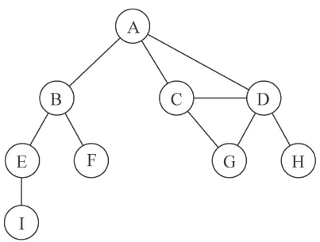
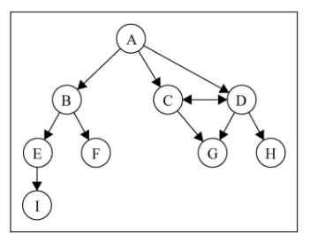
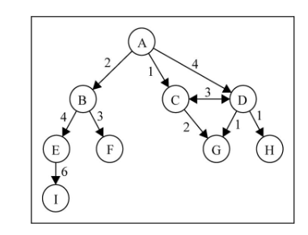
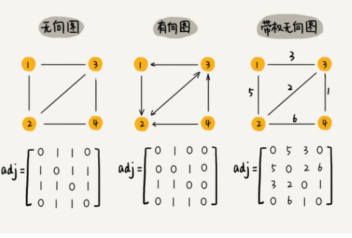
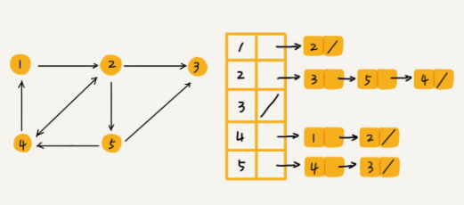
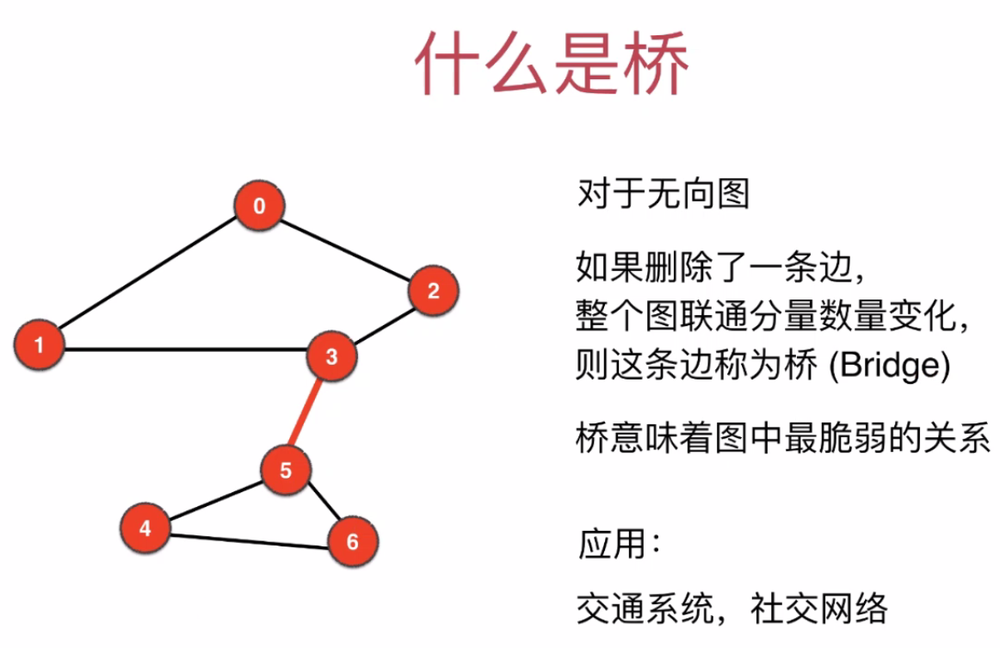

# 图

图的相关问题：图的表示，图的遍历，深度优先搜索，广度优先搜索，最小生成树，最短路径

图的分类： 有权图，无权图，有向图，无向图

## 图的基本概念

图是一组由**边**连接的**节点**（或**顶点**）。

任何社交网络，例如微博，微信，都可以用图来表示。

我们还可以使用图来表示道路、航班以及通信状态

一个图*G* = (*V*, *E* )由以下元素组成。

- *V*：一组顶点

- *E*：一组边，连接*V* 中的顶点


 
由一条边连接在一起的顶点称为**相邻顶点**。比如，A和B是相邻的，A和E不是相邻的。

一个顶点的**度**是其相邻顶点的数量。比如，A和其他三个顶点相连接，因此，A的度为3；E和其他两个顶点相连，因此，E的度为2。

**路径**是顶点*v*1, *v*2,…,*vk*的一个连续序列，以上图为例，其中包含路径A B E I和A C D G。

如果图中不存在环，则称该图是**无环的**。如果图中每两个顶点间都存在路径，则该图是**连通的**

## 图的分类
#### 有向图和无向图

图可以是**无向的**（边没有方向）或是**有向的**（有向图）。下图为有向图：



如果图中每两个顶点间在双向上都存在路径，则该图是**强连通的**。例如，C和D是强连通的，而A和B不是强连通的。

#### 有权图和无权图

图还可以是**未加权的**或是**加权的**。如下图所示，有权图的边被赋予了权重值：



## 图的表示

第一种方法： 邻接矩阵



如果是稀疏图，这种表示方法就很浪费内存了，这种空间复杂度是O(V*V),  其实现实生活中基本都是稀疏图。所以我们一般用邻接表来表示

第二种方法： 邻接表



邻接矩阵存储方法的缺点是比较浪费空间，但是优点是查询效率高，而且方便矩阵运算。邻接表存储方法中每个顶点都对应一个链表，存储与其相连接的其他顶点。尽管邻接表的存储方式比较节省存储空间，但链表不方便查找，所以查询效率没有邻接矩阵存储方式高。针对这个问题，邻接表还有改进升级版，即将链表换成更加高效的动态数据结构，比如平衡二叉查找树、跳表、散列表等

#### 图的代码表示

无权无向图

```java
public class Graph {
    private int v;
    private Map<Integer, List<Integer>> adj;

    public Graph(int v) {
        this.v = v;
        adj = new HashMap<>(v); // 邻接表
        for (int i = 0; i < v; i++) {
            adj.put(i, new LinkedList<>());
        }
    }

    public void addEdge(int s, int e) {
        if (validateV(s) && validateV(e)) {
            adj.get(s).add(e);
            adj.get(e).add(s);
        }

    }
}
```

## 图的遍历

### DFS

#### 深度优先遍历DFS及运用

应用：求联通分量，判断两点是否联通，求一个顶点到另外一个顶点的路径，无向图中的环检测, 二分图的检测

```java
import java.util.*;

public class Graph {
    private int v;
    private Map<Integer, List<Integer>> adj;

    public Graph(int v) {
        this.v = v;
        adj = new HashMap<>(v); // 邻接表
        for (int i = 0; i < v; i++) {
            adj.put(i, new LinkedList<>());
        }
    }

    public void addEdge(int s, int e) {
        if (validateV(s) && validateV(e)) {
            adj.get(s).add(e);
            adj.get(e).add(s);
        }

    }

    // 验证定点是否有效
    public boolean validateV(int s) {
        if (s < 0 || s >= v) {
            throw new RuntimeException("unValid vertex");
        }
        return true;
    }

    // 遍历这个图
    public void dfsGraph() {
        int[] visited = new int[v];
        for (int i = 0; i < v; i++) {
            visited[i] = -1;
        }
        int ccid = 0; // 联通分量的个数
        for (int i = 0; i < v; i++) {
            if (visited[i] == -1) {
                dfs(i, visited, ccid);
                ccid++;
            }
        }
        //visited有两个功能，一是避免重复遍历， 二是存储定点的联通分量标记
        for (int i = 0; i < v; i++) {
            System.out.println(visited[i]);
        }
    }

    private void dfs(int i, int[] visited, int ccid) {
        visited[i] = ccid;
        List<Integer> list = adj.get(i);
        for (int v : list) {
            if (visited[v] == -1) {
                dfs(v, visited, ccid);
            }
        }
    }

    // 判断两个顶点是否相连，也就是在一个联通分量中
    public boolean isConnected(int s, int t) {
        if (!validateV(s) || !validateV(t)) {
            return false;
        }
        boolean[] visited = new boolean[v];
        for (int i = 0; i < v; i++) {
            visited[i] = false;
        }
        return dfs(s, t, visited);
    }

    private boolean dfs(int s, int t, boolean[] visited) {
        visited[s] = true;
        if (s == t) return true; // 找到目标就不再遍历
        List<Integer> list = adj.get(s);
        for (int v : list) {
            if (!visited[v]) {
                if (dfs(v, t, visited)) {
                    return true;
                }
            }
        }
        return false;
    }

    // 一个顶点到另外一个顶点的路径
    public List<Integer> path(int s, int t) {
        List<Integer> res = new ArrayList<>();
        if (!isConnected(s, t)) return res;
        int[] pre = new int[v];
        for (int i = 0; i < v; i++) {
            pre[i] = -1;
        }
        dfs(s, s, t, pre);
        // 从目标到源点
        int curr = t;
        while (curr != s) {
            res.add(curr);
            curr = pre[curr];
        }
        res.add(curr);
        Collections.reverse(res);
        return res;
    }

    // pre储存每个顶点的上一个顶点，同时也可以作为是否顶点是否遍历的判断条件
    private void dfs(int s, int parent, int t, int[] pre) {
        pre[s] = parent;
        if (s == t) {
            return;
        }
        List<Integer> list = adj.get(s);
        for (int v : list) {
            if (pre[v] == -1) {
                dfs(v, s, t, pre);
            }
        }
    }

    // 无向图中的环检测
    public boolean isHasCircle() {
        boolean[] visited = new boolean[v];
        for (int i = 0; i < v; i++) {
            visited[i] = false;
        }
        for (int i = 0; i < v; i++) {
            if (!visited[i]) {
                if (dfs(visited, i, i)) {
                    return true;
                }
            }
        }
        return false;
    }

    private boolean dfs(boolean[] visited, int s, int parent) {
        visited[s] = true;
        for (int v : adj.get(s)) {
            if (!visited[v]) {
                if (dfs(visited, v, s)) {
                    return true;
                }
                // 如果v被访问过, 而且不是当前访问节点的上一个节点
            } else if (v != parent) {
                return true;
            }
        }
        return false;
    }

    // 检测二分图，二分图可以分成两部分，每一条边均连接不同部分的顶点
    public boolean isBiGraph() {
        boolean[] visited = new boolean[v];
        int[] colors = new int[v];
        for (int i = 0; i < v; i++) {
            visited[i] = false;
            colors[i] = -1;
        }
        for (int i = 0; i < v; i++) {
            if (!visited[i]) {
                if (!dfs(i, 0, visited, colors)) {
                    return false;
                }
            }
        }
        return true;
    }

    private boolean dfs(int s, int color, boolean[] visited, int[] colors) {
        visited[s] = true;
        colors[s] = color;
        for (int v : adj.get(s)) {
            if (!visited[v]) {
                return dfs(v, 1 - color, visited, colors);
                // 如果边两端颜色相同，那么就不是二分图
            } else if (colors[v] == color) {
                return false;
            }
        }
        return true;
    }
}

```

### BFS

#### 广度优先遍历BFS及运用

```java []
package com.graph;

import java.util.*;

public class GraphBFS {
    private int v;
    private Map<Integer, List<Integer>> adj;

    public GraphBFS(int v) {
        this.v = v;
        adj = new HashMap<>(v); // 邻接表
        for (int i = 0; i < v; i++) {
            adj.put(i, new LinkedList<>());
        }
    }

    public void addEdge(int s, int e) {
        if (validateV(s) && validateV(e)) {
            adj.get(s).add(e);
            adj.get(e).add(s);
        }

    }

    // 验证顶点是否有效
    public boolean validateV(int s) {
        if (s < 0 || s >= v) {
            throw new RuntimeException("unValid vertex");
        }
        return true;
    }

    // 遍历整个图 时间复杂度 O(V + E)
    public void bfsGraph() {
        List<Integer> path = new ArrayList<>(v);
        int[] visited = new int[v];
        for (int i = 0; i < v; i++) {
            visited[i] = -1;
        }
        int ccid = 0;
        // 图可能有多个联通分量, 这里的处理和DFS相似
        for (int i = 0; i < v; i++) {
            if (visited[i] == -1) {
                bfs(i, visited, ccid);
                ccid++;
            }
        }
        for (int i = 0; i < v; i++) {
            System.out.println(visited[i]);
        }
    }

    private void bfs(int s, int[] visited, int ccid) {
        Queue<Integer> queue = new LinkedList<>();
        queue.add(s);
        visited[s] = ccid;
        while (!queue.isEmpty()) {
            int e = queue.poll(); // 取出队头元素
            for (int w : adj.get(e)) {
                if (visited[w] == -1) {
                    // 入队
                    queue.add(w);
                    // 标记为已访问，避免重复入队，每个顶点只入队，出队一次
                    visited[w] = ccid;
                }
            }
        }
    }

    // 判断两个顶点是否相连，也就是在一个联通分量中
    public boolean isConnected(int s, int t) {
        if (!validateV(s) || !validateV(t)) {
            return false;
        }
        boolean[] visited = new boolean[v];
        Queue<Integer> queue = new LinkedList<>();
        queue.add(s);
        visited[s] = true;
        while (!queue.isEmpty()) {
            int e = queue.poll(); // 取出队头元素
            if (e == t) {
                return true;
            }
            for (int w : adj.get(e)) {
                if (!visited[w]) {
                    // 入队
                    queue.add(w);
                    // 标记为已访问，避免重复入队，每个顶点只入队，出队一次
                    visited[w] = true;
                }
            }
        }
        return false;
    }

    // 使用BFS求单源路径
    public List<Integer> singleSourcePath(int s, int t) {
        List<Integer> res = new ArrayList<>();
        if (!isConnected(s, t)) return res;
        int[] pre = new int[v];
        boolean[] visited = new boolean[v];
        Queue<Integer> queue = new LinkedList<>();
        queue.add(s);
        visited[s] = true;
        pre[s] = s;
        while (!queue.isEmpty()) {
            int e = queue.poll(); // 取出队头元素
            if (e == t) {
                break;
            }
            for (int w : adj.get(e)) {
                if (!visited[w]) {
                    // 入队
                    queue.add(w);
                    // 标记为已访问，避免重复入队，每个顶点只入队，出队一次
                    visited[w] = true;
                    pre[w] = e;
                }
            }
        }
        int curr = t;
        while (curr != s) {
            res.add(curr);
            curr = pre[curr];
        }
        res.add(curr);
        Collections.reverse(res);
        return res;
    }

    public boolean isHasCircle() {
        boolean[] visited = new boolean[v];
        for (int i = 0; i < v; i++) {
            visited[i] = false;
        }
        for (int i = 0; i < v; i++) {
            if (!visited[i]) {
                if (bfs(visited, i, i)) {
                    return true;
                }
            }
        }
        return false;
    }

    private boolean bfs(boolean[] visited, int s, int parent) {
        Queue<Integer> queue = new LinkedList<>();
        queue.add(s);
        visited[s] = true;
        while (!queue.isEmpty()) {
            int e = queue.poll(); // 取出队头元素
            for (int w : adj.get(e)) {
                if (!visited[w]) {
                    // 入队
                    queue.add(w);
                    // 标记为已访问，避免重复入队，每个顶点只入队，出队一次
                    visited[w] = true;
                } else if (w != parent) {
                    return true;
                }
            }
        }
        return false;
    }

    // 检测二分图，二分图可以分成两部分，每一条边均连接不同部分的顶点
    public boolean isBiGraph() {
        boolean[] visited = new boolean[v];
        int[] colors = new int[v];
        for (int i = 0; i < v; i++) {
            visited[i] = false;
            colors[i] = -1;
        }
        for (int i = 0; i < v; i++) {
            if (!visited[i]) {
                if (!bfs(i, visited, colors)) {
                    return false;
                }
            }
        }
        return true;
    }

    private boolean bfs(int s, boolean[] visited, int[] colors) {
        Queue<Integer> queue = new LinkedList<>();
        queue.add(s);
        visited[s] = true;
        colors[s] = 0;
        while (!queue.isEmpty()) {
            int e = queue.poll(); // 取出队头元素
            for (int w : adj.get(e)) {
                if (!visited[w]) {
                    // 入队
                    queue.add(w);
                    // 标记为已访问，避免重复入队，每个顶点只入队，出队一次
                    visited[w] = true;
                    colors[w] = 1 - colors[e];
                } else if (colors[w] == colors[e]) {
                    return false;
                }
            }
        }
        return true;
    }
}

```

BFS可以求无权图的两点之间的最短距离


### leetcode题目

+ [785. 判断二分图](https://leetcode-cn.com/problems/is-graph-bipartite/)(done)
+ [695. 岛屿的最大面积](https://leetcode-cn.com/problems/max-area-of-island/)(done)
+ [200. 岛屿数量](https://leetcode-cn.com/problems/number-of-islands/)
+ [1020. 飞地的数量](https://leetcode-cn.com/problems/number-of-enclaves/)
+ [130. 被围绕的区域](https://leetcode-cn.com/problems/surrounded-regions/)
+ [733. 图像渲染](https://leetcode-cn.com/problems/flood-fill/)
+ [1034. 边框着色](https://leetcode-cn.com/problems/coloring-a-border/)
+ [529. 扫雷游戏](https://leetcode-cn.com/problems/minesweeper/)
+ [827. 最大人工岛](https://leetcode-cn.com/problems/making-a-large-island/)(hard)
+ [1091. 二进制矩阵中的最短路径](https://leetcode-cn.com/problems/shortest-path-in-binary-matrix/)(done)
+ [752. 打开转盘锁](https://leetcode-cn.com/problems/open-the-lock/)
+ [773. 滑动谜题](https://leetcode-cn.com/problems/sliding-puzzle/)(hard)

### 双向BFS
## 桥和割点
有难度，一般面试不会考桥



## 单源最短路径

>给定一个带权有向图G=（V,E），其中每条边的权是一个实数。另外，还给定V中的一个顶点，称为源。要计算从源到其他所有各顶点的最短路径长度。这里的长度就是指路上各边权之和。这个问题通常称为单源最短路径问题。

### Dijkstra算法

算法过程

> 给一个图和一个起始顶点（源点），找到这个顶点到图中所有顶点的最短路径
>
> Dijkstra算法和求最小生成树的Prim算法非常相似，类比Prim的MST,我们创建一个SPT(shorted path tree), 将给定的起点作为根节点，维护两个集合，一个集合(T)包括最短路径树的顶点，另外一个集合(U)不包括最短路径树的顶点，在算法的每一步，我们在U中找到一个距离源点路径最短的顶点
>
> 下面是Dijkstra算法用来求单源最短路径的详细步骤
>
> 1）创建一个*sptSet* 集合，用来追踪在最短路径树中的顶点，集合初始化为空
>
> 2）将所有顶点到源点的距离初始化为正无穷，源点的距离初始化为0，用dist数组来存储这些距离
>
> 03）只要*sptSet*不包含所有的顶点，就循环下面的步骤
>
> a) 从不在*sptSet*集合中的顶点中选出距离最小的顶点u
>
> b) 将u添加进去*sptSet*
>
> c) 更新u所有相邻顶点的距离，也就是迭代u的所有的相邻零点，对于每个迭代的顶点v来说，如果v不在*sptSet*集合中并且dist(u) +weight(u,v) < dist(v),  那就更新dist[v]为dist(u) +weight(u,v) 

算法图解

用下面的例子来说明:
[](https://www.geeksforgeeks.org/wp-content/uploads/Fig-11.jpg)

*sptSet* 初始化为空 ，dist初始化为 {0, INF, INF, INF, INF, INF, INF, INF}  INF 表示无穷. 现在我们选出距离最小的顶点, 顶点0 被选中，并加入到 *sptSet*.所以*sptSet* 变成 {0}. 当0加入到*sptSet*之后，更新它相邻节点的距离，相邻节点是1和7，,1 和7的距离被更新为4和8. 下面的子图显示了顶点和他们的距离值, 仅仅显示有限距离的顶点， 在SPT中的顶点用绿色标记

[](https://www.geeksforgeeks.org/wp-content/uploads/MST1.jpg)

选出不在SPT中距离最小的顶点 ，顶点1被选中并且加入到sptSet. 所以 sptSet现在变成了 {0, 1}. 更新顶点1的相邻顶点距离. 顶点2的距离变成了12.

[](https://www.geeksforgeeks.org/wp-content/uploads/DIJ2.jpg)

选出不在SPT中距离最小的顶点 ，顶点7被选中并且加入到sptSet. 所以 sptSet现在变成了{0, 1, 7}. 更新顶点7的相邻顶点距离. 顶点6和顶点 8 的距离分别变成了9和15.
[](https://www.geeksforgeeks.org/wp-content/uploads/DIJ3.jpg)

选出不在SPT中距离最小的顶点 ，顶点7被选中. 所以 sptSet现在变成了{0, 1, 7 ，6}. 更新顶点7的相邻顶点的距离. 顶点5和顶点8放入距离被更新了

[](https://www.geeksforgeeks.org/wp-content/uploads/DIJ4.jpg)

重复上面的步骤直到l *sptSet* 包含图中所有的顶点. 最终，我们得到了下面的最短路径树(SPT).

[](https://www.geeksforgeeks.org/wp-content/uploads/DIJ5.jpg)

```java
//version1

import java.util.List;
import java.util.Arrays;

// Dijkstra算法
public class Dijkstra {
    private int[][] graph;
    private int src;
    private int V;
    private static final int INF = Integer.MAX_VALUE;
    public static void main(String[] args) {
        int[][] edges = new int[][]{
                {INF, 5, 7, INF, INF, INF, 2},
                {5, INF, INF, 9, INF, INF, 3},
                {7, INF, INF, INF, 8, INF, INF},
                {INF, 9, INF, INF, INF, 4, INF},
                {INF, INF, 8, INF, INF, 5, 4},
                {INF, INF, INF, 4, 5, INF, 6},
                {2, 3, INF, INF, 4, 6, INF}
        };
        Dijkstra d = new Dijkstra(edges,0);
        int[] dist = d.dijkstra();
    }
    public Dijkstra(int[][] graph, int src) {
        this.graph = graph;
        this.V = graph.length;
        this.src = src;
    }
    public int[] dijkstra() {
        int[] path = new int[V];
        int[] dist = new int[V];
        boolean[] sptSet = new boolean[V];
        // 距离初始化为正无穷，sptSet全部初始化为false,表示最小生成树种还未添加人任何顶点
        for (int i = 0; i < V; i++) {
            dist[i] = INF;
            sptSet[i] = false;
        }
        // 源点距离自身的距离总是为0
        dist[src] = 0;
        // 这里只循环V-1次即可，因为最后一个顶点是不会走里面的for(int v; v<V；v++)的
        for(int i = 0; i < V - 1;i++) {
            // 从未处理的顶点集合种选出距离最小的边
            // 在首轮循环种，u总是等于源点src
            int u = minDistance(dist,sptSet);
            if (u == -1) break;
            // 标记选中顶点为已经处理过了
            sptSet[u] = true;
            // 更新选中顶点相邻顶点的dist
            for(int v = 0; v < V; v++) {
                // 更新dist[v] ，仅当下面三个条件同时满足
                //  v不在 sptSet种,
                //  u , v之间存在边,
                //  从源点到u再到v之间的距离小于从源点到v的距离
                if(!sptSet[v] && graph[u][v] != INF && dist[u] + graph[u][v]< dist[v]) {
                    dist[v] = dist[u] + graph[u][v];
                }
            }

        }
        printSolution(dist);
        return dist;
    }
    private int minDistance(int[] dist, boolean[] sptSet) {
        int minDis = Integer.MAX_VALUE, minIndex = -1;
        for (int v = 0; v < V; v++)
            if (!sptSet[v] && dist[v] <= minDis) {
                minDis = dist[v];
                minIndex = v;
            }

        return minIndex;
    }
    private void printSolution(int dist[])
    {
        System.out.println("Vertex \t\t Distance from Source");
        for (int i = 0; i < dist.length; i++)
            System.out.println(i + " \t\t " + dist[i]);
    }
}

```

打印即如果

```
Vertex 		 Distance from Source
0 		 0
1 		 5
2 		 7
3 		 12
4 		 6
5 		 8
6 		 2
```


Noted:

1. 上面代码计算出了从源点到各个顶点的最短距离，但是没有计算出从源点到某个顶点的路径

2. 代码考虑的是无向图，也适用于有向图
3. 代码计算出了源点到各个顶点的最短距离,如果我们只关心源点到一个顶点的最短距离，我们可以在选出的最小距离顶点等于目标顶点的时候终止循环
4. 算法时间复杂度是O(V^2), 如果输入的图示用邻接表表示的话，那么在二叉堆的帮助下，时间复杂度可以降低到 O(E log V)，有兴趣的童鞋移步https://www.geeksforgeeks.org/dijkstras-algorithm-for-adjacency-list-representation-greedy-algo-8/
5. Dijkstra算法不适用于负权边

我们把代码改造一下, 支持求出路径,其实非常简单，我们用一个数组parent来记录，每次更新dist的时候记录当前节点的父节点即可

```java
import java.util.ArrayList;
import java.util.Collections;
import java.util.List;
import java.util.Arrays;

// Dijkstra算法
public class Dijkstra {
    private int[][] graph;
    private int src;
    private int V;
    private int[] parent;
    private static final int INF = Integer.MAX_VALUE;
    public static void main(String[] args) {
        int[][] edges = new int[][]{
                {INF, 5, 7, INF, INF, INF, 2},
                {5, INF, INF, 9, INF, INF, 3},
                {7, INF, INF, INF, 8, INF, INF},
                {INF, 9, INF, INF, INF, 4, INF},
                {INF, INF, 8, INF, INF, 5, 4},
                {INF, INF, INF, 4, 5, INF, 6},
                {2, 3, INF, INF, 4, 6, INF}
        };
        Dijkstra d = new Dijkstra(edges,0);
        int[] dist = d.dijkstra();
        d.printPath();
    }
    public Dijkstra(int[][] graph, int src) {
        this.graph = graph;
        this.V = graph.length;
        this.src = src;
    }
    public int[] dijkstra() {
        int[] path = new int[V];
        int[] dist = new int[V];
        parent = new int[V];
        Arrays.fill(parent, -1);
        boolean[] sptSet = new boolean[V];
        // 距离初始化为正无穷，sptSet全部初始化为false,表示最小生成树种还未添加人任何顶点
        for (int i = 0; i < V; i++) {
            dist[i] = INF;
            sptSet[i] = false;
        }
        // 源点距离自身的距离总是为0
        dist[src] = 0;
        parent[src] = src;
        for(int i = 0; i < V;i++) {
            // 从未处理的顶点集合种选出距离最小的边
            // 在首轮循环种，u总是等于源点src
            int u = minDistance(dist,sptSet);
            // 标记选中顶点为已经处理过了
            sptSet[u] = true;
            // 更新选中顶点相邻顶点的dist
            for(int v = 0; v < V; v++) {
                // 更新dist[v] ，仅当下面三个条件同时满足
                //  v不在 sptSet种,
                //  u , v之间存在边,
                //  从源点到u再到v之间的距离小于从源点到v的距离
                if(!sptSet[v] && graph[u][v] != INF && dist[u] + graph[u][v]< dist[v]) {
                    dist[v] = dist[u] + graph[u][v];
                    parent[v] = u;
                }
            }

        }
        printSolution(dist);
        return dist;
    }
    private int minDistance(int[] dist, boolean[] sptSet) {
        int minDis = Integer.MAX_VALUE, minIndex = -1;
        for (int v = 0; v < V; v++)
            if (!sptSet[v] && dist[v] <= minDis) {
                minDis = dist[v];
                minIndex = v;
            }

        return minIndex;
    }
    public void printPath(){
        System.out.println("Vertex \t\t Path from Source");
        for(int i = 0; i < V; i++) {
            System.out.println(i+"\t\t"+singlePath(i));
        }
    }
    public List<Integer> singlePath(int target) {
        List<Integer> path = new ArrayList<>();
        int curr = target;
        while(curr!= src) {
            path.add(curr);
            curr = parent[curr];
        }
        path.add(src);
        Collections.reverse(path);
        return path;
    }
    private void printSolution(int dist[])
    {
        System.out.println("Vertex \t\t Distance from Source");
        for (int i = 0; i < dist.length; i++)
            System.out.println(i + " \t\t " + dist[i]);
    }
}

```

优化，用优先队列来找每轮未访问顶点的dist最小的顶点

```java
// version2
import java.util.List;
import java.util.Arrays;
import java.util.PriorityQueue;

// Dijkstra算法
public class Dijkstra2 {
    private int[] data;
    private int[][] matrix;
    private int s;
    private int[] dist;
    private class Node implements Comparable<Node> {
        public int w, dist;
        public Node(int w, int dist) {
            this.w = w;
            this.dist = dist;
        }
        @Override
        public int compareTo(Node another) {
            return dist - another.dist;
        }
    }
    private boolean[] visited;
    private static final int INF = Integer.MAX_VALUE;
    public static void main(String[] args) {
        int[] data = new int[]{0,1,2,3,4,5,6};// 7个顶点
        int[][] matrix = new int[][]{
                {INF, 5, 7, INF, INF, INF, 2},
                {5, INF, INF, 9, INF, INF, 3},
                {7, INF, INF, INF, 8, INF, INF},
                {INF, 9, INF, INF, INF, 4, INF},
                {INF, INF, 8, INF, INF, 5, 4},
                {INF, INF, INF, 4, 5, INF, 6},
                {2, 3, INF, INF, 4, 6, INF}
        };
        Dijkstra2 d = new Dijkstra2(data, matrix, 0);
        System.out.println(d.dictTo(1));
        System.out.println(d.dictTo(2));
        System.out.println(d.dictTo(3));
        System.out.println(d.dictTo(4));
        System.out.println(d.dictTo(5));
    }
    public int dictTo(int w) {
        if(w >=0 && w < data.length) {
            return dist[w];
        }
        throw new IllegalArgumentException("illegal index");
    }
    public Dijkstra2(int[] data, int[][] matrix, int s) {
        this.data = data;
        this.matrix = matrix;
        this.s = s;
        int v = data.length;
        visited = new boolean[v];
        // 构造一个最小堆
        PriorityQueue<Node> pq = new PriorityQueue<>();
        pq.add(new Node(s, 0));
        dist = new int[v];
        Arrays.fill(dist, INF);
        dist[s] = 0;// 源点距离初始化为0
        while(!pq.isEmpty()) {
            int curr = pq.remove().w;
            if(visited[curr]) {
                continue;
            }
            visited[curr] = true;
            for (int i = 0; i < v; i++) {
                if(!visited[i]) {
                    // 必须先判断是不是正无穷再做加法，否则会出现溢出
                    if(matrix[curr][i] != INF && dist[curr] + matrix[curr][i] < dist[i]) {
                        dist[i] = dist[curr] + matrix[curr][i];
                        pq.add(new Node(i, dist[i]));
                    }
                }
            }
        }
    }
}

```

两种的时间复杂度分别是O(V*V)和O(VlogE)

### Bellman-Ford算法

我们上面已经讨论了Dijkstra算法求单源最短路径，但是Dijkstra不能求有负权边的图的单源最短路径， Bellman-Ford算法可以，Bellman-Ford算法也比Dijkstra算法简单，但是时间复杂度是O(VE), 高于Dijkstra(时间复杂度是O(V^2,如果采用优先队列，复杂度是O((ElogV))

算法描述

输入：图和源点
输出：从源点到其他顶点的最短路径，如图中存在负权环，最短路径无法计算

**1)** 创建一个大小为V(V是图的顶点数量）的dist数组，初始化源点到其他顶点的距离为正无穷，源点自身距离为0.

**2)** 这一步计算最短路径. 下面的步骤重复V-1次
…..**a)** 对每一条边 u-v，u是起点，v是终点，如果dist[v] > dist[u] + weight(u,v), 更新dist[v]= dist[u] + weight (u,v)，这个过程叫作松弛

**3)** 检测图中是否存在负权环.  对每一条边 u-v
……如果dist[v] > dist[u] + weight(u,v),说明图中存在负权环
这一步的原理是第二步已经保证了不包含负权环的情况下，源点到其他顶点的最短路径， 如果我们再把所有的边松弛一次, 对任一顶点还存在更短的距离，说明存在负权环


```java
class Graph {
    class Edge {
        int src, dest, weight;
        Edge()
        {
            src = dest = weight = 0;
        }
    }

    int V, E;
    Edge[] edge;

    // Creates a graph with V vertices and E edges
    Graph(int v, int e)
    {
        V = v;
        E = e;
        edge = new Edge[e];
        for (int i = 0; i < e; ++i)
            edge[i] = new Edge();
    }
}
public class BellmanFord {

    public BellmanFord(Graph graph, int src) {
        int V = graph.V, E = graph.E;
        int[] dist = new int[V];

        // Step 1: 初始化源点到其他顶点的距离为正无穷
        for (int i = 0; i < V; ++i)
            dist[i] = Integer.MAX_VALUE;
        dist[src] = 0;

        // Step 2: 所有边松弛 V - 1 次. 
        // 源点到其他顶点的某个顶点的路径最多包含V - 1条边
        for (int i = 1; i < V; ++i) {
            for (int j = 0; j < E; ++j) {
                int u = graph.edge[j].src;
                int v = graph.edge[j].dest;
                int weight = graph.edge[j].weight;
                if (dist[u] != Integer.MAX_VALUE && dist[u] + weight < dist[v])
                    dist[v] = dist[u] + weight;
            }
        }                                                                                       

        // Step 3: 检测所有的负权环. 
        // 上面的步骤已经求出了不包含负权环的情况下，源点到其他顶点的最短路径. 
        // 如果我们得到了更短路径，说明有负权环
        for (int j = 0; j < E; ++j) {
            int u = graph.edge[j].src;
            int v = graph.edge[j].dest;
            int weight = graph.edge[j].weight;
            if (dist[u] != Integer.MAX_VALUE && dist[u] + weight < dist[v]) {
                System.out.println("Graph contains negative weight cycle");
                return;
            }
        }
        printArr(dist, V);
    }
    void printArr(int dist[], int V)
    {
        System.out.println("Vertex Distance from Source");
        for (int i = 0; i < V; ++i)
            System.out.println(i + "\t\t" + dist[i]);
    }
    // 测试
    public static void main(String[] args)
    {
        int V = 5; // 图的顶点数量
        int E = 8; // 图的边的数量

        Graph graph = new Graph(V, E);

        // 添加边0-1 (or A-B)
        graph.edge[0].src = 0;
        graph.edge[0].dest = 1;
        graph.edge[0].weight = -1;

        // 添加边0-2 (or A-C)
        graph.edge[1].src = 0;
        graph.edge[1].dest = 2;
        graph.edge[1].weight = 4;

        // 添加边1-2 (or B-C)
        graph.edge[2].src = 1;
        graph.edge[2].dest = 2;
        graph.edge[2].weight = 3;

        // 添加边1-3 (or B-D)
        graph.edge[3].src = 1;
        graph.edge[3].dest = 3;
        graph.edge[3].weight = 2;

        // 添加边1-4 (or A-E)
        graph.edge[4].src = 1;
        graph.edge[4].dest = 4;
        graph.edge[4].weight = 2;

        // 添加边3-2 (or D-C )
        graph.edge[5].src = 3;
        graph.edge[5].dest = 2;
        graph.edge[5].weight = 5;

        // 添加边3-1 (or D-B)
        graph.edge[6].src = 3;
        graph.edge[6].dest = 1;
        graph.edge[6].weight = 1;

        // 添加边4-3 (or E-D)
        graph.edge[7].src = 4;
        graph.edge[7].dest = 3;
        graph.edge[7].weight = -3;
        BellmanFord bf = new BellmanFord(graph, 0);
    }
```

## 所有点对最短路径

### Floyd算法

Floyd算法用来解决图中所有点对的最短距离

时间复杂度O(V^3)

```java
public class Floyed {
    static final int INF = Integer.MAX_VALUE;
    int V;
    public static void main(String[] args) {
        int[][] graph = {
                {0, 5, INF, 10},
                {INF, 0, 3, INF},
                {INF, INF, 0, 1},
                {INF, INF, INF, 0}};
        /*
              10
       (0)------->(3)
        |         /|\
      5 |          |
        |          | 1
       \|/         |
       (1)------->(2)
            3
         */
        Floyed F = new Floyed(graph);
    }

    public Floyed(int[][] graph) {
        V = graph.length;
        int[][] dist = new int[V][V];
        for (int i = 0; i < V; i++) {
            for (int j = 0; j < V; j++) {
                dist[i][j] = graph[i][j];
            }
        }
        // 外层循环是每个点
        for (int k = 0; k < V; k++) {
            // 内层两轮循环是点对（i，j)
            for (int i = 0; i < V; i++) {
                for (int j = 0; j < V; j++) {
                    // 注意溢出
                    if (dist[i][k] != INF && dist[k][j] !=INF && dist[i][k] + dist[k][j] < dist[i][j])
                        dist[i][j] = dist[i][k] + dist[k][j];
                }
            }
        }
        // 检测负权环
        for (int i = 0; i < V; i++) {
            if(dist[i][i] < 0) {
                System.out.println("negative cycle");
            }
        }
        printSolution(dist);
    }
    void printSolution(int dist[][])
    {
        System.out.println("The following matrix shows the shortest "+
                "distances between every pair of vertices");
        for (int i=0; i<V; ++i)
        {
            for (int j=0; j<V; ++j)
            {
                if (dist[i][j]==INF)
                    System.out.print("INF ");
                else
                    System.out.print(dist[i][j]+"   ");
            }
            System.out.println();
        }
    }
}
```
## 最小生成树

学习最小生成树算法之前我们先来了解下 下面这些概念：

**树**（Tree）：如果一个无向连通图中不存在回路，则这种图称为树。

**生成树** （Spanning Tree）：无向连通图G的一个子图如果是一颗包含G的所有顶点的树，则该子图称为G的生成树。

生成树是连通图的极小连通子图。这里所谓极小是指：若在树中任意增加一条边，则将出现一条回路；若去掉一条边，将会使之变成非连通图。

**最小生成树**（Minimum Spanning Tree，MST）：或者称为最小代价树Minimum-cost Spanning Tree, 对无向连通图的生成树，各边的权值总和称为生成树的权，权最小的生成树称为最小生成树。

构成生成树的准则有三条：

<1> 必须只使用该网络中的边来构造最小生成树。

<2> 必须使用且仅使用n-1条边来连接网络中的n个顶点

<3> 不能使用产生回路的边。 

构造最小生成树的算法主要有：克鲁斯卡尔（Kruskal）算法和普利姆（Prim）算法, 他们都遵循以上准则。这两种算法都是贪心算法的应用

### Kruskal算法
算法描述：

1. 新建图G，G中拥有原图中相同的节点V，但没有边；
2. 将原图中所有的边按权值从小到大排序；
3. 从权值最小的边开始，如果这条边连接的两个节点于图G中不在同一个连通分量中，则添加这条边到图G中；
4. 重复3，直至图G中有V - 1条边。

关于第3条：如何判断两个顶点是否在图G中处于一个联通分量？

在构建最小生成树的时候，需要一个数组存储每个顶点的终点，然后判断两个顶点的终点是否相同，如果不同，说明就不在同一个联通分量中

算法代码：

```java
public class Kruskal {
    private static class Edge {
        int s;
        int e;
        int w;
        Edge(int s, int e, int w) {
            this.s = s;
            this.e = e;
            this.w = w;
        }
    }
    public static void main(String[] args) {
          /* Let us create following weighted graph
                 10
            0--------1
            |  \     |
           6|   5\   |15
            |      \ |
            2--------3
                4       */
        int[][] matrix = new int[][]{
                {0,  10, 6, 5},
                {10, 0,  0, 15},
                {6,  0,  0, 4},
                {5,  15, 4, 0},
        };
        Kruskal.kruskal(matrix);
    }
    public static void kruskal(int[][] graph) {
        int V = graph[0].length;
        List<Edge> edges = getEdges(graph);
        Collections.sort(edges, (a, b) -> a.w - b. w);
        Iterator<Edge> it = edges.iterator();
        int[] ends = new int[V];
        int count = 0;
        Edge[] res = new Edge[V - 1];
        while(it.hasNext()) {
            Edge edge = it.next();
            int s = edge.s;
            int e = edge.e;
            if(getEnd(s, ends) != getEnd(e, ends)) {
                ends[s] = e;
                res[count++] = edge;
            }
            if(count == V-1) {
                break;
            }
        }
        for (int i = 0; i < count; i++) {
            System.out.println(res[i].s + " -> " + res[i].e + ":" + res[i].w) ;
        }

    }
    private  static int getEnd(int i, int[] ends) {
        while(ends[i] != 0) {
            i = ends[i];
        }
        return i;
    }
    private  static List<Edge> getEdges(int[][] graph) {
        List<Edge> edges = new ArrayList<>();
        int V = graph[0].length;
        for (int i = 0; i < V; i++) {
            for (int j = i + 1 ; j < V; j++) {
                if(graph[i][j] > 0) {
                    edges.add(new Edge(i, j, graph[i][j]));
                }
            }
        }
        return edges;
    }
}
```

### Prim算法

算法描述

1).输入：一个加权连通图，其中顶点集合为V，边集合为E；

2).初始化：Vnew = {x}，其中x为集合V中的任一节点（起始点），Enew = {},为空；

3).重复下列操作，直到Vnew = V：

a.在集合E中选取权值最小的边<u, v>，其中u为集合Vnew中的元素，而v不在Vnew[集合](https://baike.baidu.com/item/集合/2908132)当中，并且v∈V（如果存在有多条满足前述条件即具有相同权值的边，则可任意选取其中之一）；

b.将v加入集合Vnew中，将<u, v>边加入集合Enew中；

4).输出：使用集合Vnew和Enew来描述所得到的[最小生成树](https://baike.baidu.com/item/最小生成树)

算法步骤

***Algorithm**
**1)** 创建一个集合*mstSet* 用来跟踪MST中的所有顶点

**2)** 图的每个顶点的距离初始成正无穷. 第一个顶点距离初始为0以便第一个选中， dist={0,INF,INF,INF.....}

**3)** 当*mstSet*不包含图中所有的顶点时，重复下面的步骤

….**a)** 在不在*mstSet*集合的顶点中，选中一个顶点距离最小的顶点u

….**b)** 将u加入到 mstSet.

….**c)** 更新u相邻顶点的距离. 对于每一个相邻的顶点 *v*,如果 *u-v* 边的权重小于dist[v], dist[v]更新成weight(u, v)

算法图解

用下面的例子来说明算法步骤:
[](https://www.geeksforgeeks.org/wp-content/uploads/Fig-11.jpg)

*mstSet* 集合初始化为空，距离dist初始化为 {0, INF, INF, INF, INF, INF, INF, INF} . INF 表示无穷. 现在我们选出距离最小的顶点, 顶点0 被选中，将顶点0加入到*mstSet*.所以*mstSet*变成 {0}. 当0加入到*mstSet*之后，更新它相邻节点的距离. 相邻节点是1和7,1 和7的距离被更新为4和8. 下面的子图显示了顶点和他们的距离值, 仅仅显示有限距离的顶点， 在MST中的顶点用绿色标记

[](https://www.geeksforgeeks.org/wp-content/uploads/MST1.jpg)


选出不在MST中距离最小的顶点 ，顶点1被选中并且加入到*mstSet*. 所以*mstSet*现在变成了 {0, 1}. 更新顶点1的相邻顶点的距离. 顶点2的距离变成了8.

[](https://www.geeksforgeeks.org/wp-content/uploads/MST2.jpg)


选出不在MST中距离最小的顶点 ，顶点7被选中并且加入到*mstSet*. 所以 *mstSet*现在变成了{0, 1, 7}. 更新顶点7的相邻顶点距离. 顶点6和顶点 8 的距离分别变成了1和7.
[](https://www.geeksforgeeks.org/wp-content/uploads/MST3.jpg)

选出不在MST中距离最小的顶点 ，顶点6被选中. 所以  *mstSet*现在变成了{0, 1, 7 ,6}. 更新顶点6的相邻顶点的距离. 顶点5和顶点8放入距离被更新了


[](https://www.geeksforgeeks.org/wp-content/uploads/MST4.jpg)

重复上面的步骤直到 *mstSet* 包含图中所有的顶点. 最终，我们得到了下面的生成树


[](https://www.geeksforgeeks.org/wp-content/uploads/MST5.jpg)


算法代码

```java
import java.util.Arrays;

// prim算法
public class Prim {
    private static final int INF = Integer.MAX_VALUE;
    private int V;
    private int[][] graph;
    public static void main(String[] args) {
        // 二维数组表示邻接矩阵，用来描述顶点相连的边的权重
        int[][] edges = new int[][]{
                {INF, 5, 7, INF, INF, INF, 2},
                {5, INF, INF, 9, INF, INF, 3},
                {7, INF, INF, INF, 8, INF, INF},
                {INF, 9, INF, INF, INF, 4, INF},
                {INF, INF, 8, INF, INF, 5, 4},
                {INF, INF, INF, 4, 5, INF, 6},
                {2, 3, INF, INF, 4, 6, INF}
        };
        Prim p = new Prim(edges);
        p.prim();
    }
    public Prim(int[][] graph) {
        V = graph.length;
        this.graph = graph;
    }
    public void prim() {
        int[] dist = new int[V];
        int parent[] = new int[V];
        Arrays.fill(parent, -1);
        boolean[] mstSet = new boolean[V];
        for (int i = 0; i < V; i++) {
            dist[i] = INF;
            mstSet[i] = false;
        }
        dist[0] = 0;//将第一个顶点距离初始化为0，所以会被第一个选中到MST中
        parent[0] = -1; // 第一个顶点是MST的根节点
        // MST有 V个顶点
        for (int i = 0; i < V - 1; i++) {
            // 从非MST的顶点中挑选出距离最小的点
            int u = minDistance(dist,mstSet);
            // 将顶点u加入MST
            mstSet[u] = true;
            // 更新u相邻顶点的dist
            for (int v = 0; v < V; v++) {
                // 更新dist[v]的三个必须条件:
                // v不在 MST中
                // v和u相邻
                // graph[u][v] < dist[v]
                if(!mstSet[v] && graph[u][v] > 0 && graph[u][v] < dist[v]) {
                    dist[v] = graph[u][v];
                    parent[v] = u;
                }
            }
        }
        printMST(parent);

    }
    private int minDistance(int[] dist, boolean[] mstSet) {
        int minDis = INF, minIndex = -1;
        for (int i = 0; i < V; i++) {
            if(!mstSet[i] && dist[i] < minDis) {
                minDis = dist[i];
                minIndex = i;
            }
        }
        return minIndex;
    }
    private void printMST(int[] parent)
    {
        System.out.println("Edge \tWeight");
        for (int i = 1; i < V; i++)
            System.out.println(parent[i] + " - " + i + "\t" + graph[i][parent[i]]);
    }


}

```


