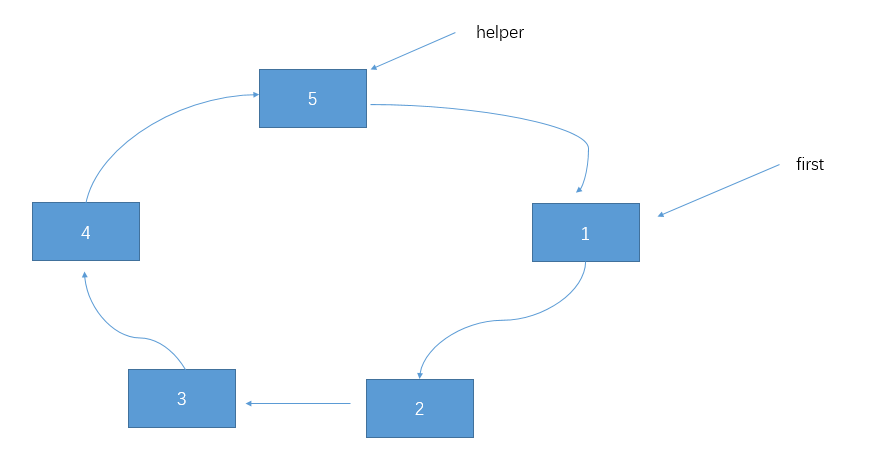
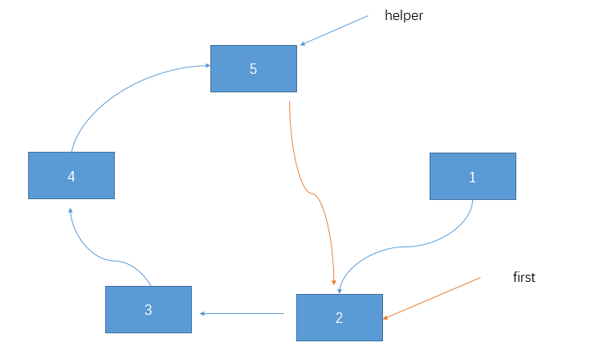

## 链表定义
链表是一种链式存储的线性表

链表是以节点的方式来存储

每个节点包含data域和next域，next指向下一个节点

节点在内存中不一定是连续存储的
## 常见问题
### 设计链表

1 单链表

```java
class ListNode{
    public int key;
    public ListNode next;
    public ListNode(int key) {
        this.key = key;
    }
}
public class LinkedList {
    public static void main(String[] args) {
        LinkedList l = new LinkedList();
        l.add(10);
        l.add(1);
        l.add(5);
        l.add(30);
        l.add(20);
        show(l.getHead());
        l.remove(10);
        show(l.getHead());
    }
    private ListNode head;
    public LinkedList() {
    }
    public ListNode getHead() {
        return head;
    }
    // 向链表尾部添加节点，创建链表
    public void add(int key) {
        ListNode node = new ListNode(key);
        ListNode curr = head;
        if(head == null) {
            head = node;
            return;
        }
        while(true) {
            if(curr.next == null) {
                break;
            }
            curr = curr.next;
        }
        curr.next = node;
    }
    // 删除节点，必须找到待删除节点的前一个节点,将前一个节点的next
    // 指向待删除节点的next,即prev.next = deleteListNode.next
    public void remove(int key) {
        if(head == null) {
            return;
        }
        ListNode curr = head.next;
        ListNode prev = head;
        boolean flag = false;
        while(curr != null) {
            if(curr.key == key) {
                flag = true;
                break;
            }
            prev = curr;
            curr = curr.next;
        }
        if(flag) {
            prev.next = curr.next;
        }
    }
    // 获取单链表的节点个数
    public static int getLength(ListNode head) {
        ListNode curr = head;
        int size = 0;
        while(curr != null) {
            size++;
            curr= curr.next;
        }
        return size;
    }
    public static void show(ListNode head) {
        if(head == null) {
            System.out.println("empty linkedList");
        }
        ListNode curr = head;
        while(curr != null) {
            System.out.print(curr.key + "->");
            curr = curr.next;
        }
        System.out.println("NULL");
    }

}
```

### 合并两个有序链表

1 递归法

两个链表头部较小的一个与剩下元素的 merge 操作结果合并

```java
/**
 * Definition for singly-linked list.
 * public class ListNode {
 *     int val;
 *     ListNode next;
 *     ListNode(int x) { val = x; }
 * }
 */
class Solution {
    public ListNode mergeTwoLists(ListNode l1, ListNode l2) {
        if(l1 == null) {
            return l2;
        } else if(l2 == null) {
            return l1;
        } else if(l1.val < l2.val) {
            l1.next = mergeTwoLists(l1.next, l2);
            return l1;
        } else {
            l2.next = mergeTwoLista(l2.next, l1);
            return l2;
        }
    }
}
```


2 迭代法

```java
/**
 * Definition for singly-linked list.
 * public class ListNode {
 *     int val;
 *     ListNode next;
 *     ListNode(int x) { val = x; }
 * }
 */
class Solution {
    public ListNode mergeTwoLists(ListNode l1, ListNode l2) {
        if(l1 == null) {
            return l2;
        } 
        if(l2 == null) {
            return l1;
        }
        ListNode prevHead = new ListNode(0);
        ListNode prev = prevHead;
        while(l1 != null && l2 != null) {
            if(l1.val <l2.val) {
                prev.next = l1;
                l1 = l1.next;
            }else {
                prev.next = l2;
                l2 = l2.next;
            }
            prev = prev.next;
        }
        prev.next = l1 == null ? l2: l1;
        return prevHead.next;
    }
}
```

### 单链表反转

1 递归

```java
public static  ListNode reverseList(ListNode head) {
    if(head== null || head.next == null) return head;
    ListNode p = reverseList(head.next);
    head.next.next = head;
    head.next = null;
    return p;
}
```

2 迭代

```java
public static ListNode reverseList(ListNode head) {
    if(head == null || head.next == null) return head;
    ListNode prev = null;
    ListNode curr = head;
    while(curr != null) {
        ListNode nextTemp = curr.next;
        curr.next = prev;
        prev = curr;
        curr = nextTemp; 
    }
}
```

3 头插法

```java
// 头插法
// 10->20->40->30
//       curr next
//        |   |
// dummy  10->20->40->30
//           curr
//            |
// dummy->10  20->40->30
// dummy->20->10  40->30
// dummy->20->10->40  30
// dummy->20->10->40  30
// dummy->20->10->40->30
public static ListNode reverse(ListNode head) {
		if(head == null || head.next == null) {
            return head;
        }
        ListNode dummy = new Node(-1);
        ListNode curr = head;
        while(curr != null) {
            Node next = curr.next;
            curr.next = dummy.next;
            dummy.next = curr;
            curr = next;
        }
        return dummy.next;
	}

```

###  链表中环的检测和环入口

```java
public boolean isHasCircle(ListNode head) {
    ListNode dummy = new ListNode(0);
    if(head == null) {
        return false;
    }
    ListNode fast = head;
    ListNode slow = head;
    while(fast.next != null) {
        fast = fast.next.next;
        slow = slow.next;
        if(fast == slow) {
            return true;
        }
    }
    return false;
}
```

###  删除倒数第K个节点

```java
/**
 * Definition for singly-linked list.
 * public class ListNode {
 *     int val;
 *     ListNode next;
 *     ListNode(int x) { val = x; }
 * }
 */
class Solution {
    // 删除单链表的倒数第K个节点，返回删除后的链表
    // 10->60->49->20-15->NULL, 15是倒数第一个，依次类推
    // k=2,要删除的是20
    // slow         fast
    //  |<----k+1---->|
    // dummy->10->60->49->20-15->NULL
    //              slow          fast
    //                |<----k+1-->|
    // dummy->10->60->49->20->15->NULL
    public ListNode removeNthFromEnd(ListNode head, int k) {
       if(head == null) return head;
        // 构造一个哑铃节点
        ListNode dummy = new ListNode(0);
        dummy.next = head;
        ListNode fast = dummy.next;
        ListNode slow = dummy;
        for (int i = 0; i < k; i++) {
            if(fast == null) return dummy.next;
            fast = fast.next;
        }
        while(fast != null) {
            fast = fast.next;
            slow = slow.next;
        }
        // slow就是要删除的节点的前一个节点
        slow.next = slow.next.next;
        return dummy.next;
    }
}
```

### k个一组反转链表

1. 尾插法
   举例说明， k = 3

```markdown
pre    start
end
dummy->  1  ->  2  ->  3  ->  4

// end移到要翻转的部分最后一个元素
pre    
       start          end
dummy->  1  ->  2  ->  3  ->  4

// 尾插法的意思就是,依次把curr(prev.next)移到end后面
pre             end   start   
dummy->  2  ->   3  ->  1  ->  4


pre     end          start               
dummy->  3  ->  2  ->  1  ->  4
// 将pre, end移动到start的位置，开始下一轮翻转
.....
```

代码：

```javascript
function listNode(val) {
    this.val = val
    this.next = null
}
function reverseKGroup(head, k) {
    let dummy = new ListNode(-1)
    dummy.next = head
    let pre = dummy;
    let end = dummy
    while(true) {
        let count = 0;
        while(end != null && count < k) {
            end = end.next
            count++
        }
        if(end == null) break
        let start = pre.next
        while(pre.next !== end) {
            let curr = pre.next // 本次要插入到end节点后面的节点
            pre.next = curr.next // pre连接到curr.next, curr游离出来
            curr.next = end.next // curr插入到end的后面
            end.next = curr // end连接到curr
        }
        // 移动到待翻转链表的前一个节点
        pre = start
        end = start
    }
    return dummy.next
}
```

2. 递归

   我无法理解

### 约瑟夫问题

```
约瑟夫问题是个有名的问题：N个人围成一圈，从第一个开始报数，
第M个将被杀掉，最后剩下一个，其余人都将被杀掉。例如N=6，M=5，被杀掉的顺序是：5，4，6，2，3，1。
```

构建环形链表

```java
// 创建一个环形单向链表
class CircleSingleLinkedList {
    private Node first = null; // 第一个节点
    public void addNode(int nums) {
        if(nums < 1) {
            return;
        }
        // 辅助指针，帮助构建环形链表
        Node curr = null;
        for (int i = 1; i <= nums; i++) {
            Node node = new Node(i);
            if(i == 1) {
                first = node;
                first.setNext(first); // 构成环,自己指向自己
                curr = first;
            } else {
                curr.setNext(node);
                node.setNext(first); // 指向第一个节点
                curr = node; // 移动curr
            }
        }
    }
    // 遍历环形链表
    public void show() {
        // 判断非空
        if(first == null) {
            return;
        }
        Node curr = first;
        while(true) {
           System.out.println(curr.getNo());
           curr = curr.getNext();
           if(curr == first) {
               break;
           }
        }
    }
}
// 节点
class Node {
    private int no;
    private Node next;
    public Node(int no) {
        this.no = no;
    }
    public int getNo() {
        return no;
    }
    public void setNext(Node node) {
        next = node;
    }
    public Node getNext() {
        return next;
    }
}
```

根据输入，输出死人编号顺序





```java
 public void countKills(int startNo, int countNum, int nums) {
        if(first == null || startNo < 1 || startNo > nums) {
            return;
        }
        // 构造一个辅助节点，始终指向firs后面的节点
        Node helper = first;
        while(true) {
            if(helper.getNext() == first) {
                break;
            }
            helper = helper.getNext();
        }
        // 首先找到计数起点
        for (int i = 0; i < startNo - 1; i++) {
            first = first.getNext();
            helper = helper.getNext();
        }
        while(true) {
            // 说明圈中只有一个人
            if(helper == first) {
                System.out.println(first.getNo());
                break;
            }
            // first和helper移动 countNum- 1 次
            for (int i = 0; i < countNum - 1; i++) {
                first = first.getNext();
                helper = helper.getNext();
            }
            // 此时first指向要出圈的节点
            System.out.println(first.getNo());
            // first出圈
            first = first.getNext();
            helper.setNext(first);
        }
    }
```


## leetCode

- [x] [两个有序链表合并](https://leetcode-cn.com/problems/merge-two-sorted-lists/)
- [ ] [删除链表的倒数第N个节点](https://leetcode-cn.com/problems/remove-nth-node-from-end-of-list/)
- [ ] [设计链表](https://leetcode-cn.com/problems/design-linked-list/)
- [ ] https://leetcode-cn.com/problems/container-with-most-water/
- [x] https://leetcode-cn.com/problems/climbing-stairs/
- [x] [https://leetcode-cn.com/problems/3sum/ ](https://leetcode-cn.com/problems/3sum/)(高频老题）
- [x] https://leetcode-cn.com/problems/reverse-linked-list/
- [ ] https://leetcode-cn.com/problems/swap-nodes-in-pairs
- [x] https://leetcode-cn.com/problems/linked-list-cycle
- [x] https://leetcode-cn.com/problems/linked-list-cycle-ii
- [ ] [k个一组反转链表](https://leetcode-cn.com/problems/reverse-nodes-in-k-group/)
- [ ] https://leetcode-cn.com/problems/remove-duplicates-from-sorted-array/
- [ ] https://leetcode-cn.com/problems/rotate-array/
- [ ] https://leetcode-cn.com/problems/merge-two-sorted-lists/
- [ ] https://leetcode-cn.com/problems/merge-sorted-array/
- [x] https://leetcode-cn.com/problems/two-sum/
- [x] https://leetcode-cn.com/problems/move-zeroes/
- [ ] https://leetcode-cn.com/problems/plus-one/

