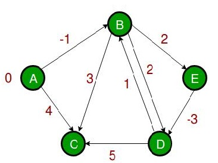

## 单源最短路径

>给定一个带权有向图G=（V,E），其中每条边的权是一个实数。另外，还给定V中的一个顶点，称为源。要计算从源到其他所有各顶点的最短路径长度。这里的长度就是指路上各边权之和。这个问题通常称为单源最短路径问题。

### Dijkstra算法

算法过程

> 给一个图和一个起始顶点（源点），找到这个顶点到图中所有顶点的最短路径
>
> Dijkstra算法和求最小生成树的Prim算法非常相似，类比Prim的MST,我们创建一个SPT(shorted path tree), 将给定的起点作为根节点，维护两个集合，一个集合(T)包括最短路径树的顶点，另外一个集合(U)不包括最短路径树的顶点，在算法的每一步，我们在U中找到一个距离源点路径最短的顶点
>
> 下面是Dijkstra算法用来求单源最短路径的详细步骤
>
> 1）创建一个*sptSet* 集合，用来追踪在最短路径树中的顶点，集合初始化为空
>
> 2）将所有顶点到源点的距离初始化为正无穷，源点的距离初始化为0，用dist数组来存储这些距离
>
> 03）只要*sptSet*不包含所有的顶点，就循环下面的步骤
>
> a) 从不在*sptSet*集合中的顶点中选出距离最小的顶点u
>
> b) 将u添加进去*sptSet*
>
> c) 更新u所有相邻顶点的距离，也就是迭代u的所有的相邻零点，对于每个迭代的顶点v来说，如果v不在*sptSet*集合中并且dist(u) +weight(u,v) < dist(v),  那就更新dist[v]为dist(u) +weight(u,v) 

算法图解

用下面的例子来说明:
[](https://www.geeksforgeeks.org/wp-content/uploads/Fig-11.jpg)

*sptSet* 初始化为空 ，dist初始化为 {0, INF, INF, INF, INF, INF, INF, INF}  INF 表示无穷. 现在我们选出距离最小的顶点, 顶点0 被选中，并加入到 *sptSet*.所以*sptSet* 变成 {0}. 当0加入到*sptSet*之后，更新它相邻节点的距离，相邻节点是1和7，,1 和7的距离被更新为4和8. 下面的子图显示了顶点和他们的距离值, 仅仅显示有限距离的顶点， 在SPT中的顶点用绿色标记

[](https://www.geeksforgeeks.org/wp-content/uploads/MST1.jpg)

选出不在SPT中距离最小的顶点 ，顶点1被选中并且加入到sptSet. 所以 sptSet现在变成了 {0, 1}. 更新顶点1的相邻顶点距离. 顶点2的距离变成了12.

[](https://www.geeksforgeeks.org/wp-content/uploads/DIJ2.jpg)

选出不在SPT中距离最小的顶点 ，顶点7被选中并且加入到sptSet. 所以 sptSet现在变成了{0, 1, 7}. 更新顶点7的相邻顶点距离. 顶点6和顶点 8 的距离分别变成了9和15.
[](https://www.geeksforgeeks.org/wp-content/uploads/DIJ3.jpg)

选出不在SPT中距离最小的顶点 ，顶点7被选中. 所以 sptSet现在变成了{0, 1, 7 ，6}. 更新顶点7的相邻顶点的距离. 顶点5和顶点8放入距离被更新了

[](https://www.geeksforgeeks.org/wp-content/uploads/DIJ4.jpg)

重复上面的步骤直到l *sptSet* 包含图中所有的顶点. 最终，我们得到了下面的最短路径树(SPT).

[](https://www.geeksforgeeks.org/wp-content/uploads/DIJ5.jpg)

```java
//version1

import java.util.List;
import java.util.Arrays;

// Dijkstra算法
public class Dijkstra {
    private int[][] graph;
    private int src;
    private int V;
    private static final int INF = Integer.MAX_VALUE;
    public static void main(String[] args) {
        int[][] edges = new int[][]{
                {INF, 5, 7, INF, INF, INF, 2},
                {5, INF, INF, 9, INF, INF, 3},
                {7, INF, INF, INF, 8, INF, INF},
                {INF, 9, INF, INF, INF, 4, INF},
                {INF, INF, 8, INF, INF, 5, 4},
                {INF, INF, INF, 4, 5, INF, 6},
                {2, 3, INF, INF, 4, 6, INF}
        };
        Dijkstra d = new Dijkstra(edges,0);
        int[] dist = d.dijkstra();
    }
    public Dijkstra(int[][] graph, int src) {
        this.graph = graph;
        this.V = graph.length;
        this.src = src;
    }
    public int[] dijkstra() {
        int[] path = new int[V];
        int[] dist = new int[V];
        boolean[] sptSet = new boolean[V];
        // 距离初始化为正无穷，sptSet全部初始化为false,表示最小生成树种还未添加人任何顶点
        for (int i = 0; i < V; i++) {
            dist[i] = INF;
            sptSet[i] = false;
        }
        // 源点距离自身的距离总是为0
        dist[src] = 0;
        // 这里只循环V-1次即可，因为最后一个顶点是不会走里面的for(int v; v<V；v++)的
        for(int i = 0; i < V - 1;i++) {
            // 从未处理的顶点集合种选出距离最小的边
            // 在首轮循环种，u总是等于源点src
            int u = minDistance(dist,sptSet);
            if (u == -1) break;
            // 标记选中顶点为已经处理过了
            sptSet[u] = true;
            // 更新选中顶点相邻顶点的dist
            for(int v = 0; v < V; v++) {
                // 更新dist[v] ，仅当下面三个条件同时满足
                //  v不在 sptSet种,
                //  u , v之间存在边,
                //  从源点到u再到v之间的距离小于从源点到v的距离
                if(!sptSet[v] && graph[u][v] != INF && dist[u] + graph[u][v]< dist[v]) {
                    dist[v] = dist[u] + graph[u][v];
                }
            }

        }
        printSolution(dist);
        return dist;
    }
    private int minDistance(int[] dist, boolean[] sptSet) {
        int minDis = Integer.MAX_VALUE, minIndex = -1;
        for (int v = 0; v < V; v++)
            if (!sptSet[v] && dist[v] <= minDis) {
                minDis = dist[v];
                minIndex = v;
            }

        return minIndex;
    }
    private void printSolution(int dist[])
    {
        System.out.println("Vertex \t\t Distance from Source");
        for (int i = 0; i < dist.length; i++)
            System.out.println(i + " \t\t " + dist[i]);
    }
}

```

打印即如果

```
Vertex 		 Distance from Source
0 		 0
1 		 5
2 		 7
3 		 12
4 		 6
5 		 8
6 		 2
```


Noted:

1. 上面代码计算出了从源点到各个顶点的最短距离，但是没有计算出从源点到某个顶点的路径

2. 代码考虑的是无向图，也适用于有向图
3. 代码计算出了源点到各个顶点的最短距离,如果我们只关心源点到一个顶点的最短距离，我们可以在选出的最小距离顶点等于目标顶点的时候终止循环
4. 算法时间复杂度是O(V^2), 如果输入的图示用邻接表表示的话，那么在二叉堆的帮助下，时间复杂度可以降低到 O(E log V)，有兴趣的童鞋移步https://www.geeksforgeeks.org/dijkstras-algorithm-for-adjacency-list-representation-greedy-algo-8/
5. Dijkstra算法不适用于负权边

我们把代码改造一下, 支持求出路径,其实非常简单，我们用一个数组parent来记录，每次更新dist的时候记录当前节点的父节点即可

```java
import java.util.ArrayList;
import java.util.Collections;
import java.util.List;
import java.util.Arrays;

// Dijkstra算法
public class Dijkstra {
    private int[][] graph;
    private int src;
    private int V;
    private int[] parent;
    private static final int INF = Integer.MAX_VALUE;
    public static void main(String[] args) {
        int[][] edges = new int[][]{
                {INF, 5, 7, INF, INF, INF, 2},
                {5, INF, INF, 9, INF, INF, 3},
                {7, INF, INF, INF, 8, INF, INF},
                {INF, 9, INF, INF, INF, 4, INF},
                {INF, INF, 8, INF, INF, 5, 4},
                {INF, INF, INF, 4, 5, INF, 6},
                {2, 3, INF, INF, 4, 6, INF}
        };
        Dijkstra d = new Dijkstra(edges,0);
        int[] dist = d.dijkstra();
        d.printPath();
    }
    public Dijkstra(int[][] graph, int src) {
        this.graph = graph;
        this.V = graph.length;
        this.src = src;
    }
    public int[] dijkstra() {
        int[] path = new int[V];
        int[] dist = new int[V];
        parent = new int[V];
        Arrays.fill(parent, -1);
        boolean[] sptSet = new boolean[V];
        // 距离初始化为正无穷，sptSet全部初始化为false,表示最小生成树种还未添加人任何顶点
        for (int i = 0; i < V; i++) {
            dist[i] = INF;
            sptSet[i] = false;
        }
        // 源点距离自身的距离总是为0
        dist[src] = 0;
        parent[src] = src;
        for(int i = 0; i < V;i++) {
            // 从未处理的顶点集合种选出距离最小的边
            // 在首轮循环种，u总是等于源点src
            int u = minDistance(dist,sptSet);
            // 标记选中顶点为已经处理过了
            sptSet[u] = true;
            // 更新选中顶点相邻顶点的dist
            for(int v = 0; v < V; v++) {
                // 更新dist[v] ，仅当下面三个条件同时满足
                //  v不在 sptSet种,
                //  u , v之间存在边,
                //  从源点到u再到v之间的距离小于从源点到v的距离
                if(!sptSet[v] && graph[u][v] != INF && dist[u] + graph[u][v]< dist[v]) {
                    dist[v] = dist[u] + graph[u][v];
                    parent[v] = u;
                }
            }

        }
        printSolution(dist);
        return dist;
    }
    private int minDistance(int[] dist, boolean[] sptSet) {
        int minDis = Integer.MAX_VALUE, minIndex = -1;
        for (int v = 0; v < V; v++)
            if (!sptSet[v] && dist[v] <= minDis) {
                minDis = dist[v];
                minIndex = v;
            }

        return minIndex;
    }
    public void printPath(){
        System.out.println("Vertex \t\t Path from Source");
        for(int i = 0; i < V; i++) {
            System.out.println(i+"\t\t"+singlePath(i));
        }
    }
    public List<Integer> singlePath(int target) {
        List<Integer> path = new ArrayList<>();
        int curr = target;
        while(curr!= src) {
            path.add(curr);
            curr = parent[curr];
        }
        path.add(src);
        Collections.reverse(path);
        return path;
    }
    private void printSolution(int dist[])
    {
        System.out.println("Vertex \t\t Distance from Source");
        for (int i = 0; i < dist.length; i++)
            System.out.println(i + " \t\t " + dist[i]);
    }
}

```

优化，用优先队列来找每轮未访问顶点的dist最小的顶点

```java
// version2
import java.util.List;
import java.util.Arrays;
import java.util.PriorityQueue;

// Dijkstra算法
public class Dijkstra2 {
    private int[] data;
    private int[][] matrix;
    private int s;
    private int[] dist;
    private class Node implements Comparable<Node> {
        public int w, dist;
        public Node(int w, int dist) {
            this.w = w;
            this.dist = dist;
        }
        @Override
        public int compareTo(Node another) {
            return dist - another.dist;
        }
    }
    private boolean[] visited;
    private static final int INF = Integer.MAX_VALUE;
    public static void main(String[] args) {
        int[] data = new int[]{0,1,2,3,4,5,6};// 7个顶点
        int[][] matrix = new int[][]{
                {INF, 5, 7, INF, INF, INF, 2},
                {5, INF, INF, 9, INF, INF, 3},
                {7, INF, INF, INF, 8, INF, INF},
                {INF, 9, INF, INF, INF, 4, INF},
                {INF, INF, 8, INF, INF, 5, 4},
                {INF, INF, INF, 4, 5, INF, 6},
                {2, 3, INF, INF, 4, 6, INF}
        };
        Dijkstra2 d = new Dijkstra2(data, matrix, 0);
        System.out.println(d.dictTo(1));
        System.out.println(d.dictTo(2));
        System.out.println(d.dictTo(3));
        System.out.println(d.dictTo(4));
        System.out.println(d.dictTo(5));
    }
    public int dictTo(int w) {
        if(w >=0 && w < data.length) {
            return dist[w];
        }
        throw new IllegalArgumentException("illegal index");
    }
    public Dijkstra2(int[] data, int[][] matrix, int s) {
        this.data = data;
        this.matrix = matrix;
        this.s = s;
        int v = data.length;
        visited = new boolean[v];
        // 构造一个最小堆
        PriorityQueue<Node> pq = new PriorityQueue<>();
        pq.add(new Node(s, 0));
        dist = new int[v];
        Arrays.fill(dist, INF);
        dist[s] = 0;// 源点距离初始化为0
        while(!pq.isEmpty()) {
            int curr = pq.remove().w;
            if(visited[curr]) {
                continue;
            }
            visited[curr] = true;
            for (int i = 0; i < v; i++) {
                if(!visited[i]) {
                    // 必须先判断是不是正无穷再做加法，否则会出现溢出
                    if(matrix[curr][i] != INF && dist[curr] + matrix[curr][i] < dist[i]) {
                        dist[i] = dist[curr] + matrix[curr][i];
                        pq.add(new Node(i, dist[i]));
                    }
                }
            }
        }
    }
}

```

两种的时间复杂度分别是O(V*V)和O(VlogE)

### Bellman-Ford算法

我们上面已经讨论了Dijkstra算法求单源最短路径，但是Dijkstra不能求有负权边的图的单源最短路径， Bellman-Ford算法可以，Bellman-Ford算法也比Dijkstra算法简单，但是时间复杂度是O(VE), 高于Dijkstra(时间复杂度是O(V^2,如果采用优先队列，复杂度是O((ElogV))

算法描述

输入：图和源点
输出：从源点到其他顶点的最短路径，如图中存在负权环，最短路径无法计算

**1)** 创建一个大小为V(V是图的顶点数量）的dist数组，初始化源点到其他顶点的距离为正无穷，源点自身距离为0.

**2)** 这一步计算最短路径. 下面的步骤重复V-1次
…..**a)** 对每一条边 u-v，u是起点，v是终点，如果dist[v] > dist[u] + weight(u,v), 更新dist[v]= dist[u] + weight (u,v)，这个过程叫作松弛

**3)** 检测图中是否存在负权环.  对每一条边 u-v
……如果dist[v] > dist[u] + weight(u,v),说明图中存在负权环
这一步的原理是第二步已经保证了不包含负权环的情况下，源点到其他顶点的最短路径， 如果我们再把所有的边松弛一次, 对任一顶点还存在更短的距离，说明存在负权环



```java
class Graph {
    class Edge {
        int src, dest, weight;
        Edge()
        {
            src = dest = weight = 0;
        }
    }

    int V, E;
    Edge[] edge;

    // Creates a graph with V vertices and E edges
    Graph(int v, int e)
    {
        V = v;
        E = e;
        edge = new Edge[e];
        for (int i = 0; i < e; ++i)
            edge[i] = new Edge();
    }
}
public class BellmanFord {

    public BellmanFord(Graph graph, int src) {
        int V = graph.V, E = graph.E;
        int[] dist = new int[V];

        // Step 1: 初始化源点到其他顶点的距离为正无穷
        for (int i = 0; i < V; ++i)
            dist[i] = Integer.MAX_VALUE;
        dist[src] = 0;

        // Step 2: 所有边松弛 V - 1 次. 
        // 源点到其他顶点的某个顶点的路径最多包含V - 1条边
        for (int i = 1; i < V; ++i) {
            for (int j = 0; j < E; ++j) {
                int u = graph.edge[j].src;
                int v = graph.edge[j].dest;
                int weight = graph.edge[j].weight;
                if (dist[u] != Integer.MAX_VALUE && dist[u] + weight < dist[v])
                    dist[v] = dist[u] + weight;
            }
        }                                                                                       

        // Step 3: 检测所有的负权环. 
        // 上面的步骤已经求出了不包含负权环的情况下，源点到其他顶点的最短路径. 
        // 如果我们得到了更短路径，说明有负权环
        for (int j = 0; j < E; ++j) {
            int u = graph.edge[j].src;
            int v = graph.edge[j].dest;
            int weight = graph.edge[j].weight;
            if (dist[u] != Integer.MAX_VALUE && dist[u] + weight < dist[v]) {
                System.out.println("Graph contains negative weight cycle");
                return;
            }
        }
        printArr(dist, V);
    }
    void printArr(int dist[], int V)
    {
        System.out.println("Vertex Distance from Source");
        for (int i = 0; i < V; ++i)
            System.out.println(i + "\t\t" + dist[i]);
    }
    // 测试
    public static void main(String[] args)
    {
        int V = 5; // 图的顶点数量
        int E = 8; // 图的边的数量

        Graph graph = new Graph(V, E);

        // 添加边0-1 (or A-B)
        graph.edge[0].src = 0;
        graph.edge[0].dest = 1;
        graph.edge[0].weight = -1;

        // 添加边0-2 (or A-C)
        graph.edge[1].src = 0;
        graph.edge[1].dest = 2;
        graph.edge[1].weight = 4;

        // 添加边1-2 (or B-C)
        graph.edge[2].src = 1;
        graph.edge[2].dest = 2;
        graph.edge[2].weight = 3;

        // 添加边1-3 (or B-D)
        graph.edge[3].src = 1;
        graph.edge[3].dest = 3;
        graph.edge[3].weight = 2;

        // 添加边1-4 (or A-E)
        graph.edge[4].src = 1;
        graph.edge[4].dest = 4;
        graph.edge[4].weight = 2;

        // 添加边3-2 (or D-C )
        graph.edge[5].src = 3;
        graph.edge[5].dest = 2;
        graph.edge[5].weight = 5;

        // 添加边3-1 (or D-B)
        graph.edge[6].src = 3;
        graph.edge[6].dest = 1;
        graph.edge[6].weight = 1;

        // 添加边4-3 (or E-D)
        graph.edge[7].src = 4;
        graph.edge[7].dest = 3;
        graph.edge[7].weight = -3;
        BellmanFord bf = new BellmanFord(graph, 0);
    }
```

## 所有点对最短路径

### Floyd算法

Floyd算法用来解决图中所有点对的最短距离

时间复杂度O(V^3)

```java
public class Floyed {
    static final int INF = Integer.MAX_VALUE;
    int V;
    public static void main(String[] args) {
        int[][] graph = {
                {0, 5, INF, 10},
                {INF, 0, 3, INF},
                {INF, INF, 0, 1},
                {INF, INF, INF, 0}};
        /*
              10
       (0)------->(3)
        |         /|\
      5 |          |
        |          | 1
       \|/         |
       (1)------->(2)
            3
         */
        Floyed F = new Floyed(graph);
    }

    public Floyed(int[][] graph) {
        V = graph.length;
        int[][] dist = new int[V][V];
        for (int i = 0; i < V; i++) {
            for (int j = 0; j < V; j++) {
                dist[i][j] = graph[i][j];
            }
        }
        // 外层循环是每个点
        for (int k = 0; k < V; k++) {
            // 内层两轮循环是点对（i，j)
            for (int i = 0; i < V; i++) {
                for (int j = 0; j < V; j++) {
                    // 注意溢出
                    if (dist[i][k] != INF && dist[k][j] !=INF && dist[i][k] + dist[k][j] < dist[i][j])
                        dist[i][j] = dist[i][k] + dist[k][j];
                }
            }
        }
        // 检测负权环
        for (int i = 0; i < V; i++) {
            if(dist[i][i] < 0) {
                System.out.println("negative cycle");
            }
        }
        printSolution(dist);
    }
    void printSolution(int dist[][])
    {
        System.out.println("The following matrix shows the shortest "+
                "distances between every pair of vertices");
        for (int i=0; i<V; ++i)
        {
            for (int j=0; j<V; ++j)
            {
                if (dist[i][j]==INF)
                    System.out.print("INF ");
                else
                    System.out.print(dist[i][j]+"   ");
            }
            System.out.println();
        }
    }
}
```
