# 排序算法

## 各大算法对比

| 排序算法 | 平均时间复杂度 | 最好时间复杂度 | 最坏时间复杂度 | 空间复杂度 | 排序方式 | 是否基于比较 | 是否稳定 |
| -------- | -------------- | -------------- | -------------- | ---------- | -------- | ------------ | -------- |
| 冒泡排序 | O(n^2)         | O(n)           | O(n^2)         | O(1)       | 原地     | 是           | 是       |
| 选择排序 | O(n^2)         | O(n^2)         | O(n^2)         | O(1)       | 原地     | 是           | 否       |
| 插入排序 | O(n^2)         | O(n)           | O(n^2)         | O(1)       | 原地     | 是           | 是       |
| 希尔排序 | O(nlogn)       | O(nlogn)       | O(n^2)         | O(1)       | 原地     | 是           | 否       |
| 归并排序 | O(nlogn)       | O(nlogn)       | O(nlogn)       | O(n)       | 非原地   | 是           | 是       |
| 快速排序 | O(nlogn)       | O(nlogn)       | O(n^2)         | O(n)       | 原地     | 是           | 否       |
| 堆排序   | O(nlogn)       | O(nlogn)       | O(nlogn)       | O(1)       | 原地     | 是           | 否       |
| 计数排序 | O(n+k)         | O(n+k)         | O(n+k)         | O(n+k)     | 非原地   | 否           | 是       |
| 基数排序 | O(n*k)         | O(n*k)         | O(n*k)         | O(n)       | 非原地   | 否           | 是       |
| 桶排序   | O(n+k)         | O(n+k)         | O(n^2)         | O(n+k)     | 非原地   | 否           | 是       |

## 冒泡排序

#### 算法步骤

给定一个N个元素的数组，冒泡法排序将：

1. 比较相邻的元素。如果第一个比第二个大，就交换他们两个。
2. 对每一对相邻元素做同样的工作，从开始第一对到结尾的最后一对。至此，最后的元素应该会是最大的数。
3. 针对所有的元素重复以上的步骤，除了最后一个。 
4. 持续每次对越来越少的元素重复上面的步骤，直到没有任何一对数字需要比较。 

#### 动画演示

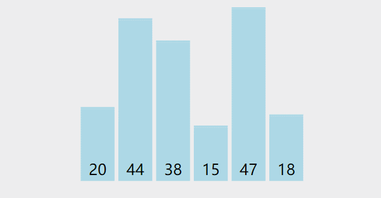


#### 代码参考

```java
public class BubbleSort {
    public static void bubbleSort(int[] arr) {
        for (int i = 0; i < arr.length - 1; i++) {
            // 加一个标识，如果没有发生交换，说明已经完全升序了，那么就可以退出循环了
            boolean flag = false;
            for(int j = 0; j < arr.length -1 - i; j++) {
                if(arr[j] > arr[j+1]) {
                    flag = true;
                    int tmp = arr[j];
                    arr[j] = arr[j + 1];
                    arr[j + 1] = tmp;
                }
            }
            if(!flag) {
                break;
            }
        }
    }
}
```
#### 算法分析

##### 复杂度分析


比较和交换需要一个以常量为界的时间，我们记为c。
Bubble Sort中有两个嵌套循环。
外循环正好运行n次迭代。 但内部循环运行变得越来越短：

1. 当 i = 0，（n-1）次迭代（比较和可能交换）。
2. 当 i = 1，（n-2）次迭代
3. 当 i =（n-2）时，1次迭代
4. 当 i =（n-1），0次迭代

因此，总迭代次数=（n-1）+（n-2）+ ... + 1 + 0 = n *（n-1）/ 2。
总时间= c * n *（n-1）/ 2 = O（n ^ 2）。

最好时间复杂度：原数组是升序的，那么只需要执行一次内层循环即可退出双层循环，时间复杂度是0(n)

最坏的情况：原数组是降序的，那么，循环不会break, 复杂是是0(n^2)

排序没有消耗额外的内存空间，所以空间复杂度是O(1), 也就是原地排序

##### 稳定性

稳定性是指，比如a在b前面，a=b，排序后，a仍然应该在b前面，这样就是稳定的。

我们在交换的过程中，只有前面的数据大于后面相邻的数据，才发生交换，相等元素不会改变相对位置，所以是稳定的

## 选择排序

#### 算法描述

1. 第一次从待排序的数据集合中选出最小（或最大）的一个元素，存放在序列的起始位置

2. 然后再从剩余的未排序元素中寻找到最小（大）元素，然后放到已排序的序列的末尾。
3. 以此类推，直到全部待排序的数据元素的个数为零。

#### 动画演示
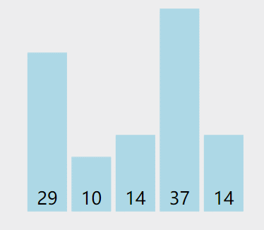


#### 参考代码

```java
public class SelectionSort {
    public static void selectionSort(int[] arr) {
        for(int i = 0 ; i < arr.length -1; i++) {
            int minIndex = i;
            for(int j = i+1; j < arr.length; j++) {
                if(arr[minIndex] > arr[j]) {
                    minIndex = j;
                }
            }
            if(minIndex != i) {
                int tmp = arr[i];
                arr[i] = arr[minIndex];
                arr[minIndex] = tmp;
            }
        }
    }
}
```

```javascript
function insertionSort(arr) {
     for(var i = 0 ; i < arr.length -1; i++) {
        var minIndex = i;
        for(var j = i+1; j < arr.length; j++) {
            if(arr[minIndex] > arr[j]) {
                minIndex = j;
            }
        }
        if(minIndex !== i) {
            var tmp = arr[i];
            arr[i] = arr[minIndex];
            arr[minIndex] = tmp;
        }
    }
}
```

#### 算法分析
双层循环没法提前终止，所以平均，最好，最坏时间复杂度都是O(n^2),第二在选择交换的过程中，改变了相对位置，所以算法是不稳定的

## 插入排序

插入排序，一般也被称为直接插入排序。对于**少量元素**的排序，它是一个有效的算法 。算法是将一个记录插入到已排好序的序列中，从而得到一个新的有序序列（将序列的第一个数据看成是一个有序的子序列，然后从第二个记录逐个向该有序的子序列进行有序的插入，直至整个序列有序）

图解如下

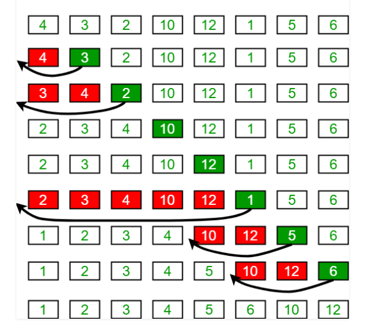

#### 动画演示

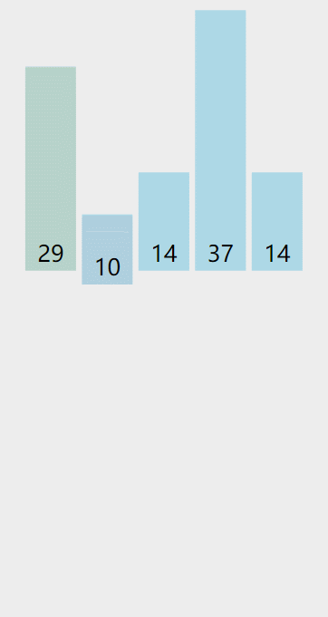


#### 参考代码

```java
public class InsertionSort {
    public static void insertionSort(int[] arr) {
        // 初始的时候默认第一个元素是有序的，从第二个元素开始考察，找到它的插入位置
        for(int i = 1; i < arr.length; i++) {
            int X = arr[i]; // X是待插入的元素
            int j = i-1;
            // 遍历有序部分，找到X的插入位置
            for(;j>=0 && arr[j] > X;j--) {
                arr[j+1] = arr[j];
            }
            arr[j+1] = X;
        }
    }
}

```

#### 算法分析

##### 时间复杂度分析

外循环执行n-1次，这很明显。
但内循环执行的次数取决于输入：
在最好的情况下，数组已经排序并且（a[j]> X）总是为假，所以不需要移动数据，并且内部循环运行在O（1），
在最坏的情况下，数组被反向排序并且（a[j]> X）始终为真，插入始终发生在数组的前端，并且内部循环以O（n）运行。
因此，最佳情况时间是O(n × 1) = O(n) ，最坏情况时间是O(n × n) = O(n^2).

##### 是否是稳定排序

我们插入的时候是前面的大于后面的才移动和交换，相同数据不会移动和交换，所以插入排序是稳定的算法

##### 总结
1.在大多数元素已经有序的情况下，插入排序的工作量较小

这个结论很明显，如果一个数组大部分元素都有序，那么数组中的元素自然不需要频繁地进行比较和交换。

2.在元素数量较少的情况下，插入排序的工作量较小

这个结论更加显而易见，插入排序的工作量和n的平方成正比，如果n比较小，那么排序的工作量自然要小得多。

## 希尔排序

> 希尔排序是**插入排序**的一种，又称"缩小增量排序"，是直接插入排序算法的一种更高效的改进版本。希尔排序是非稳定排序算法
>
> 希尔排序是把记录按下标的一定增量分组，对每组使用直接插入排序算法排序；随着增量逐渐减少，每组包含的关键词越来越多，当增量减至1时，整个文件恰被分成一组，算法便终止
>
> 希尔排序是基于插入排序的以下两点性质而提出改进方法的：
>
> 1. 插入排序在对几乎已经排好序的数据操作时，效率高，即可以达到线性排序的效率。
> 2. 但插入排序一般来说是低效的，因为插入排序每次只能将数据移动一位。

在插入排序中，当一个元素要插入到一个前面的位置的时候，需要移动很多元素，(比如序列{2,3,4,5,1},要把1插入到{2,3,4，5}中的话，2,3,4,5都要向后移动)，希尔排序的思想是允许交换更远的元素

在希尔排序中，我们让数组距离h的元素,发生交换（对其进行插入排序），以后不断减小h, 直到h等于1，此时再进行最后一轮插入排序，那么排序就完成了，这个h称为增量

为了方便演示，我们增量初始化为数列大小的一半，以后每次减半，对{5,8,6,4,2,1,7}这个序列，下图展示了算法的运行步骤和结果

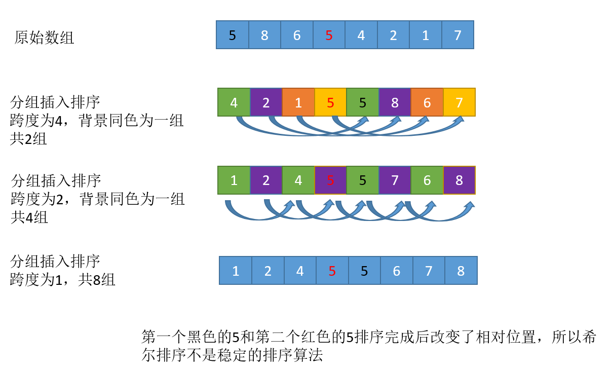

其中分组跨度4， 2， 1就叫做增量序列

#### 动画演示


#### 示例代码

```java
public class ShellSort {
    public static void shellSort(int[] arr) {
        int h = arr.length / 2; // 增量
        while(h >= 1) {
            for (int i = h; i < arr.length ; i++) {
                int X = arr[i];
                int j = i - h;
                for(;j>=0 && arr[j] > X;j-=h) {
                    arr[j+h] = arr[j];
                }
                arr[j+h] = X;
            }
            h /= 2;
        }
    }
}

```

其实最广泛的增量取法是`h= length / 3 + 1`，有兴趣的可以去查阅为什么是 **除以3**(除以3交换的次数最少，时间用的最少), 代码如下

```java
public class ShellSort {
    public static void shellSort(int[] arr) {
        int h = arr.length / 3 + 1; // 增量
        while(h >= 1) {
            for (int i = h; i < arr.length ; i++) {
                int X = arr[i];
                int j = i - h;
                for(;j>=0 && arr[j] > X;j-=h) {
                    arr[j+h] = arr[j];
                }
                arr[j+h] = X;
            }
            h = h / 3 + 1;
        }
    }
}

```

#### 算法分析

希尔排序利用分组粗调的方式使算法的复杂度小于O(n^2), 但是在某些极端情况下，希尔排序的最坏时间复杂度依然是O(n^2), 设置比直接插入排序更慢

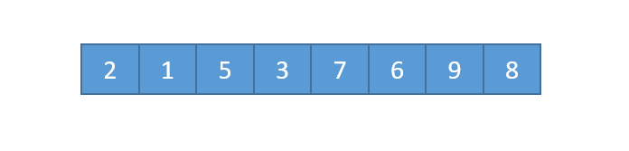

看看上面这个数组，如果我们按照之前的折半取增量的分组思路，无论是以4为增量，还是以2为增量，每组内部的元素都没有任何交换。一直到我们把增量缩减为1，数组才会按照直接插入排序的方式进行调整。

对于这样的数组，希尔排序不但没有减少直接插入排序的工作量，反而白白增加了分组操作的成本。

由此我们可以得出，Shell排序的执行时间依赖于增量序列。

好的增量序列的共同特征：

1. 最后一个增量必须为1；

2. 应该尽量避免序列中的值(尤其是相邻的值)互为倍数的情况。


最佳情况：O(nlogn)    最坏情况：O(n^2)    平均情况：T(n) = O(nlogn)

## 归并排序

#### 算法描述

归并操作的工作原理如下：

第一步：申请空间，使其大小为两个已经[排序](https://baike.baidu.com/item/排序)序列之和，该空间用来存放合并后的序列

第二步：设定两个[指针](https://baike.baidu.com/item/指针)，最初位置分别为两个已经排序序列的起始位置

第三步：比较两个指针所指向的元素，选择相对小的元素放入到合并空间，并移动指针到下一位置

重复步骤3直到某一指针超出序列尾

将另一序列剩下的所有元素直接复制到合并序列尾

#### 动画演示

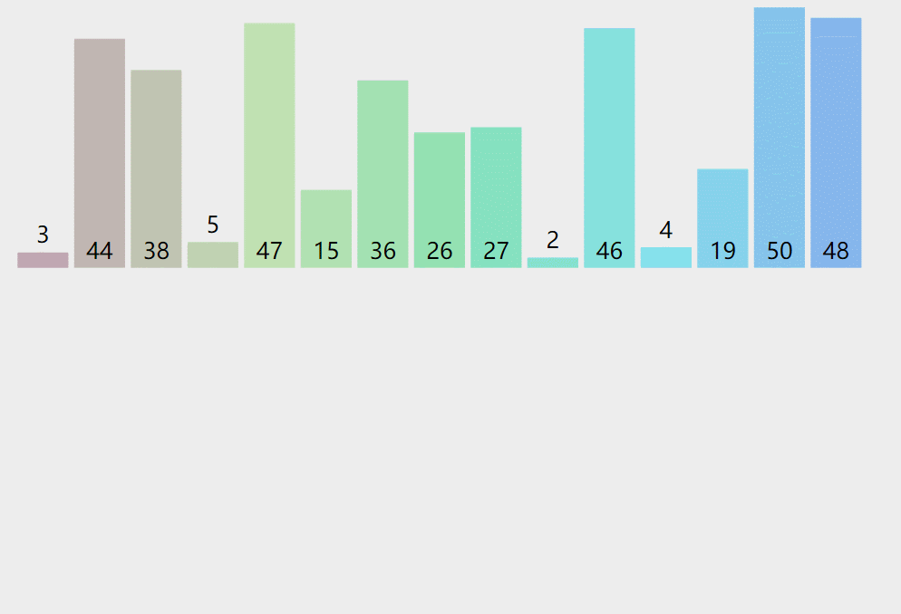

#### 参考代码

```java
//version1 自顶向下递归
public class MergeSort {
    public static void sort(int[] arr) {
        if(arr.length < =1) {
            return;
        }
        mergeSort(arr, 0, arr.length -1);
    }
    private static void mergeSort(int[] arr, int left,int right) {
        if(left < right) {
            int mid = (right - left) / 2 + left; //分成两半
            mergeSort(arr, left, mid); // 对每一部分继续递归排序
            mergeSort(arr, mid+1, right);
            merge(arr, left, mid, right); // 归并子程序
        }
    }
    // 归并操作 arr[left...mid] arr[mid+1...right]
    private static void merge(int[] arr, int left, int mid, int right) {
        int n = right - left + 1;
        int[] data = new int[n]; // 申请一个临时数组来合并
        int k = 0;
        int i = left;
        int j = mid+1;
        while(i <= mid && j <= right) {
            data[k++] = arr[i] <= arr[j] ? arr[i++]: arr[j++];
        }
        while(i <= mid) {
            data[k++] = arr[i++];
        }
        while(j <= right) {
            data[k++] = arr[j++];
        }
        for(int m = 0; m < n; m++) {
            arr[m + left] = data[m];
        }
    }
}

```

上面的代码是自顶向下递归的归并排序，将一个目标排序数组，采用二分法，一直递归分解，直到数量为1，开始两两比较排序合并，最终完成目标数组合并排序。

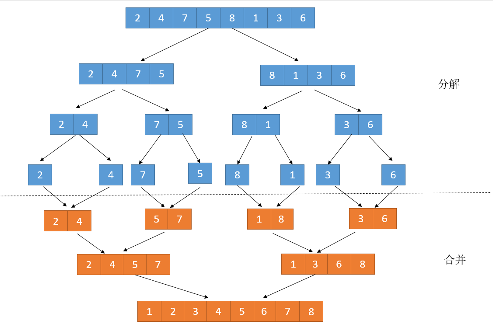


现在来考虑自底向上的归并排序，不用递归, 首先直接从相邻合并，步长依次成倍递增。

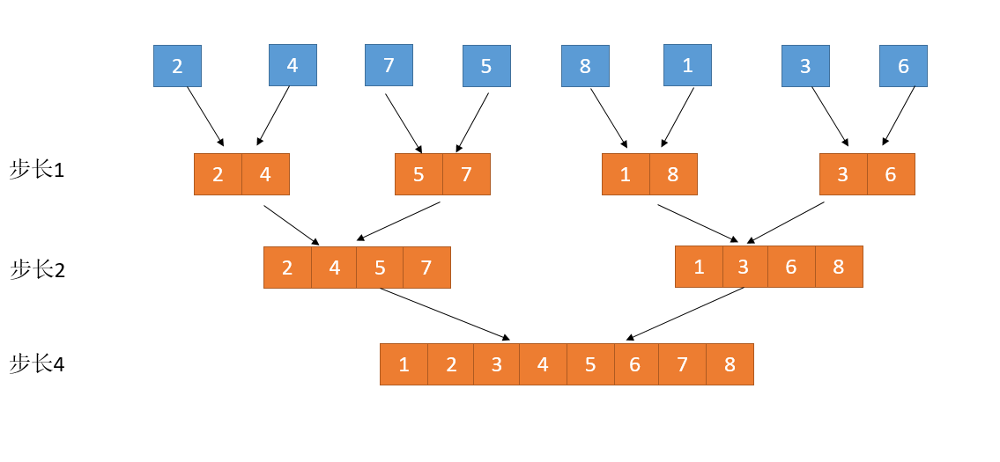

```java
// version2 自底向上递推
public class MergeSortBU {
    public static void mergeSortBU(int[] arr) {
        int n = arr.length;
        for (int size = 1; size < n; size *= 2) { //步长成倍递增, 1, 2, 4, 8.....
            for (int i = 0; i < n - size; i += size * 2) {
                // 对 arr[i, i+size-1]和arr[i+size,i+size*2 -1]进行归并
                merge(arr, i, i + size - 1, Math.min(i + 2 * size - 1, n - 1));
            }
        }
    }
    // 归并操作 arr[left...mid] arr[mid+1...right]
    private static void merge(int[] arr, int left, int mid, int right) {
        int n = right - left + 1;
        int[] data = new int[n];
        int k = 0;
        int i = left;
        int j = mid + 1;
        while (i <= mid && j <= right) {
            data[k++] = arr[i] <= arr[j] ? arr[i++] : arr[j++];
        }
        while (i <= mid) {
            data[k++] = arr[i++];
        }
        while (j <= right) {
            data[k++] = arr[j++];
        }
        for (int m = 0; m < n; m++) {
            arr[m + left] = data[m];
        }
    }
}
```

#### 算法分析

##### 是否是稳定排序

归并排序稳不稳定关键要看 merge() 函数，也就是两个有序子数组合并成一个有序数组的那部分代码。在合并的过程中，如果 Array[left…mid]和 Array[mid+1…right]之间有值相同的元素，那我们可以先把 A[left…mid]中的元素放入临时数组里面。这样就保证了值相同的元素，在合并前后的先后顺序不变。所以，归并排序是一个稳定的排序算法。

##### 时间复杂度

我们这里分析自顶向下递归的时间复杂度,

归并排序涉及递归，如何分析递归代码的时间复杂度。递归的适用场景是，一个问题 a 可以分解为多个子问题 b、c，那求解问题 a 就可以分解为求解问题 b、c。问题 b、c 解决之后，我们再把 b、c 的结果合并成 a 的结果。如果我们定义求解问题 a 的时间是 T(a)，求解问题 b、c 的时间分别是 T(b) 和 T( c)，那我们就可以得到这样的递推关系式：

```
T(a) = T(b) + T(c) + K
```

其中 K 等于将两个子问题 b、c 的结果合并成问题 a 的结果所消耗的时间

套用这个公式，我们来分析一下归并排序的时间复杂度。

我们假设对 n 个元素进行归并排序需要的时间是 T(n)，那分解成两个子数组排序的时间都是 T(n/2)。merge() 函数合并两个有序子数组的时间复杂度是 O(n)。所以，归并排序的时间复杂度的计算公式就是：

```
T(1) = C； n=1时，只需要常量级的执行时间，所以表示为C。
T(n) = 2*T(n/2) + n； n>1
```

再进一步分解一下计算过程

```
T(n) = 2*T(n/2) + n 
= 2*(2*T(n/4) + n/2) + n 
= 4*T(n/4) + 2*n = 4*(2*T(n/8) + n/4) + 2*n 
= 8*T(n/8) + 3*n 
= 8*(2*T(n/16) + n/8) + 3*n 
= 16*T(n/16) + 4*n ...... 
= 2^k * T(n/2^k) + k * n ......
```

通过这样一步一步分解推导，我们可以得到 T(n) = 2^kT(n/2^k)+kn。当 T(n/2^k)=T(1) 时，也就是 n/2^k=1，我们得到 k=log2n 。我们将 k 值代入上面的公式，得到 T(n)=Cn+nlog2n 。如果我们用大 O 标记法来表示的话，T(n) 就等于 O(nlogn)。所以归并排序的时间复杂度是 O(nlogn)。


##### 空间复杂度

归并排序的时间复杂度任何情况下都是 O(nlogn)，看起来非常优秀。（即便是快速排序，最坏情况下，时间复杂度也是 O(n2)。）但是，归并排序并没有像快排那样，应用广泛，这是为什么呢？因为它有一个致命的“弱点”，那就是归并排序不是原地排序算法。这是因为归并排序的合并函数merge，在合并两个有序数组为一个有序数组时，需要借助额外的存储空间。

那么归并排序的空间复杂度到底是多少呢？是 O(n)，还是 O(nlogn)，应该如何分析呢？

如果我们继续按照分析递归时间复杂度的方法，通过递推公式来求解，那整个归并过程需要的空间复杂度就是 O(nlogn)。我们用分析时间复杂度那样来分析空间复杂度，这个思路对吗**？实际上，递归代码的空间复杂度并不能像时间复杂度那样累加**。尽管每次合并操作都需要申请额外的内存空间，但在合并完成之后，临时开辟的内存空间就被释放掉了。在任意时刻，CPU 只会有一个函数在执行，也就只会有一个临时的内存空间在使用。临时内存空间最大也不会超过 n 个数据的大小，所以空间复杂度是 O(n)。

## 快速排序

快速排序算法通过多次比较和交换来实现排序，其排序流程如下： 

+ (1)首先设定一个分界值,一般选左边界或者右边界，通过该分界值将数组分成左右两部分。

+ (2)将大于分界值的数据集中到数组右边，小于等于分界值的数据集中到数组的左边。此时，左边部分中各元素都小于等于分界值，而右边部分中各元素都大于分界值。这个过程叫做`partition`

+ (3)然后，左边和右边的数据可以独立排序。对于左侧的数组数据，又可以取一个分界值，将该部分数据分成左右两部分，同样在左边放置较小值，右边放置较大值。右侧的数组数据也可以做类似处理。

+ (4)重复上述过程，直到不可以再分区，可以看出，这是一个递归定义。通过递归将左侧部分排好序后，再递归排好右侧部分的顺序。当左、右两个部分各数据排序完成后，整个数组的排序也就完成了

#### 动画演示

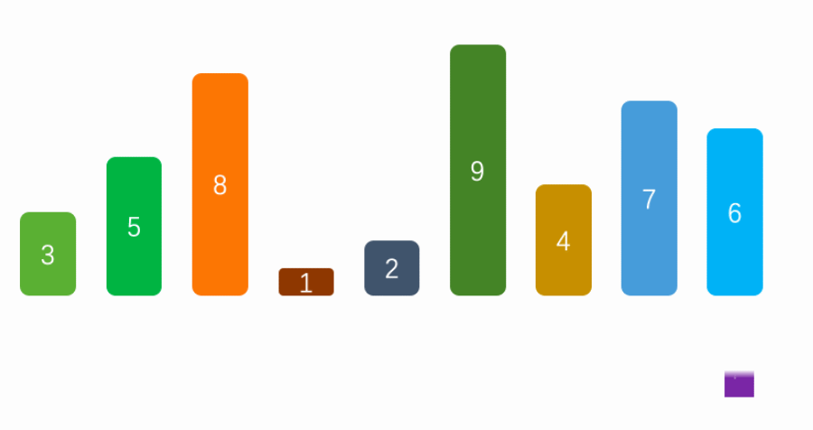

#### 示例代码

```java
public class QuickSort {
    public static void sort(int arr[]) {
        int n = arr.length-1;
        quickSort2(arr, 0, n);
    }
    public static void quickSort(int[] arr, int left, int right) {
       if(left < right) {
           int pivotIndex = partition(arr, left, right);
           quickSort(arr, left, pivotIndex-1);
           quickSort(arr, pivotIndex+1, right);
       }
    }
    private static int partition(int[] arr, int left, int right) {
        int pivot = arr[left];
        int l = left;
        int r = right;
        while(l < r) {
            while(l < r && arr[r] > pivot) {
                r--;
            }
            while(l < r && arr[l] <= pivot) {
                l++;
            }
            if (l<r) {
                int tmp = arr[l];
                arr[l] = arr[r];
                arr[r] = tmp;
            }
        }
        //pivot和指针重合点交换
        int p = arr[l];
        arr[l] = arr[left];
        arr[left] = p;
        return l;
    }

}

```

其实分区函数partition有很多种写法, 这里是用的双指针法，还有挖坑法，有兴趣的童鞋可以去了解一下

#### 算法分析
当分区总是将数组分成两个相等的一半时，就会发生快速排序的最佳情况，如归并排序。
当发生这种情况时，递归的深度只有O(log N）。
由于每个级别进行O（N）比较，时间复杂度为O（N log N），空间复杂度是O(logn)


来考虑这样一种情况，假设我们选择左边界，如果序列右侧都比分界大，那么这个递归树就严重不平衡，直接退化成为链表，递归深度变成了n，时间复杂度退化成O(n^2)，空间复杂度变成O(n)


如何避免这个问题呢? 其实很好解决，分界不要选在一个固定的位置，而应该**随机选取**，这种快排也叫作**随机快排**，这种随机化版本的快速排序在任何N个元素的输入数组上预期的时间复杂度为O（N log N）（如何证明有兴趣的自己去研究）

综上：
快排的平均时间复杂度是O(nlogn),最好是O(nlogn)，最坏是O(n^2)
快排的平均空间复杂度是O(nlogn),最好是O(logn)，最坏是O(n)

#### 随机快速代码参考

分界不选在一个固定的位置，而是随机选取

```java
public class QuickSort {
    public static void sort(int arr[]) {
        int n = arr.length-1;
        quickSort2(arr, 0, n);
    }
    public static void quickSort(int[] arr, int left, int right) {
       if(left < right) {
           int pivotIndex = partition(arr, left, right);
           quickSort(arr, left, pivotIndex-1);
           quickSort(arr, pivotIndex+1, right);
       }
    }
    private static int partition(int[] arr, int left, int right) {
        // 随机产生区间[left, right]的某个索引
        int randomIndex = (int) (Math.random() * (right - left + 1));
        swap(arr, left, randomIndex);
        int pivot = arr[left];
        int l = left;
        int r = right;
        while(l < r) {
            while(l < r && arr[r] > pivot) {
                r--;
            }
            while(l < r && arr[l] <= pivot) {
                l++;
            }
            if (l<r) {
                int tmp = arr[l];
                arr[l] = arr[r];
                arr[r] = tmp;
            }
        }
        //pivot和指针重合点交换
        int p = arr[l];
        arr[l] = arr[left];
        arr[left] = p;
        return l;
    }
    private static void swap(int[] arr, int i , int j) {
        int tmp = arr[i];
        arr[i] = arr[j];
        arr[j] = tmp;
    }

}
```


## 堆排序

堆是具有以下性质的完全二叉树：每个结点的值都大于或等于其左右孩子结点的值，称为大顶堆；或者每个结点的值都小于或等于其左右孩子结点的值，称为小顶堆。

堆排序利用的是二叉堆的性质

堆排序算法的步骤：

**1. 把无序数组构建成二叉堆。**

**2. 循环删除堆顶元素，移到集合尾部，调节堆产生新的堆顶。**

#### 动画演示
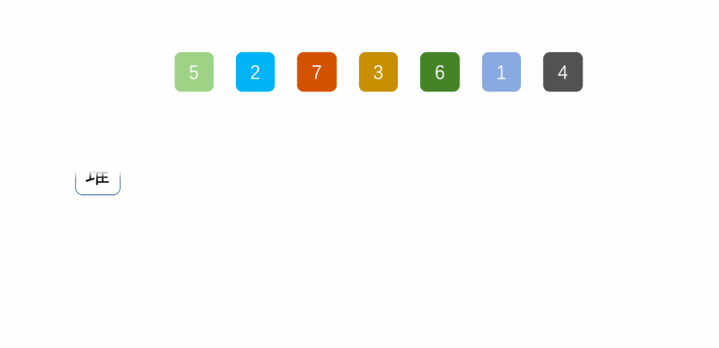


```java
public class HeapSort {
    public static void heapSort(int[] arr) {
        int n = arr.length;
        // 1. heapify, 从第一个非叶子节点开始向下堆化,构建一个最大堆
        for (int i = (n-1) / 2; i>=0; i--) {
            shiftDown(arr, i, n);
        }
        // 2 循环删除堆顶元素，移到集合尾部，调节堆产生新的堆顶。
        for(int i = n - 1 ; i > 0;i--) {
            swap(arr,0, i); // 把堆顶和当前元素交换
            shiftDown(arr, 0, i); // 从堆顶开始下沉，维护堆
        }
    }
    // 下沉操作就是每次不断和左右子节点比较，如果子节点比当前节点大，那么就交换，开始下一轮循环，否则退出循环
    private static void shiftDown(int[] arr, int k, int n) {
        while(2*k + 1 < n) {
            int i = 2*k + 1;
            if(i + 1 < n && arr[i+1] > arr[i]) {
                i = i+1;
            }
            if(arr[k] > arr[i]) {
                break;
            }
            swap(arr, i, k);
            k = i;
        }
    }
    private static void swap(int[] arr, int i , int j) {
        int tmp = arr[i];
        arr[i] = arr[j];
        arr[j] = tmp;
    }
}

```

以这个数组为例，看看第一步heapify堆化的过程

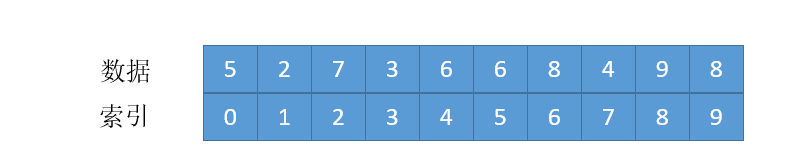


完全二叉出树的第一个非叶子节点的索引是`(n -1) / 2`,从第一个非叶子节点开始堆化，一直到第一个节点，就构建了一个最大堆

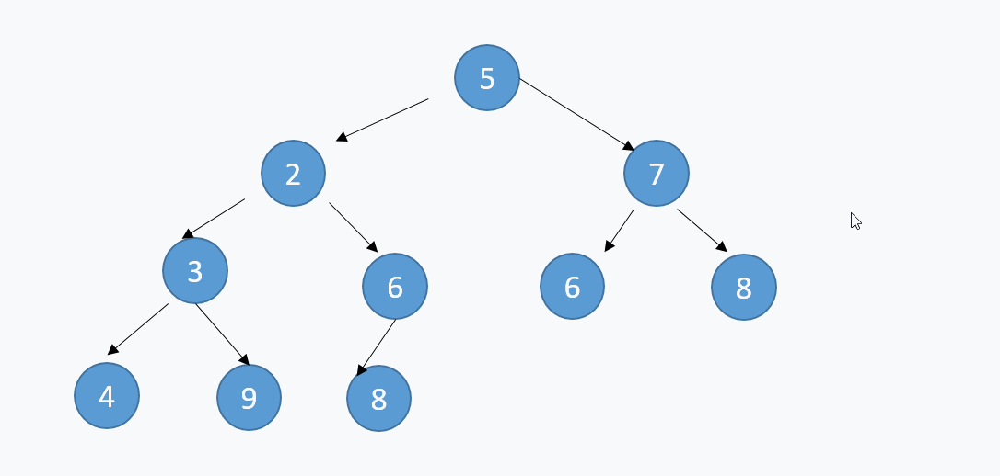

#### 复杂度分析

我们再来回顾一下堆排序算法的步骤：

1. 把无序数组构建成二叉堆。

2. 循环删除堆顶元素，移到集合尾部，调节堆产生新的堆顶。

第一步，把无序数组构建成二叉堆，需要进行n/2次循环。每次循环调用一次 shiftDown方法，所以第一步的计算规模是 n/2 * logn，时间复杂度 **O（nlogn）**。

第二步，需要进行n-1次循环。每次循环调用一次 shiftDown方法，所以第二步的计算规模是 （n-1） * logn ，时间复杂度 **O（nlogn）**。

所以整体的时间复杂度同样是 **O（nlogn）**，并且最差和最好的时间复复杂度也是O(nlogn)

归并和快排都是不稳定的排序算法， 平均时间复杂度都是O(nlogn)，快排的最坏时间复杂度是O(n^2), 堆排序是O(nlogn)

## 计数排序

>计数排序是一个非基于比较的排序算法，它的优势在于在对一定范围内的整数排序时，它的复杂度为Ο(n+k)（其中k是整数的范围），快于任何比较排序算法。 当然这是一种牺牲空间换取时间的做法，而且当O(k)>O(n*log(n))的时候其效率反而不如基于比较的排序（基于比较的排序的时间复杂度在理论上的下限是O(n*log(n)), 如归并排序，快速排序，堆排序）

计数排序的核心在于将输入的数据值转化为键存储在额外开辟的数组空间中。作为一种线性时间复杂度的排序，计数排序要求输入的数据必须是有**确定范围的整数**。

#### 算法描述

1. 花O(n)的时间扫描一下整个序列 A，获取最小值 min 和最大值 max
2. 开辟一块新的空间创建新的数组 B，长度为 ( max - min + 1)
3. 数组 B 中 index 的元素记录的值是 A 中某元素出现的次数
4. 最后输出目标整数序列，具体的逻辑是遍历数组 B，输出相应元素以及对应的个

#### 动画演示

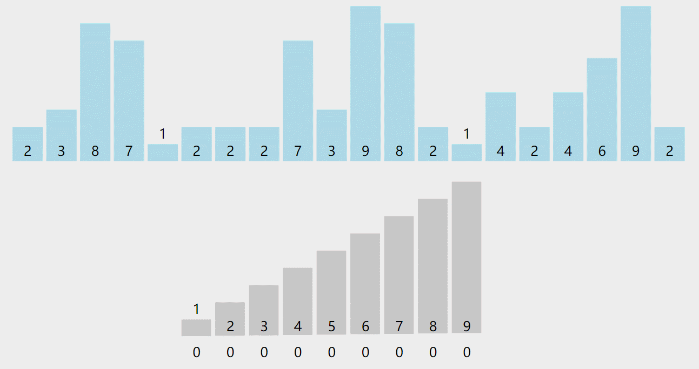

#### 示例代码

##### 第一版
```java
// version 1
public class CountingSort {
    public static void countingSort(int[] arr) {
        int max = arr[0];
        for(int i = 0 ; i < arr.length; i++) {
            if(max < arr[i]) {
               max = arr[i]
            }
        }
        int k = max +1;
        // 创建计数数组
        int[] countArr = new int[k];
        // 遍历数列中的每个元素, 相应的计数增加1
        for(int i = 0; i < arr.length: i++) {
            countArr[arr[i]]++;
        }
        int index = 0;
        for (int i = 0; i < k; i++) {
           while(countArr[i] > 0) {
               arr[index++] = i;
               countArr[i]--;
           }
        }
    }
}

```


上面已经实现了一个计数排序，

**但是这个算法不稳定**！！！想想为什么?
我们现在需要把它改造成一个稳定算法, 我们来写第二版算法

##### 第二版

```java
// version2
public class CountingSort {
    public static int[] countingSort(int[] arr) {
        int max = arr[0];
        for(int i = 0 ; i < arr.length; i++) {
            if(max < arr[i]) {
               max = arr[i]
            }
        }
        int k = max +1;
        // 创建计数数组
        int[] countArr = new int[k];
        // 遍历数列中的每个元素, 相应的计数增加1
        for(int i = 0; i < arr.length: i++) {
            countArr[arr[i]]++;
        }
        for(int i = 1; i < k; i++) {
            countArr[i] = countArr[i] + countArr[i-1]; // 统计数据排序后的位置
        }
        int[] res = new int[arr.length];
        for(int i = arr.length -1; i--; i>=0) {
            result[--count[arr[i]-1]] = arr[i]; // 把arr[i]放在排序后的正确位置上
        }
        return res;
    }
}

```

先来分析这段代码

```java
for(int i = 0; i < arr.length: i++) {
    countArr[arr[i]]++;
}
for(int i =1; i < k; i++) {
    countArr[i] = countArr[i] + countArr[i-1];
}
```

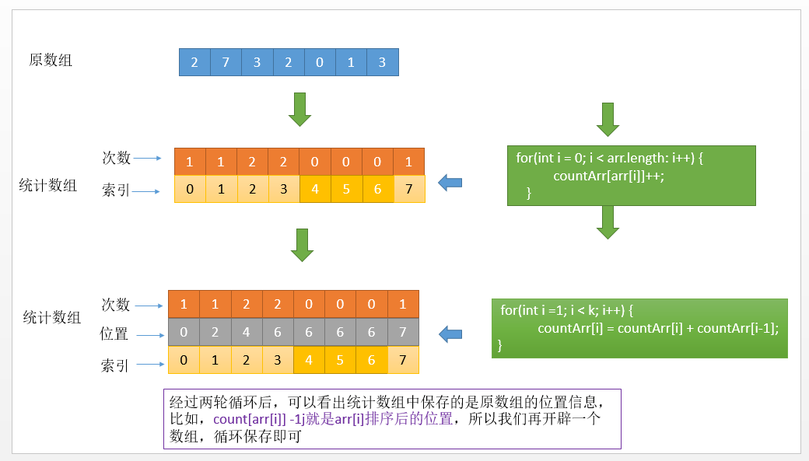

解决了稳定性的问题，我们继续来看还有什么问题

假设我们数列不是从0开始，最小值是90，最大值是为99，那么按照这个算法，开辟一个长度为100的的统计数组就会浪费前面90个空间。

为了解决这个问题，我们不再以（输入数列的最大值+1）作为统计数组的长度，而是以（数列最大值和最小值的差+1）作为统计数组的长度。同时，**数列的最小值作为一个偏移量**，用于统计数组的对号入座。

所以最终版第三版代码如下

##### 第三版

```java
// version3
public class CountingSort {
    public static int[] countingSort(int[] arr) {
        int max = arr[0];
        int min = arr[0];
        for(int i= 0 ； i< arr.length; i++) {
            if(arr[i] > max) {
                max = arr[i];
            }
            if(arr[i] < min) {
                min = arr[i];
            }
        }
        int k = max - min +1;
        // 创建计数数组
        int[] countArr = new int[k];
        // 遍历数列中的每个元素, 相应的计数增加1
        for(int i = 0; i < arr.length: i++) {
            countArr[arr[i]-min]++; // 注意减去偏移量
        }
        for(int i = 1; i < k; i++) {
            countArr[i] = countArr[i] + countArr[i-1]; // 统计数据排序后的位置
        }
        int[] res = new int[arr.length];
        for(int i = arr.length -1; i--; i>=0) {
            result[--count[arr[i]-min]] = arr[i]; // 把arr[i]放在排序后的正确位置上，这里也要减去偏移量
        }
        return res;
    }
}


```


#### 算法分析

我们最终选用第三版，来分析下复杂度

时间复杂度：一共三轮循环， n + (k-1) + n = O(n+k)

空间复杂度：一个统计数组需要k的空间，一个保存结果的数组n的空间，所以是O(n + k)

总结：

**计数排序适用于整型序列，且要求数据范围小，对于k<<n(海量数据，数据范围有限)的情况下，时间复杂度可以退化成O(n)**

## 基数排序

基数排序法会使用到桶 (Bucket)，基数排序顾名思义，依次比较各位，十位，百位，将要排序的元素分配至 0~9 个桶中，借以达到排序的作用，在某些时候，基数排序法的效率高于其它的比较性排序法。

 比如：2，22，31，1221，90，85，105

        个位排序：90，31，1221，2，22，85，105
    
        十位排序：2，105，1221，22，31，85，90
    
        百位排序：2，22，31，85，90，105，1221
    
        千位排序：2，22，31，85，90，105，1221
    
         注意：每次排序都是在上次排序的基础上进行排序的，也就是说此次排序的位数上他们相等时，就不移动元素（即顺序参数上一个位数的排序顺序），所以是稳定排序


#### 动画演示

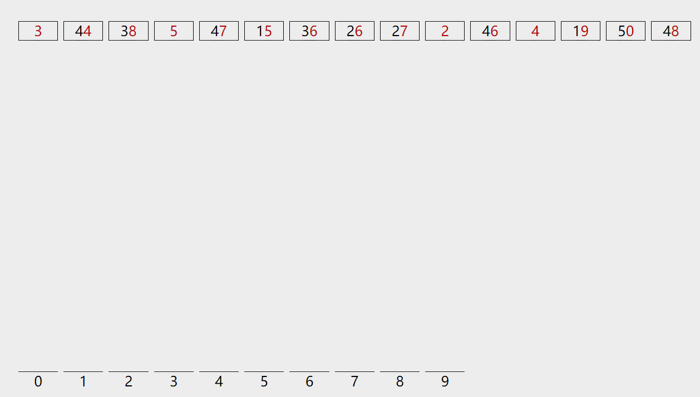

#### 示例代码

我们先考虑非负整数的情况

```java
// verson1
import java.util.Arrays;
public class RadixSort {
    public static void radixSort(int[] arr) {
        int max = getMax(arr);
        // 从低位到高位，依次采取计数排序
        for(int exp = 1; max/exp > 0; exp*=10) {
            // 计数排序
            countSort(arr, exp);
        }
    }
    private static void countSort(int[] arr, int exp) {
        int n = arr.length;
        int output[] = new int[n]; // 输出数组
        int count[] = new int[10]; // 假设是10进制，桶的长度是10，分别对应位数是0,1,2,3,4,5，6,7，8,9
        // count[]统计次数
        for (int i = 0; i < n; i++)
            count[(arr[i]/exp)%10]++;
        // 存储当前位数下，输出数组元素的正确位置
        for (int i = 1; i < 10; i++)
            count[i] += count[i - 1];
        // 构建输出数组
        for (int i = n - 1; i >= 0; i--){
            output[--count[ (arr[i]/exp)%10 ]] = arr[i];
        }
        // 每轮输出数组拷贝到原数组
        for (int i = 0; i < n; i++)
            arr[i] = output[i];
    }
    private static int getMax(int[] arr) {
        int max = arr[0];
        for (int i = 1; i < arr.length; i++)
            if (arr[i] > max)
                max = arr[i];
        return max;
    }
}
```
我们现在的算法只支持排序非负整数的序列，所以需要改造一下，也可以支持负数

需要把桶的长度设置成20，其中 [0-9]对应负数，[10-19]对应正数，同时最大值要取绝对值最大的

```java
// verson2
public class RadixSort {
    public static void radixSort(int[] arr) {
        int max = getAbsMax(arr);
        // 从低位到高位，依次采取计数排序
        for(int exp = 1; max/exp > 0; exp*=10) {
            // 计数排序
            countSort(arr, exp);
        }
    }
    private static void countSort(int[] arr, int exp) {
        int n = arr.length;
        int output[] = new int[n]; // 输出数组
        int k = 20;
        int count[] = new int[k];
        int offset = 10; // 偏移是10
        // count[]统计次数
        for (int i = 0; i < n; i++)
            count[(arr[i]/exp)%10 + offset]++;
        // 存储当前位数下，输出数组元素的正确位置
        for (int i = 1; i < k; i++)
            count[i] += count[i - 1];
        // 构建输出数组
        for (int i = n - 1; i >= 0; i--){
            output[--count[(arr[i]/exp)%10+offset]] = arr[i];
        }
        // 每轮输出数组拷贝到原数组
        for (int i = 0; i < n; i++)
            arr[i] = output[i];
    }
    private static int getAbsMax(int[] arr) {
        int max = Math.abs(arr[0]);
        for (int i = 1; i < arr.length; i++)
            if (Math.abs(arr[i]) > max)
                max = Math.abs(arr[i]);
        return max;
    }
}

```


#### 复杂度分析

计数`countSort`函数的时间是n + r, 其中r是进制，10进制要的桶长度是10*2，其他进制同理，然后外层位数循环，取决于绝对值最大的数的位数，是一个常数k, 所以是

`O(k * (n + r) = O(k*n)`

空间复杂度`O(n + r) = O(n)`

基数排序对每个桶的排序使用计数排序，计数排序是稳定排序，所以基数排序也是稳定排序

## 桶排序

桶排序和计数排序一样，不受O(nlogn)时间复杂度下限的影响，它将待排序序列通过遍历方式分到有限数量的桶中，然后每个桶被单独地排序，桶内排序可以通过比较方式实现，也可以通过非比较方式实现。

算法步骤

通过比较方式的桶排序分为4步工作步骤：

1.设定合适数量的分桶；

2.遍历待排序序列，将每个元素放入到对应的桶中；

3.对每个非空桶进行合适的排序算法；

4.按顺序访问桶，将桶中的元素依次放回到原序列中对应的位置。

#### 动画演示


#### 参考代码

桶排序可以排序浮点型数据，这里我们考虑double型数组

```java
import java.util.*
public class BucketSort {
    public static void main(String[] args) {
        double[] arr = {10.3, 60.4, 30.7, -20.4, 10, -70, 60};
        bucketSort(arr);
        System.out.println(Arrays.toString(arr));
    }
    public static void bucketSort(double[] arr) {
        int n = arr.length;
        double max = arr[0];
        double min = arr[0];
        for(double v: arr) {
            if(v > max) {
                max = v;
            }
            if(v < min) {
                min = v;
            }
        }
        // 计算桶的数量
        int bucketNum = (int) ((max - min) / n + 1);
        // 初始化桶
        LinkedList<Double>[] bucket = new LinkedList[bucketNum];
        for (int i = 0; i < bucketNum; i++) {
            bucket[i] = new LinkedList<Double>();
        }
        // 将元素分配到对应的桶中
        for (int i = 0; i < n; i++) {
            int index = (int) ((arr[i] - min ) / n);
            bucket[index].add(arr[i]);
        }
        // 对每个桶的元素进行排序
        for(int i = 0; i < bucket.length; i++){
            Collections.sort(bucket[i]);
        }
        // 依次取出桶中的元素
        int index = 0;
        for(int i = 0; i < bucket.length; i++){
            // 依次取出当前桶中的元素,也就是迭代链表
            Iterator<Double> iterator = bucket[i].iterator();
            while(iterator.hasNext()){
                arr[index++] = iterator.next();
            }

        }
    }
}

```

#### 算法分析

##### 复杂度分析

对N个数据进行桶排序的时间复杂度分为两部分：

1. N次循环，每一个数据装入桶
2. 对桶内数据的排序，时间复杂度为`∑ O(Ni*logNi)` ，其中Ni 为第i个桶的数据量。
3. 循环取出每个桶中的数据，一共N个数据,执行N次

对于N个待排数据，M个桶，平均每个桶 有[N/M]个数据，桶排序平均时间复杂度为：

`O(N)+O(M*(N/M)*log(N/M)) + O(N)=O(N+N*(logN-logM))=O(N+N*logN - N*logM)`

当N=M时，即极限情况下每个桶只有一个数据时。桶排序的最好效率能够达到O(N)。

对于相同数量的数据，桶的数量越多，数据分散得越平均，桶排序的效率越高，可以说，桶排序的效率是空间的牺牲换来的。

空间复杂度
空间复杂度一般指算法执行过程中需要的额外存储空间

桶排序中，需要创建M个桶的额外空间，以及N个元素的额外空间

所以桶排序的空间复杂度为 O(N+M)

##### 稳定性

稳定性是指，比如a在b前面，a=b，排序后，a仍然应该在b前面，这样就是稳定的。

桶排序中，假如升序排列，a已经在桶中，b插进来是永远都会a右边的(因为一般是从右到左，如果不小于当前元素，则插入该元素的右侧)

所以桶排序是稳定的

当然了，如果桶内排序算法采用快速排序等非稳定性排序，那么就不是稳定的，但是我们可以做到稳定，所以统一认为桶排序是稳定的

##### 适用范围

用排序主要适用于均匀分布的数字序列，这样就可以使数据均匀分布到每个桶中，在这种情况下能够达到最大效率

*******************

参考：

+ https://visualgo.net/zh/sorting
+ https://www.geeksforgeeks.org/sorting-algorithms/
+ https://www.cnblogs.com/xiaowenshu/p/10260784.html
