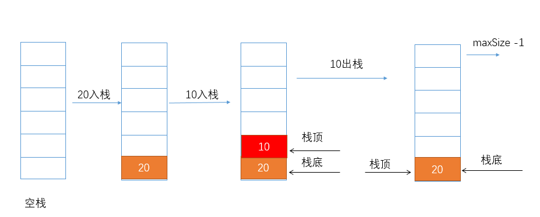
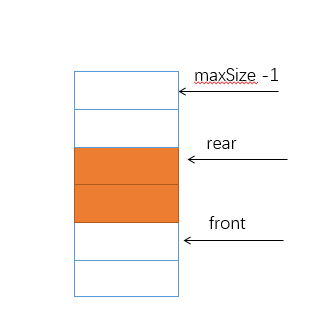

## 栈 队列 

### 栈

栈是一个先入后出的有序列表，允许插入和删除的一端成为栈顶，另一端成为栈底



#### 用数组模拟栈

```java
public class ArrayStack {
    private int maxSize;
    private int[] data;
    private int top;
    public ArrayStack(int maxSize) {
        this.maxSize = maxSize;
        data = new int[maxSize];
        top = -1;
    }
    public boolean isEmpty() {
        return top == -1;
    }
    public boolean isFull() {
        return top == maxSize - 1;
    }
    // 入栈
    public void push(int val) {
        if(isFull()) {
            return;
        }
        top++;
        data[top] = val;
    }
    // 出栈
    public int pop() {
        if(isEmpty()) {
            throw new RuntimeException("栈为空");
        }
        int temp = data[top];
        top--;
        return temp;
    }
    public void show() {
        if(isEmpty()) {
           return;
        }
        // 从栈顶开始遍历
        for (int i = top; i >= 0; i--) {
            System.out.println(data[i]);
        }
    }
}
```

#### 用栈实现综合计算器

使用栈，计算一个表达式的值`3 + 4 * 8 - 2`

算法思路：

1. 用两个栈，一个存放数据，一个存放运算符，对于表达式

2. 创建一个指针index,  从左到右扫描

3. 如果是数值，存放进去数据栈

4. 如果是运算符，分两种情况，

   4.1.  如果发现符号栈为空，直接入栈

   4.2.  如果符号栈有操作符，就进行比较

   ​	4.2.1.   如果当前的运算符的优先级小于或者等于栈顶的操作符的优先级，则从符号栈顶弹出一个操作符，从数据栈中弹出两个数据，计算，结果入数据栈，再将当前的操作符入符号栈

   ​	4.2.2.   如果当前的运算符的优先级大于栈顶的操作符的优先级，则直接入栈

5. 当表达式扫描完毕，顺序pop数据栈中的数据和符号栈中的操作符，运算

6. 最后数据栈的结果就是表达式的结果

   

用代码来实现上面的算法

```java
import java.util.Stack;

public class Calculator {
    public static void main(String[] args) {
     String expression = "120+3*4-4/2";
     int res = calculateExpressionValue(expression);
     System.out.printf("表达式%s的值是%d", expression, res);
    }
    public static int calculateExpressionValue(String expression) {
        if(expression == null || expression.length() ==0) {
            return 0;
        }
        Stack<Integer> dataStack = new Stack<>();
        Stack<Character> operatorStack = new Stack<>();
        int index = 0;
        int num1 = 0;
        int num2 = 0;
        int res = 0;
        char oper = 0;
        char ch = ' ';
        // 扫描表达式
        while (true) {
            ch = expression.charAt(index); // 这种取法只可以计算一位数的四则运算
            // 如果是操作符
            if (isOperator(ch)) {
                // 操作符栈不为空
                if (!operatorStack.empty()) {
                    // 如果当前操作符的优先级小于等于栈顶操作符的优先级，取数计算
                    if (priority(ch) <= priority(operatorStack.peek())){
                        num1 = dataStack.pop();
                        num2 = dataStack.pop();
                        oper = operatorStack.pop();
                        res = calculate(num1, num2, oper);
                        // 计算结果入栈
                        dataStack.push(res);
                        // 当前操作符入栈
                        operatorStack.push(ch);
                    } else {
                        operatorStack.push(ch);
                    }
                } else {
                    operatorStack.push(ch);
                }
            } else {
                // 如果是数据
                dataStack.push(ch - 48); // '0'在ASCII中是48
            }
            index++;
            // 扫描结束
            if (index >= expression.length()) {
                break;
            }
        }
        while(true) {
            if(operatorStack.isEmpty()) {
                break;
            }
            num1 = dataStack.pop();
            num2 = dataStack.pop();
            oper = operatorStack.pop();
            res = calculate(num1, num2, oper);
            dataStack.push(res);
        }
        return dataStack.peek();
    }
    // 运算符的优先级
    public static int priority(char val) {
        if (val == '*' || val == '/') {
            return 1;
        } else if (val == '+' || val == '-') {
            return 0;
        } else {
            return -1;
        }
    }
    // 是否是运算符
    public static boolean isOperator(char val) {
        return val == '*' || val == '/' || val == '+' || val == '-';
    }
    // 两个数运算
    public static int calculate(int num1, int num2, char operator) {
        int res = 0;
        switch (operator) {
            case '+':
                res = num1 + num2;
                break;
            case '-':
                res = num2 - num1; // 注意顺序
                break;
            case '*':
                res = num1 * num2;
                break;
            case '/':
                res = num2 / num1;
                break;
        }
        return res;
    }
}

```

多位数的运算

```java
import java.util.Stack;

public class Calculator {
    public static void main(String[] args) {
     String expression = "70+2*6-4+18";
     int res = calculateExpressionValue(expression);
     System.out.printf("表达式%s的值是%d", expression, res);
    }
    public static int calculateExpressionValue(String expression) {
        if(expression == null || expression.length() ==0) {
            return 0;
        }
        Stack<Integer> dataStack = new Stack<>();
        Stack<Character> operatorStack = new Stack<>();
        int index = 0;
        int num1 = 0;
        int num2 = 0;
        int res = 0;
        char oper = 0;
        char ch = ' ';
        String keepNum = ""; // 拼接多位数
        // 扫描表达式
        while (true) {
            ch = expression.charAt(index); // 这种取法只可以计算一位数的四则运算
            // 如果是操作符
            if (isOperator(ch)) {
                // 操作符栈不为空
                if (!operatorStack.empty()) {
                    // 如果当前操作符的优先级小于等于栈顶操作符的优先级，取数计算
                    if (priority(ch) <= priority(operatorStack.peek())){
                        num1 = dataStack.pop();
                        num2 = dataStack.pop();
                        oper = operatorStack.pop();
                        res = calculate(num1, num2, oper);
                        // 计算结果入栈
                        dataStack.push(res);
                        // 当前操作符入栈
                        operatorStack.push(ch);
                    } else {
                        operatorStack.push(ch);
                    }
                } else {
                    operatorStack.push(ch);
                }
            } else {
                keepNum += ch;
                // 查看下一位，如果下一位是数字，入栈，如果是运算符，继续扫描
                // 如果是最后一位
                if(index == expression.length() -1) {
                    dataStack.push(Integer.parseInt(keepNum)); // 字符串转为int
                } else {
                    if(isOperator(expression.charAt(index + 1))) {
                        dataStack.push(Integer.parseInt(keepNum)); // "120"转成120
                        keepNum = ""; // 记得清空
                    }
                }
            }
            index++;
            // 扫描结束
            if (index >= expression.length()) {
                break;
            }
        }
        while(true) {
            if(operatorStack.isEmpty()) {
                break;
            }
            num1 = dataStack.pop();
            num2 = dataStack.pop();
            oper = operatorStack.pop();
            res = calculate(num1, num2, oper);
            dataStack.push(res);
        }
        return dataStack.peek();
    }
    // 运算符的优先级
    public static int priority(char val) {
        if (val == '*' || val == '/') {
            return 1;
        } else if (val == '+' || val == '-') {
            return 0;
        } else {
            return -1;
        }
    }
    // 是否是运算符
    public static boolean isOperator(char val) {
        return val == '*' || val == '/' || val == '+' || val == '-';
    }
    // 两个数运算
    public static int calculate(int num1, int num2, char operator) {
        int res = 0;
        switch (operator) {
            case '+':
                res = num1 + num2;
                break;
            case '-':
                res = num2 - num1; // 注意顺序
                break;
            case '*':
                res = num1 * num2;
                break;
            case '/':
                res = num2 / num1;
                break;
        }
        return res;
    }
}
```

思考：表达式中有小括号要怎么做

### 队列

队列： 队列是一个有序列表，可以用数组或者链表来实现，遵循先入先出的原则

分类： 队列，双端队列, 优先队列

优先队列：插入o(1), 取o(logn)底层实现，可以是heap，bst, treap

应用： 广度优先遍历

#### 用数组模拟队列



```java
public class ArrayQueue {
    private int front; // 指向队列的第一个元素的前一个位置
    private int rear; // 队列的最后一个元素的位置
    private int maxSize;
    private int[] arr;
    public ArrayQueue(int maxSize) {
        this.maxSize = maxSize;
        arr = new int[maxSize];
        front = -1;
        rear = -1;
    }
    public boolean isFull() {
        return rear == maxSize - 1;
    }
    public boolean isEmpty() {
        return front == rear;
    }
    // 入队
    public void enQueue(int val) {
        if(isFull()) {
            return;
        }
        rear++;
        arr[rear] = val;
    }
    // 出队
    public int deQueue() {
        if(isEmpty()) {
            throw new RuntimeException("队列为空");
        }
        front++;
        return arr[front];
    }
    // 查看队列的头部
    public int peek() {
        if(isEmpty()) {
            throw new RuntimeException("队列为空");
        }
        return arr[front+1];
    }
    public void showQueue() {
        if(isEmpty()) {
            System.out.println("the queue is empty");
        }
        for (int i = 0; i < arr.length; i++) {
            System.out.println(arr[i]+"\t");
        }
        System.out.println();
    }
}

```

但是这种实现方式有一个很大的问题，front前面的空间几十已经空出来，却无法再使用了，我们需要用数组来实现环形队列

1. front表示第一个元素的索引，rear表示最后一个元素的下一个索引
2. 对列为空的条件` front == rear`,  队列满的条件，`(rear + 1) % maxSize == front`
3. 队列的大小`(rear +maxSize - front) % maxSize`

```java
public class ArrayQueue2 {
    private int front; // 指向队列的第一个元素的个位置
    private int rear; // 队列的最后一个元素的后一个位置
    private int maxSize;
    private int[] arr;
    public ArrayQueue2(int maxSize) {
        this.maxSize = maxSize;
        arr = new int[maxSize];
        front = 0;
        rear = 0;
    }
    public boolean isFull() {
        return (rear + 1) % maxSize == front;
    }
    public boolean isEmpty() {
        return rear == front;
    }
    // 入队
    public void enQueue(int val) {
        if (isFull()) {
            return;
        }
        arr[rear] = val;
        // 更新rear
        rear = (rear + 1) % maxSize;
    }
    // 出队
    public int deQueue() {
        if (isEmpty()) {
            throw new RuntimeException("队列为空");
        }
        int temp = arr[front];
        // 更新front
        front = (front + 1) % maxSize;
        return temp;
    }
    // 查看队列的头部
    public int peek() {
        if (isEmpty()) {
            throw new RuntimeException("队列为空");
        }
        return arr[front];
    }
    public void showQueue() {
        if (isEmpty()) {
            System.out.println("the queue is empty");
        }
        for (int i = front; i < front + size(); i++) {
            System.out.printf("arr[%d]=%d\n", i % maxSize, arr[i % maxSize]);
        }
        System.out.println();
    }
    public int size() {
        return (rear + maxSize - front) % maxSize;
    }
}
```
### 优先队列
普通队列： 先进先出， 出队顺序和入队顺序一致
优先队列： 出队顺序和入队顺序无关，和优先级有关
优先队列的底层实现是一个堆
对于堆要求可以白板编程
在java中有PriorityQueue
应用: topK

### leetCode

- [有效括号](https://leetcode-cn.com/problems/valid-parentheses/)
- https://leetcode-cn.com/problems/min-stack/
- https://leetcode-cn.com/problems/largest-rectangle-in-histogram
- https://leetcode-cn.com/problems/sliding-window-maximum
- https://leetcode.com/problems/design-circular-deque
- https://leetcode.com/problems/trapping-rain-water/
- [279. 完全平方数](https://leetcode-cn.com/problems/perfect-squares/)
- [199. 二叉树的右视图](https://leetcode-cn.com/problems/binary-tree-right-side-view/)
- [102. 二叉树的层序遍历](https://leetcode-cn.com/problems/binary-tree-level-order-traversal/)
- [103. 二叉树的锯齿形层次遍历](https://leetcode-cn.com/problems/binary-tree-zigzag-level-order-traversal/)
- 126
- 347

### leetCode题解

#### [20. 有效的括号](https://leetcode-cn.com/problems/valid-parentheses/)

```
给定一个只包括 '('，')'，'{'，'}'，'['，']' 的字符串，判断字符串是否有效。
有效字符串需满足：
左括号必须用相同类型的右括号闭合。
左括号必须以正确的顺序闭合。
注意空字符串可被认为是有效字符串。

示例 1:
输入: "()"
输出: true

示例 2:
输入: "()[]{}"
输出: true

示例 3:
输入: "(]"
输出: false
示例 4:

输入: "([)]"
输出: false
示例 5:

输入: "{[]}"
输出: true
```

**题解**

<!-- tabs:start -->

###### **java**

```java
class Solution {
    public boolean isValid(String s) {
		Map<Character, Character> map = new HashMap<>() {{
            put('}', '{');
            put(')','(');
            put(']','[');
        }};
        Deque<Character> stack = new ArrayDeque<>();
        for(int i = 0; i < s.length(); i++) {
            char c = s.charAt(i);
            if(map.containsKey(c)) {
            	char topEle = stack.isEmpty() ? '#': stack.removeLast();
            	if(topEle != map.get(c)) {
            		return false;
            	}
            } else {
            	stack.addLast(c);
            }
        }
        return stack.isEmpty();
    }
}
```

###### **javascript**

```javascript
/**
 * @param {string} s
 * @return {boolean}
 */
var isValid = function(s) {
    let map = {'}':'{', ']':'[', ')':'('}
    let stack = []
    for(let i = 0; i < s.length; i++) {
        if(s[i] in map) {
            let top = stack.length ? stack.pop(): '#'
            if(top != map[s[i]]) {
                return false
            }
        } else {
            stack.push(s[i])
        }
    }
    return !stack.length
};
```

######  **python**

```python
class Solution:
    def isValid(self, s: str) -> bool:
        map = {"}":"{","]":"[", ")":"("}
        stack = []
        for c in s:
            if c in map:
                top='#'
                if stack:
                    top = stack.pop()
                if top != map[c]:
                    return False
            else:
                stack.append(c)
        return not stack
```

<!-- tabs:end -->

#### [102. 二叉树的层序遍历](https://leetcode-cn.com/problems/binary-tree-level-order-traversal/)
```
给你一个二叉树，请你返回其按 层序遍历 得到的节点值。 （即逐层地，从左到右访问所有节点）。

示例：
二叉树：[3,9,20,null,null,15,7],

    3
   / \
  9  20
    /  \
   15   7
返回其层次遍历结果：

[
  [3],
  [9,20],
  [15,7]
]
```
**题解**
解法1: 修改版的BFS, 用队列，一层层入队，一层层出队

<!-- tabs:start -->

###### **java**
```java
/**
 * Definition for a binary tree node.
 * public class TreeNode {
 *     int val;
 *     TreeNode left;
 *     TreeNode right;
 *     TreeNode(int x) { val = x; }
 * }
 */
class Solution {
    public List<List<Integer>> levelOrder(TreeNode root) {
        List<List<Integer>> res = new ArrayList<>();
        Queue<TreeNode> queue = new LinkedList<>();
        if(root == null) {
            return res;
        }
        queue.offer(root);
        while(!queue.isEmpty()) {
            List<Integer> path = new ArrayList<>();
            int size = queue.size();
            for(int i = 0; i < size; i++) {
                TreeNode node = queue.poll();
                path.add(node.val);
                if(node.left != null) {
                    queue.add(node.left);
                }
                if(node.right != null) {
                    queue.add(node.right);
                }
            }
            res.add(path);
        }
        return res;
    }
}
```
###### **python**
```python
# Definition for a binary tree node.
# class TreeNode:
#     def __init__(self, x):
#         self.val = x
#         self.left = None
#         self.right = None

class Solution:
    def levelOrder(self, root: TreeNode) -> List[List[int]]:
        res = []
        queue = collections.deque()
        if not root:
            return res
        queue.append(root)
        while(len(queue)):
            size = len(queue)
            path = []
            for _ in range(size):
                headNode = queue.popleft()
                path.append(headNode.val)
                if headNode.left:
                    queue.append(headNode.left)
                if headNode.right:
                    queue.append(headNode.right)
            res.append(path)
        return res
```

<!-- tabs:end -->

#### [103. 二叉树的锯齿形层次遍历](https://leetcode-cn.com/problems/binary-tree-zigzag-level-order-traversal/)

```
给定一个二叉树，返回其节点值的锯齿形层次遍历。（即先从左往右，再从右往左进行下一层遍历，以此类推，层与层之间交替进行）。

例如：
给定二叉树 [3,9,20,null,null,15,7],

    3
   / \
  9  20
    /  \
   15   7
返回锯齿形层次遍历如下：

[
  [3],
  [20,9],
  [15,7]
]
```


```java
/**
 * Definition for a binary tree node.
 * public class TreeNode {
 *     int val;
 *     TreeNode left;
 *     TreeNode right;
 *     TreeNode(int x) { val = x; }
 * }
 */
class Solution {
    public List<List<Integer>> zigzagLevelOrder(TreeNode root) {
        List<List<Integer>> res = new ArrayList<>();
        Queue<TreeNode> queue = new LinkedList<>();
        if(root == null) {
            return res;
        }
        queue.offer(root);
        boolean inOrder = true;
        while(!queue.isEmpty()) {
            LinkedList<Integer> path = new LinkedList<>();
            int size = queue.size();
            for(int i = 0; i < size; i++) {
                TreeNode node = queue.poll();
                 if (inOrder) {
                    path.addLast(node.val);
                 } else {
                    path.addFirst(node.val);
                 }
                if(node.left != null) {
                    queue.add(node.left);
                }
                if(node.right != null) {
                    queue.add(node.right);
                }
            }
            inOrder = !inOrder;
            res.add(path);
        }
        return res;
    }
}
```

#### [199. 二叉树的右视图](https://leetcode-cn.com/problems/binary-tree-right-side-view/)

```
给定一棵二叉树，想象自己站在它的右侧，按照从顶部到底部的顺序，返回从右侧所能看到的节点值。

示例:

输入: [1,2,3,null,5,null,4]
输出: [1, 3, 4]
解释:

   1            <---
 /   \
2     3         <---
 \     \
  5     4       <---
```

#### [279. 完全平方数](https://leetcode-cn.com/problems/perfect-squares/)

```
给定正整数 n，找到若干个完全平方数（比如 1, 4, 9, 16, ...）使得它们的和等于 n。你需要让组成和的完全平方数的个数最少。
示例 1:
输入: n = 12
输出: 3 
解释: 12 = 4 + 4 + 4.
示例 2:
输入: n = 13
输出: 2
解释: 13 = 4 + 9.
```

**题解**

1 动态规划 `dp[n] = min(dp[n], dp[n-i*i] + 1)`

```

```


#### [滑动窗口最大值](https://leetcode-cn.com/problems/sliding-window-maximum/)

`level:hard`

>给定一个数组 nums，有一个大小为 k 的滑动窗口从数组的最左侧移动到数组的最右侧。你只可以看到在滑动窗口内的 k 个数字。滑动窗口每次只向右移动一位。返回滑动窗口中的最大值。

```markdown
输入: nums = [1,3,-1,-3,5,3,6,7], 和 k = 3
输出: [3,3,5,5,6,7] 
解释: 

  滑动窗口的位置                最大值
---------------               -----
[1  3  -1] -3  5  3  6  7       3
 1 [3  -1  -3] 5  3  6  7       3
 1  3 [-1  -3  5] 3  6  7       5
 1  3  -1 [-3  5  3] 6  7       5
 1  3  -1  -3 [5  3  6] 7       6
 1  3  -1  -3  5 [3  6  7]      7
```
