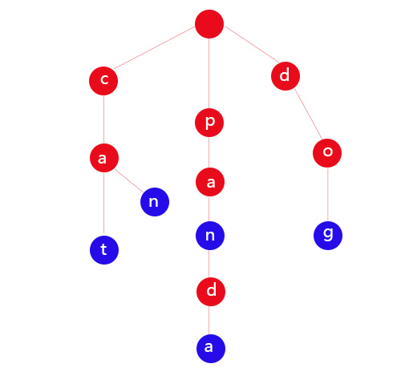

# 字符串匹配算法

## Brute-Force

## RK

## BM


## 暴力匹配算法

## Rabin-karp


## KMP


```javascript
function KMP(str, pattern) {
    function _getNext(pattern) {
         let n= pattern.length
         let count = 0
         let next = Array.from({length:pattern.length}).fill(0)
         for(let i = 1; i < n;i++) {
             while(count > 0 && pattern[i] !== pattern[count]) {
                 count = next[count-1]
             }
             if(pattern[i] === pattern[count]) {
                 count++
             }
             next[i] = count
         }
         return next
    }
    function index(str, pattern) {
        let next = _getNext(pattern)
        let j = 0
        for(let i = 0; i < str.length; i++) {
            while(j > 0 && pattern[j] !== str[i]) {
                j = next[j-1]
            }
            if(pattern[j] === str[i]) {
               j++
            }
            if(j === pattern.length) {
                return i - j + 1
            }
        }
       
    }
    function indexPositions(str,pattern) {
            let j = 0
            let next = KMP.getNext(pattern)
            let positions= []
            for(let i = 0; i < str.length; i++) {
                while(j > 0 && pattern[j] !== str[i]) {
                    j = next[j-1]
                }
                if(pattern[j] === pattern[i]) {
                    j++
                }
                if(j === pattern.length) {
                    positions.push(i - j + 1)
                    j = 0
                }
            }
            return positions
        }
    return {
        index,
        indexPositions
    }
    
}

```

```


## 需要强化

DFS, BFS, DP


```

引用：

+ https://www.cnblogs.com/yoke/p/6697013.html

## Trie树
Trie树, 又称单词查找树，Trie树，是一种树形结构，是一种哈希树的变种。典型应用是用于统计，排序和保存大量的字符串（但不仅限于字符串），所以经常被搜索引擎系统用于文本词频统计。它的优点是：利用字符串的公共前缀来减少查询时间，最大限度地减少无谓的字符串比较，查询效率比哈希树高

它有3个基本性质：

根节点不包含字符，除根节点外每一个节点都只包含一个字符；

从根节点到某一节点，路径上经过的字符连接起来，为该节点对应的字符串；

每个节点的所有子节点包含的字符都不相同。

如下图所示，蓝色节点标识单词结尾
 
 

trie树实现参考代码,如果只考虑英文字母，next可以用26个长度的数组来存储，性能更好
```java
import java.util.HashMap;

public class Trie {
    class Node {
        public boolean isWord;
        public HashMap<Character, Node> next = new HashMap<>();
    }

    public static void main(String[] args) {
        Trie t = new Trie();
        t.insert("panda");
//        t.insert("pan");
        System.out.println(t.search("panda"));
        System.out.println(t.search("pan"));
        System.out.println(t.startsWith("panda"));
        System.out.println(t.startsWith("pan"));
    }

    private Node root;
    private int size;

    public Trie() {
        root = new Node();
        size = 0;
    }

    // 添加单词
    public void insert(String str) {
        Node curr = root;
        for (int i = 0; i < str.length(); i++) {
            char c = str.charAt(i);
            if (!curr.next.containsKey(c)) {
                curr.next.put(c, new Node());
            }
            curr = curr.next.get(c);
        }
        if (!curr.isWord) {
            size++;
            curr.isWord = true;
        }
    }

    // 在trie树中搜索单词
    public boolean search(String str) {
        Node curr = root;
        for (int i = 0; i < str.length(); i++) {
            char c = str.charAt(i);
            if (!curr.next.containsKey(c)) {
                return false;
            }
            curr = curr.next.get(c);
        }
        return curr.isWord;
    }

    // 在trie树中查询是否有包含str的单词
    public boolean startsWith(String str) {
        Node curr = root;
        for (int i = 0; i < str.length(); i++) {
            char c = str.charAt(i);
            if (!curr.next.containsKey(c)) {
                return false;
            }
            curr = curr.next.get(c);
        }
        return true;
    }
}
```
leetcode相关题目
 
 + [208. 实现 Trie (前缀树)](https://leetcode-cn.com/problems/implement-trie-prefix-tree/)
 + https://leetcode-cn.com/problems/add-and-search-word-data-structure-design/
 + https://leetcode-cn.com/problems/map-sum-pairs/
 
 ## AC自动机
