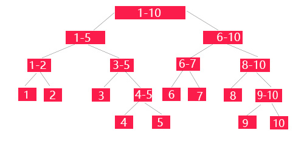

# 树
> 树是一种抽象数据类型（ADT）或是实现这种抽象数据类型的数据结构，用来模拟具有树状结构性质的数据集合。它是由 n(n>0)n(n>0) 个有限节点组成一个具有层次关系的集合。
      把它叫做「树」是因为它看起来像一棵倒挂的树，也就是说它是根朝上，而叶朝下的。  
      
“树”这种数据结构很像我们现实生活中的“树”，这里面每个元素我们叫作“节点”；
用来连线相邻节点之间的关系，我们叫作“父子关系”。

比如下面这幅图，A 节点就是 B 节点的父节点，B 节点是 A 节点的子节点。B、C、D 这三个节点的父节点是同一个节点，所以它们之间互称为兄弟节点。
我们把没有父节点的节点叫作根节点，也就是图中的节点 E。
我们把没有子节点的节点叫作叶子节点或者叶节点，比如图中的 G、H、I、J、K、L 都是叶子节点。 


    
  


概念辨析

树的高度和深度

节点的高度，深度，层数


      
**满二叉树**

叶子节点全都在最底层，除了叶子节点之外，每个节点都有左右两个子节点，这种二叉树就叫作满二叉树

**完全二叉树**

叶子节点都在最底下两层，最后一层的叶子节点都靠左排列，并且除了最后一层，其他层的节点个数都要达到最大，这种二叉树叫作完全二叉树

**平衡二叉树**

对于任意一个节点，左子树和右子树的高度差不能超过1

应用：递归树
## 二叉树
## 二叉搜索树

>二叉搜索树（Binary Search Tree），（又：二叉查找树，二叉排序树）它或者是一棵空树，或者是具有下列性质的二叉树：
 若它的左子树不空，则左子树上所有结点的值均小于它的根结点的值； 
 若它的右子树不空，则右子树上所有结点的值均大于它的根结点的值； 它的左、右子树也分别为二叉搜索树。

查询, 插入, 删除:`O(logn)`，极端情况下退化为链表，复杂度变成`o(n)`

用代码实现BST的构造，插入，删除，查询，前，中，后遍历

```java
import java.util.*;

public class BST<E extends Comparable<E>> {
    public static void main(String[] args) {
        BST bst = new BST();
        bst.add(100);
        bst.add(20);
        bst.add(30);
        bst.add(40);
        bst.add(50);
        bst.add(45);
        bst.remove(100);
        System.out.println(bst.maximum());
    }
    class Node {
        public E e;
        public Node left;
        public Node right;
        public Node(E e) {
            this.e = e;
        }
    }
    private Node root;
    private int size;
    public BST() {
        this.root = null;
        size = 0;
    }
    public boolean isEmpty() {
        return size == 0 ;
    }
    public int size(){
        return size;
    }
    // 添加元素
    public void add(E e) {
        root = add(root, e);
    }
    // 查询元素
    public boolean contains(E e) {
        return contains(root, e) ;
    }
    // 查找树中最小值
    public E minimum() {
        if (size == 0) {
            throw new IllegalArgumentException("BSTree is empty");
        }
        return minimum(root).e;
    }
    // 查找树中最小值
    public E maximum() {
        if (size == 0) {
            throw new IllegalArgumentException("BSTree is empty");
        }
        return maximum(root).e;
    }
    // 删除最小值
    public E removeMin() {
        E min = minimum();
        root = removeMin(root);
        return min;
    }
    // 移除最大值
    public E removeMax() {
        E max = maximum();
        root = removeMax(root);
        return max;
    }
    // 删除任意值
    public void remove(E e) {
        root = remove(root, e);
    }
    // 向以node为根的二分搜索树种插入节点, 递归算法
    // 返回插入节点后的二分搜索树的根
    private Node add(Node node, E e) {
        if(node == null) {
            size++;
            return new Node(e);
        }
        // node.e > e
        if(node.e.compareTo(e) > 0) {
            node.left = add(node.left, e);
        } else if(node.e.compareTo(e) < 0) {
            node.right = add(node.right, e);
        }
        // 由于定义的二分搜索树不保存重复元素, 所以针对node.e.compareTo(e) == 0的这种情况这里不做任何处理
        return node;
    }
    private boolean contains(Node node, E e) {
        if(node == null) {
            return false;
        }
        if(node.e.compareTo(e) == 0) {
            return true;
        } else if(node.e.compareTo(e) > 0) {
            return contains(node.left, e);
        }else {
            return contains(node.right, e);
        }
    }
    // 查找以node为根节点二叉搜索树的最小节点，递归法
    private Node minimum(Node node) {
        if(node.left == null) {
            return node;
        }
        return minimum(node.left);
    }
    // 查找以node为根节点二叉搜索树的最大节点，迭代法
    private Node maximum(Node node) {
        while(node.right != null) {
            node = node.right;
        }
        return node;
    }
    /**
     * 删除以node为根节点的树的最小值
     * @param node
     * @return 返回删除后的新的二分搜索树的根
     */
    private Node removeMin(Node node) {
        if(node.left == null) {
            Node rightNode = node.right;
            node.right = null;
            size--;
            return rightNode;
        }
        node.left = removeMax(node.left);
        return node;
    }

    /**
     * 删除以node为根节点的树的最大值
     * @param node
     * @return 返回删除后的新的二分搜索树的根
     */
    private Node removeMax(Node node) {
        if(node.right == null) {
            Node leftNode = node.left;
            node.left = null;
            size --;
            return leftNode;
        }
        node.right = removeMax(node.right);
        return node;
    }

    /**
     * 删除以node为根节点的树种节点值等于e的节点
     * @param node
     * @return 返回删除后的新的二分搜索树的根
     */
    private Node remove(Node node , E e) {
        if(node == null) {
            return null;
        }
        if(node.e.compareTo(e) > 0) {
            node.left = remove(node.left, e);
            return node;
        } else if(node.e.compareTo(e) < 0) {
            node.right = remove(node.right, e);
            return node;
        } else {
            // 左子树为空
            if(node.left == null) {
                Node rightNode = node.right;
                node.right = null;
                size--;
                return rightNode;
            }
            // 右子树为空
            if(node.right == null) {
                Node leftNode = node.left;
                node.left = null;
                size--;
                return leftNode;
            }
            // 左右子树均存在,取右子树的最小节点,缓存这个后继节点，作为根节点
            Node successor = minimum(node.right);
            // 删除这个节点
            successor.right = removeMin(node.right);
            successor.left = node.left;
            // 后继节点完成替换, 删除当前节点
            node.left = node.right = null;
            return successor;
        }
    }
}

```

## AVL树

## 红黑树

## 线段树（区间数）


线段树（Segment Tree）是一种二叉树形数据结构，1977 年由 Jon Louis Bentley 发明，用以存储区间或线段，并且允许快速查询结构内包含某一点的所有区间。


线段树的作用是进行区间快速的修改，查询，当区间的左端点与右端点相等时，即单点的修改与查询，也适用于线段树。


线段树由于其自身性质，任意两个没有祖先关系的节点之间，他们所存储的线段范围是不会相交的。因此，这缩短了改查的时间，从 N 降低到 log（N），比如在上图中，要查询线段[4 , 10]的信息（可能是总值，可能是最值等等），只需要往下查询到[4 , 5]和[6 , 10]两个节点，递归时总结两个节点的信息即可。



```java
// 线段树
interface Merger<E> {
    E merge(E a, E b);
}
public class SegmentTree<E> {
    private E[] tree;
    private E[] data;
    private Merger<E> merger;
    private static final int N = 4;
    public static void main(String[] args) {
        Integer[] arr = {-3,-2, -1, 0, 1, 2,3,4};
        SegmentTree<Integer> tree = new SegmentTree<>(arr, (a, b) -> a + b);
        System.out.println(tree.query(0,1));
        System.out.println(tree.query(0,2));
        System.out.println(tree.query(0,4));
        System.out.println(tree.query(3,6));
        tree.set(0, 3);
        System.out.println(tree.query(0,1));
        System.out.println(tree.query(0,2));
        System.out.println(tree.query(0,4));
    }
    public SegmentTree(E[] arr, Merger<E> merger) {
        tree = (E[]) new Object[N*arr.length];
        data = (E[]) new Object[arr.length];
        for (int i = 0; i < arr.length; i++) {
            data[i] = arr[i];
        }
        this.merger = merger;
        buildSegmentTree(0, 0, data.length - 1);
    }
    // 构建线段树
    private void buildSegmentTree(int treeIndex, int l, int r) {
        if(l == r) {
            tree[treeIndex] = data[l];
            return;
        }
        int mid = (r - l) /2  + l;
        int leftChildIndex = 2*treeIndex + 1;
        int rightChildIndex = 2*treeIndex + 2;
        buildSegmentTree(leftChildIndex, l , mid);
        buildSegmentTree(rightChildIndex, mid+1 , r);
        tree[treeIndex] = merger.merge(tree[leftChildIndex], tree[rightChildIndex]);
    }
    public E query(int queryL, int queryR) {
        return query(0, 0, data.length - 1, queryL, queryR);
    }
    public void set(int index, E e) {
        set(0, 0 ,data.length -1, index, e);
    }
    // 在以treeIndex为根的[l,r]区间内更新index的值为e;
    private void set(int treeIndex, int l, int r, int index, E e) {
        if(l == r) {
            tree[treeIndex] = e;
            return;
        }
        int mid = (r - l) / 2 + l;
        // 左节点区间[l, mid]
        int leftChildIndex = 2*treeIndex + 1;
        // 右节点区间[mid+1,r]
        int rightChildIndex = 2*treeIndex + 2;
        if(index >= mid + 1) {
            set(rightChildIndex, mid + 1, r, index, e);
        } else {
            set(leftChildIndex, l, mid, index, e);
        }
        // 更新父节点的值
        tree[treeIndex] = merger.merge(tree[leftChildIndex], tree[rightChildIndex]);
    }
    // 在以treeIndex为根的[l,r]区间内查找[queryL,queryR];
    private E query(int treeIndex, int l, int r, int queryL, int queryR) {
        if(l == queryL && r == queryR) {
            return tree[treeIndex];
        }
        int mid = (r - l) / 2 + l;
        // 左节点区间[l, mid]
        int leftChildIndex = 2*treeIndex + 1;
        // 右节点区间[mid+1,r]
        int rightChildIndex = 2*treeIndex + 2;
        if(queryL >= mid+1) {
            return query(rightChildIndex,mid+1, r, queryL, queryR);
        } else if(queryR <= mid) {
            return query(leftChildIndex,l, mid, queryL, queryR);
        } else {
            E left = query(leftChildIndex, l, mid, queryL, mid);
            E right = query(rightChildIndex, mid + 1, r, mid + 1, queryR);
            return merger.merge(left, right);
        }

    }
}
```
