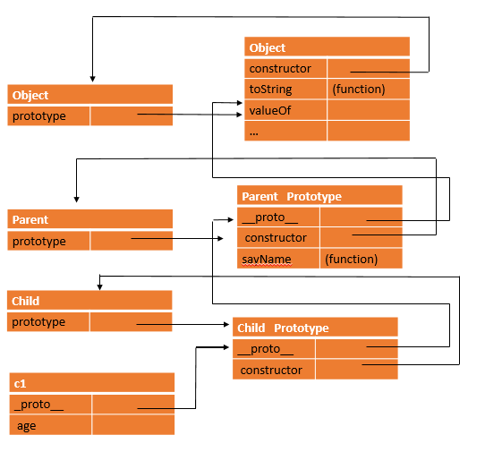
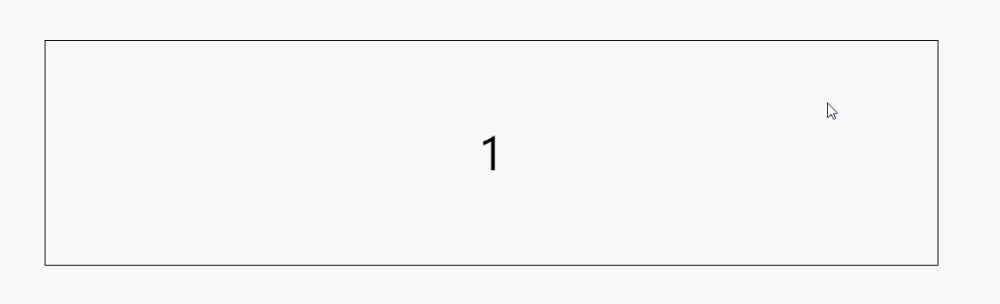
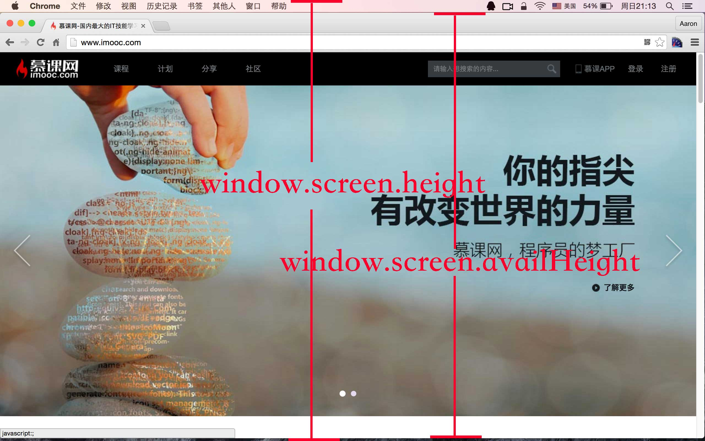
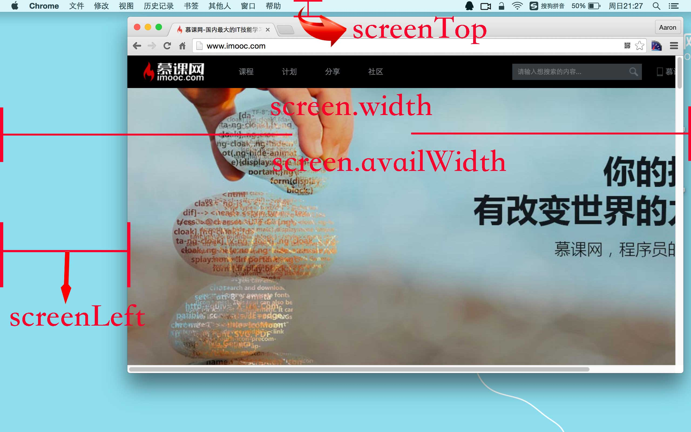

# js入门教程

# 教程重难点快速指南

+ [js创建对象的7种方法](/js/guidebook/#js创建对象的7种方法)
+ [js实现继承的6种方法](/js/guidebook/js实现继承的6种方法)
+ [函数防抖和节流](/js/guidebook/#防抖和节流函数)

# 常见问题

* ```JavaScript```七种内置类型: ```number、string、boolean、undefined、null、object、symbol```(ES6新增加)
* ```基本类型：```指保存在栈内存中的数据，```引用类型：```([对象引用]())指保存在堆内存中的对象，传递的是引用的地址
* ```弱类型：```变量没有类型, 变量持有的值有类型
* ```(typeof null === 'object') = true```，正确的返回值应该是```null```，但是这个```bug```由来已久。 ```(undefined == null) = true```
* ```indexOf```为```ECMAScript5```新方法，```IE8```及以下不支持
*  ```setTimeout(callback, 100)```，```setTimeout```只接受一个函数做为参数不接受闭包，因为闭包会自执行，Nodejs 下最小延迟 ```1ms``` 参见 [v12.x timers.js#L167](https://github.com/nodejs/node/blob/v12.x/lib/internal/timers.js#L167)

# 欺骗词法作用域

首先明确一点，js是词法作用域，词法作用域由写代码期间函数所声明的位置来定义，而不是调用的时候确定的，但是js可以有方法欺骗此法作用域

> javascript有两种机制(eval()、with)在运行时来修改词法作用域，这样做通常会导致性能下降，内存泄漏问题。

- **eval函数接收一个字符串为参数，解析字符串生成代码并运行**

```js
function test(str, b){
    eval(str);

    console.log(a, b);
}

var a = 1;

test("var a = 3", 2); // 3 2

console.log(a); // 1
```

上面这段代码示例，eval调用的str相当于在test函数作用域内部声明了一个新的变量a，当console.log()在打印时会在foo函数内部找到a和b，将无法找到外部的a，因此最终输出结果是3和2，最外层a仍就输出是1，两者比较可以看到效果。

- **with通常被当作重复引用同一个对象中的多个属性的快捷方式**

```js
{
function withObj(obj){
    with(obj){
        a = 2
    }
}

let o1 = {
    a: 1,
}

let o2 = {
    b: 1,
}

withObj(o1);
console.log(o1.a); // 2

withObj(o2);
console.log(o2.a); // undefined
console.log(a); // 2
}
```

以上示例中withObj(obj)函数接受一个obj参数，该参数是一个对象引用，执行了with，o1传进去，a=2赋值操作找到了o1.a并将2赋值给它，o2传进去，因为o2没有a属性，就不会创建这个属性，o2.a保持undefined，这个时候就会创建一个新的全局变量a。

- **对性能的影响**

javascript引擎在编译阶段会进行性能优化，很多优化依赖于能够根据代码词法进行静态分析，预先确定了变量和函数的定义位置，才能快速找到标识符，但是在词法分析阶段遇到了with或eval无法明确知道它们会接收什么代码，也就无法判断标识符的位置，最简单的做法就是遇到with或eval不做任何优化，使用其中一个都会导致代码运行变慢，因此，请不要使用他们。

# 数据类型

javascript中的数据类型可以分成两类：基本数据类型和引用数据类型

基本数据类型包括Number, String, Boolean, Undefined, Null, Symbol(ES6新增)

引用数据类型只有一种，是Object

基本数据类型用typeof 来判断

```javascript
typeof 1 // 'number'
typeof 'adbn' // 'string'
typeof true // 'boolean'
typeof null // 'object'
typeof undefined // 'undefined'
typeof Symbol() // 'symbol'
typeof {} // 'object'
typeof [] // 'object'
typeof function() {} // 'function'
```

注意，**typeof null 的结果是 'object'**

引用类型判断使用Object.prototype.toString()方法

```javascript
Object.prototype.toString.call([])
// "[object Array]"
Object.prototype.toString.call({})
// "[object Object]"
Object.prototype.toString.call(function(){})
// "[object Function]"
Object.prototype.toString.call(null)
// "[object Null]"
Object.prototype.toString.call(undefined)
// "[object Undefined]"
Object.prototype.toString.call(1)
// "[object Number]"
Object.prototype.toString.call("1")
// "[object String]"
Object.prototype.toString.call(true)
// "[object Boolean]"
Object.prototype.toString.call(Symbol())
// "[object Symbol]"
```
## Number
******
# 类型转换
## 转Number
有三个函数可以转成数值类型
Number, parseInt, parseFloat
```javascript
Number("1234acv") // NaN
parseInt("1234acv") // 1234
parseFloat("1234acv") //1234
```
## 转Boolean
调用Boolean显示转换

# 数组
数组常用方法总结
### 数组去重

数组去重方法网上十几种之多，这里只总结了自己觉得好用的几种

- **1 Set数组去重**

> ES6新的数据结构Set，类似于数组，它的元素都是唯一的。

```js
var arr = [1,1,'true','true',true,true,undefined,undefined, null,null, NaN, NaN,'NaN', 0, 0, [], [],{},{}];
var res = [...new Set(arr)]
console.log(res) 
// [ 1, 'true', true, undefined, null, NaN, 'NaN', 0, [], [], {}, {} ]
```
不考虑兼容性，这种去重的方法代码最少。这种方法无法去掉空对象,空数组
- **2  reduce + includes**

> reduce对数组中的每一个元素依次执行回调函数，不含数组中未赋值、被删除的元素，回调函数接收四个参数

* ```callback```：执行数组中每个值的函数，包含四个参数
  * ```previousValue```：上一次调用回调返回的值，或者是提供的初始值```（initialValue）```
  * ```currentValue```：数组中当前被处理的元素
  * ```index```：当前元素在数组中的索引
  * ```array```：调用 ```reduce``` 的数组
* ```initialValue```：可选，作为第一次调用 ```callback``` 的第一个参数。

```javascript
function uniqByReduce(arr) {
   return arr.reduce((prev, curr) => prev.includes(curr)? prev: [...prev, curr],[])
}
var arr = [1,1,'true','true',true,true,undefined,undefined, null,null, NaN, NaN,'NaN', 0, 0, [], [],{},{}]
console.log(uniqByReduce(arr))
// [ 1, 'true', true, undefined, null, NaN, 'NaN', 0, [], [], {}, {}]
```

- **3  filter + indexOf**

```js
var arr = [1,1,'true','true',true,true,undefined,undefined, null,null, NaN, NaN,'NaN', 0, 0, [], [],{},{}]
function uniqByFilter(arr) {
    return arr.filter((v, i) => {
        return arr.indexOf(v) === i
    })
}
console.log(uniqByFilter(arr));
// [ 1, 'true', true, undefined, null, 'NaN', 0, [], [], {}, {} ]
```
无法去掉空对象,空数组, NaN全部被筛掉了

- **4 filter + hasOwnProperty**
```javascript
function uniq(arr) {
    var obj = {};
    return arr.filter(function(item, index, arr){
        return obj.hasOwnProperty(typeof item + item) ? false : (obj[typeof item + item] = true)
    })
}
console.log(uniq(arr));
[ 1, 'true', true, undefined, null, NaN, 'NaN', 0, [], {} ]
```
注意：`typeof item + item`的执行顺序是`typeof item`然后再与后面的item相加
这种方法最好，可以将空数组和空对象也去重

- **5 map**

```javascript
function uniqByMap() {
    let map = new Map()
    let res = []  // 数组用于返回结果
    for (let i = 0; i < arr.length; i++) {
        if(!map.has(arr[i])) {  // 如果有该key值
            res.push(arr[i])
        }
        map.set(arr[i], true)  // 如果没有该key值
    }
    return res
}
console.log(uniqByMap(arr));
// [ 1, 'true', true, undefined, null, NaN, 'NaN', 0, [], [], {}, {}]
```
不能去重空数组，空对象，将这种方法用`typeof item + item`改造一下就可以实现数组和对象的去重了
```javascript
function uniqByMap() {
    let map = new Map()
    let res = []
    for (let i = 0; i < arr.length; i++) {
        let key = typeof arr[i] + arr[i] // 构造key
        if(!map.has(key)){  // 如果有该key值
            res.push(arr[i])
        }
        map.set(key, true)  // 如果没有该key值
    }
    return res
}
console.log(uniqByMap(arr));
// [ 1, 'true', true, undefined, null, NaN, 'NaN', 0, [], [], {}, {}]
```

上面的方法适用于数组的元素是基本数据类型吗，如果数组的元素是对象，想根据对象的某个key去重


```javascript
let person = [
     {id: 0, name: "小明"},
     {id: 1, name: "小张"},
     {id: 2, name: "小李"},
     {id: 3, name: "小孙"},
     {id: 1, name: "小周"},
     {id: 2, name: "小陈"},   
]
function uniqBy(arr, key) {
	let hash = {}
    return arr.reduce((prev, next) => {
       hash[next[key]] ? "" : hash[next[key]] = true && cur.push(next);
       return cur;
    }, [])
}
```

### 深度降维

- **`递归`**

```javascript
function flattenDeep(arr){
    let ret = [];
    let toArr = function(arr){
        arr.forEach(function(item){
            Array.isArray(item) ? toArr(item) : ret.push(item);
        });
    }
    toArr(arr);
    return ret;
}
```

- **`栈`**

不使用递归，使用 stack 无限反嵌套多层嵌套数组

```javascript
function flattenDeep(arr) {
    const stack = [...arr],res = []
    while(stack.length) {
        let topEle = stack.pop()
        if(Array.isArray(topEle)) {
            stack.push(...topEle)
        } else {
            res.push(topEle)
        }
    }
    res.reverse()
    return res
}
```


- **`reduce + concat`**

```js
function flattenDeep(arr) {
   return arr.reduce((acc, val) => Array.isArray(val) ? acc.concat(flattenDeep(val)) : acc.concat(val), []);
}
```
### 数组交集

求两个数组的交集，交集里面允许有重复元素

方法1:双指针
```js
// 
function intersection(arr1, arr2) {
    if(!arr1.length) {
        return arr2
    }
    if(!arr2.length) {
        return arr1
    }
    arr1.sort((a, b) => a - b)
    arr2.sort((a, b) => a - b)
    let i = 0
    let j = 0
    let res = []
    while(i < arr1.length && j < arr2.length) {
        if(arr1[i] < arr2[j]) {
            i++
        } else if(arr1[i] > arr2[j]) {
            j++
        } else {
            res.push(arr1[i])
            i++
            j++
        }
    }
    return res
}
```
方法2: map计数
```javascript
function intersection(arr1, arr2) {
    let map = new Map()
    let res = []
    for (let i = 0; i < arr1.length; i++) {
        if(!map.has(arr1[i])) {
            map.set(arr1[i], 1)
        } else {
            map.set(arr1[i],  map.get((arr1[i]) + 1))
        }
    }
    for (let i = 0; i < arr2.length; i++) {
        let val = map.get((arr2[i]))
        if(val && val > 0) {
            res.push(arr2[i])
            map.set(arr2[i], val - 1)
        }
    }
}
```
# 对象
### new
### js中创建对象的7种方法
#### 1 工厂模式
工厂模式是软件工程领域一种广为人知的设计模式，
这种模式抽象了创建具体对象的过程
```javascript
function createPerson(name, age) {
    var o = new Object()
    o.name  = name;
    o.age = age;
    o.sayName = function() {
        console.log(this.name)
    }
    return o;
}
var p1 =  createPerson('Alice', 17)
var p2 = createPerson('Bob', 20)
```
工厂模式虽然解决了创建多个相似对象的问题，
但却没有解决对象识别的问题（即怎样知道一个对象的类型
#### 2 构造函数模式
```javascript
function Person(name, age) {
    this.name  = name;
    this.age = age;
    this.sayName = function() {
        console.log(this.name)
    }
}
var p1 =  new Person('Alice', 17)
var p2 = new Person('Bob', 20)
console.log(p1 instanceof Object);  //true
console.log(p1 instanceof Person);  //true
console.log(p2 instanceof Object);  //true
console.log(p2 instanceof Person);  //true
```
使用new调用构造函数实际上会经历以下几个步骤
   1. 创建一个新对象  
   2. 新对象的原型链接到构造函数的prototype
   3. 将构造函数的作用域赋给新对象（因此this就指向了这个新对象）；  
   4. 执行构造函数中的代码（为这个新对象添加属性）；  
   5. 如果构造函数没有返回值或者返回的不是一个对象类型，那么返回这个新对象

我们来模拟实现一个new

```javascript
function myNew(constructor) {
    // 1
    var object = new Object() 
    // 2
    object.__proto__ = constructor.prototype 
    // 3 4
    var args = Array.prototype.slice.call(arguments, 1)
    var result = constructor.apply(this, args) 
    //5
    return typeof result === 'object' ? result : object 
}
// 这样调用Person
var p1 = myNew(Person, 'Alice', 20)
```
优点： 可以区分对象类型

缺点： 每个方法都要在每个实例上重新创建一
#### 3 原型模式
js中创建的每个函数都有一个prototype
（原型）属性，这个属性是一个指针，指向一个对象，
而这个对象的用途是包含可以由特定类型的所有实例共享的属
性和方法。如果按照字面意思来理解，那么prototype
就是通过调用构造函数而创建的那个对象实例的原型对象。
使用原型对象的好处是可以让所有对象实例共享它所包含的属
性和方法。
```javascript
function Person() {
    
}
Person.prototype.name = "Alice"
Person.prototype.age = 20
Person.prototype.friends = ['A','B']
Person.prototype.lovedColors = ['res','blue']
Person.prototype.sayName = function() {
    console.log(this.name)
}
var p1 = new Person()
p1.name = 'new Alice'
p1.friends.push('new Friend') //改变引用类型的属性，地址不变
p1.lovedColors = ['yellow'] // 直接指向一个新的地址
var p2 = new Person()
// p1.name = "new Alice"
// p1.friends = ["A", "B", "new Friend"]
// p2.name= "Alice"
// p2.friends= ["A", "B", "new Friend"]
// p1.lovedColors ["yellow"]
// p2.lovedColors ["res", "blue"]
delete p1.name
// p1.name = 'Alice'
```
优点：可以区分实例类型
缺点：省略了为构造函数传递初始化参数这一环节，
结果所有实例在默认情况下都将取得相同的属性

原型中所有属性和方法是被所有实例共享，共享对于函数非常合适。对于那些包含基本值的属性也说得过去，
通过在实例上添加一个同名属性，可以隐藏原型中的对应属性。然而，
对于包含引用类型值的属性来说，修改一个实例的这个属性值可能会影响到所有实例的这个属性值
#### 4 组合模式
　组合使用构造函数模式和原型模式

创建自定义类型的最常见方式，
就是组合使用构造函数模式与原型模式。
构造函数模式用于定义实例属性，
而原型模式用于定义方法和共享的属性。结果，
每个实例都会有自己的一份实例属性的副本，
但同时又共享着对方法的引用，最大限度地节省了内存。另外
，这种混成模式还支持向构造函数传递参数；
可谓是集两种模式之长
```javascript
function Person(name, age, job){
    this.name = name;
    this.age = age;
    this.job = job;
    this.friends = ["Shelby", "Court"];
}
Person.prototype = {
    constructor : Person,
    sayName : function(){
        alert(this.name);
    }
}
var person1 = new Person("Nicholas", 29, "Software Engineer");
var person2 = new Person("Greg", 27, "Doctor");
person1.friends.push("Van");
alert(person1.friends);    //"Shelby,Count,Van"
alert(person2.friends);    //"Shelby,Count"
alert(person1.friends === person2.friends);    //false
alert(person1.sayName === person2.sayName);    //true
```
**组合模式是用来定义引用类型的一种默认模式**
#### 5 动态原型模式
动态原型模式所有信息都封装在了构造函数中，
而通过在构造函数中初始化原型（仅在必要的情况下），
又保持了同时使用构造函数和原型的优点。换句话说，
可以通过检查某个应该存在的方法是否有效，
来决定是否需要初始化原型
```javascript
function Person(name, age) {
    this.name = name;
    this.age = age;
     // 这段代码只会在初次调用构造函数时才会执行。此后，
     //  原型已经完成初始化，不需要再做什么修改了。不过要记住，
     //  这里对原型所做的修改，能够立即在所有实例中得到反映。
     //  因此，这种方法确实可以说非常完美
    if(typeof this.sayName !== 'function') {
        Person.prototype.sayName = function() {
            console.log(this.name)
        }
    }
}
var friend = Person("Nicholas", 29);
friend.sayName();  //"Nicholas"
```
#### 6 寄生构造函数模式
这种模式的基本思想是创建一个函数，该函数的作用仅仅是封装创建对象的代码，
然后再返回新创建的对象；但从表面上看，
这个函数又很像是典型的构造函数

```javascript
function Person(name, age) {
    var o = new Object()
    o.name  = name;
    o.age = age;
    o.sayName = function() {
        console.log(this.name)
    }
    return o;
}
var p1 =  new Person('Alice', 17)
var p2 = new Person('Bob', 20)
```
除了使用new
操作符并把使用的包装函数叫做构造函数之外，
这个模式跟工厂模式其实是一模一样
缺点：不能区分实例类型，返回的对象与构造函数或者与构造函数的原型属性之间没有关系
#### 7 稳妥构造函数模式
所谓稳妥对象，指的是没有公共属性，
而且其方法也不引用this
的对象。稳妥对象最适合在一些安全的环境

```javascript
function Person(name) {
    var o = new Object()
    o.sayName = function() {
        console.log(name)
    }
    return o
}
var friend = Person("Nicholas");
friend.sayName();  //"Nicholas"
//这样，变量
//person中保存的是一个稳妥对象，而除了调用
//sayName()
//方法外，没有别的方式可以访问其数据成员
```
## 原型与继承

### js实现继承的6种方式
#### 1 原型链
其基本思想是利用原型让一个引用类型继承另一个引用类型的
属性和方法
```javascript
function Parent(name) {
    this.name = name
    this.friend = [1, 2, 3]
}
Parent.prototype.sayName = function() {
    console.log(this.name)
}
function Child(age) {
    this.age = age
}
Child.prototype = new Parent()
let c1 = new Child(20)
let c2 = new Child(10)
c1.friend.push(4)
console.log(c1.friend)  // [1, 2, 3, 4]
console.log(c2.friend)  // [1, 2, 3, 4]
console.log(c1 instanceof Child) // true
console.log(c1 instanceof Parent) // true
```
原型链如图



优点：可以区分实例的类型

缺点：包含引用类型的原型属性会被所有实例共享

没法向父类的构造函数传递参数，确切的说应该是没办法在不影响所有实例对象的前提下向父类构造函数传递参数

#### 2 借用构造函数
```javascript
function Parent(name) {
    this.name = name
    this.friend = [1, 2, 3]
}
parent.prototype.sayName = function() {
    console.log(this.name)
}
function Child(age, name) {
    // 继承了Parent,同时传递了参数
    Parent.call(this,name)
    // 实例属性
    this.age = age
}
let c1 = new Child('lilei', 20)
let c2 = new Child('Alice', 10)
c1.friend.push(4)
console.log(c1.friend) // [1. 2. 3, 4]
console.log(c2.friend) // [1, 2, 3]
c1.sayName() // lilei
c2.sayName() // Alice
```
优点：可以在子类的构造函数中向父类的构造函数传递参数
缺点: 方法和属性都在构造函数中定义，函数无法复用, 在父类中原型上定义的的方法，对子类也是不可见的

#### 3 组合继承
组合继承，也叫经典继承，将原型链技术和用构造函数组合在一起
```javascript
function Parent(name) {
    this.name = name
    this.friend = [1, 2, 3]
}
// 继承方法
parent.prototype.sayName = function() {
    console.log(this.name)
}
function Child(age, name) {
    // 继承了Parent,同时传递了参数
    Parent.call(this,name) // 第二次调用父类构造函数，在实例上创建了name和friend属性，屏蔽了原型上的同名属性
    // 实例属性
    this.age = age
}
Child.prototype = new Parent() //  第一次调用父类构造函数,在子类原型上创建了name和friend属性
let c1 = new Child('lilei', 20)
let c2 = new Child('Alice', 10)
c1.friend.push(4)
console.log(c1.friend) // [1. 2. 3, 4]
console.log(c2.friend) // [1, 2, 3]
c1.sayName() // 'lilei'
c2.sayName() // 'Alice'
console.log(c1 instanceof Child) // true
console.log(c1 instanceof Parent) // true
```
优点：包含了原型链继承和借用构造函数继承的优点，是javascript中最常用的继承模式
缺点：父类构造函数会调用两次，而且会在子类原型上创建不必要的属性

#### 4 原型式继承

```javascript
function object(o) {
    function f () {}
    f.prototype = o
    return new f()
}
var person = {
    name:'hameimei',
    friend: [1, 2, 3]
}
var another = object(person)
another.name = 'lilei'
another.friend.push(4)
another.friend // [1, 2, 3, 4]
person.friend// [1, 2,3, 4]
```

原型式继承要求必须有一个对象作为可以作为另一个对象的基础，如果有一个对象的话，
可以把它传递给object函数，然后再根据需求对得到的对象修改即可

ES6新增了Object.create方法规范了原型式继承
优点:不必刻意创造构造函数
缺点:引用类型属性共享

#### 5 寄生式继承
寄生式继承的思路与寄生构造函数和工厂模式类似，
即创建一个仅用于封装继承过程的函数，
该函数在内部以某种方式来增强对象，
最后再像真地是它做了所有工作一样返回对象
```javascript
function object(o) {
    function f () {}
    f.prototype = 0
    return new f()
}

function createAnother(original){
    var clone = object(original);    // 通过调用函数创建一个新对象
    clone.sayHi = function(){        //以某种方式来增强这个对象
        alert("hi");
    };
    return clone;                    //返回这个对象
}
```
在这个例子中，createAnother()函数接收了一个参数，也就是将要作为新对象基础的对象。
然后，把这个对象（original）传递给object()函数，将返回的结果赋值给clone。再为clone对象添加一个新方法sayHi()，最后返回clone对象。可以像下面这样来使用createAnother()函数：

```javascript
var person={
	name: "Nicholas",
    friends: ["Shelby", "Court", "Van"]
};
var anotherPerson = createAnother(person);
anotherPerson.sayHi(); //"hi"
```

这个例子中的代码基于person返回了一个新对象——anotherPerson。新对象不仅具有person的所有属性和方法，而且还有自己的sayHi()方法。在主要考虑对象而不是自定义类型和构造函数的情况下，寄生式继承也是一种有用的模式。前面示范继承模式时使用的object()函数不是必需的；任何能够返回新对象的函数都适用于此模式

缺点： 和借用构造函数模式一样，不能函数复用

#### 6 寄生组合式继承
谓寄生组合式继承，即通过借用构造函数来继承属性，
通过原型链的混成形式来继承方法。其背后的基本思路是：
不必为了指定子类型的原型而调用超类型的构造函数，
我们所需要的无非就是超类型原型的一个副本而已。本质上，
就是使用寄生式继承来继承超类型的原型，
然后再将结果指定给子类型的原型
```javascript
function object(o) {
    function f () {}
    f.prototype = 0
    return new f()
}
//  第一步是创建超类型原型的一个副本。
//  第二步是为创建的副本添加constructor
//  属性，从而弥补因重写原型而失去的默认的constructor
//  属性。最后一步，将新创建的对象（即副本）
//  赋值给子类型的原型。这样，我们就可以用调用
//  inheritPrototype()
//  函数的语句
function inheritPrototype(child, parent) {
    var prototype = object(parent.prototype)
    prototype.constructor = child
    child.prototype = prototype
}
```

```javascript
function object(o) {
    function f () {}
    f.prototype = 0
    return new f()
}
function inheritPrototype(child, parent) {
    var prototype = object(parent.prototype)
    prototype.constructor = child
    child.prototype = prototype
}
function Parent(name) {
    this.name = name
    this.friend = [1, 2, 3]
}
// 继承方法
parent.prototype.sayName = function() {
    console.log(this.name)
}
function Child(age, name) {
    // 继承了Parent,同时传递了参数
    Parent.call(this,name) 
    // 实例属性
    this.age = age
}
inheritPrototype(Child, Parent)
Child.prototype.sayAge = function() {
    console.log(this.age)
}
```
优点: 只调用了一次父类构造函数 ，保持了原型链，能够正常的使用instanceof和isPrototypeOf,
**寄生组合式继承被认为是引用类型最理想的继承方式**
# DOM
> DOM 是一项 W3C (World Wide Web Consortium) 标准。
  DOM 定义了访问文档的标准

DOM可以将任何HTML或XML文档描绘成一个由多层节点构成
的结构
## 节点Node
JavaScript中的所有节点类型都继承自Node
类型，因此所有节点类型都共享着相同的基本属性和方法。
每个节点都有一个nodeType属性，用于表明节点的类型
有12种节点类型，但不是所有的浏览器都支持

元素节点，也叫标签节点         nodeType = 1

文本几点                                    nodeType = 3

注释节点                                    nodeType = 8

### NodeList   v.s. HTMLCollection 

1. 包含节点的类型不同(重要)

> (1) NodeList
> 一个节点的集合，既可以包含元素和其他非元素节点(注释节点、文本节点等)。
> (2) HTMLCollection
> 元素集合, 只有元素Element

2. 使用方法

相同点：

1） 都是类数组，都有length属性

2） 都有元素的getter，叫做item，可以传入索引值取得元素。

不同点：

HTMLCollection还有一个nameItem()方法，可以返回集合中name属性和id属性值的元素

**常用的就是元素和文本节点**

以下面的代码来看看节点常用的属性和方法

```html
<!doctype html>
<html lang="en">
<head>
    <meta charset="UTF-8">
    <meta name="viewport"
          content="width=device-width, user-scalable=no, initial-scale=1.0, maximum-scale=1.0, minimum-scale=1.0">
    <meta http-equiv="X-UA-Compatible" content="ie=edge">
    <title>Document</title>
</head>
<body>
<div id="box">hello<!--注释节点--></div>
<div></div>
<script>
    let elementNode = document.getElementById('box')
    let children = box.children // 伪数组
    let childNodes = box.childNodes // 伪数组
    let textNode = childNodes[0]
    let commentNode = childNodes.item(1)
</script>
</body>
</html>

```

|                | 元素节点   elementNode                            | 文本节点textNode     | 注释节点commentNode  |
| -------------- | ------------------------------------------------- | -------------------- | -------------------- |
| nodeType       | 1                                                 | 3                    | 8                    |
| nodeName       | 'DIV'                                             | '#text'              | '#comment'           |
| nodeValue      | null                                              | 'hello'              | '这是注释‘           |
| textContent    | 'hello'                                           | 'hello'              | '这是注释‘           |
| tagName        | 'div'                                             | N/A                  | N/A                  |
| localName      | 'div'                                             | N/A                  | N/A                  |
| parentNode     | body                                              | elementNode          | elementNode          |
| parentElement  | body                                              | elementNode          | elementNode          |
| children       | HTMLCollection {length: 0}                        | N/A                  | N/A                  |
| childNodes     | NodeList {0: textNode, 1 : commentNode,length: 2} | NodeList {length: 0} | NodeList {length: 0} |
| fistChild      | textNode                                          | null                 | null                 |
| lastChild      | commentNode                                       | null                 | null                 |
| previousSibing | null                                              | null                 | textNode             |
| nextSibing     | null                                              | commentNode          | null                 |


### 节点属性

```javascript
// 获取节点属性getAttribute
imgNode.getAttribute('src')
// 设置节点属性setAttribute
imgNode.setAttribute('src', 'ulr...')
```


### 节点关系

树形结构


# 节点操作API


## 查找节点
document.getElementById ：根据ID查找元素，大小写敏感，如果有多个结果，只返回第一个元素；

document.getElementsByClassName ：根据类名查找元素，多个类名（’parent child')用空格分隔，返回一个 HTMLCollection 

document.getElementsByTagName ：根据标签查找元素， * 表示查询所有标签，返回一个 HTMLCollection 。

document.querySelector ：返回单个Node，如果匹配到多个结果，只返回第一个。

document.querySelectorAll ：返回一个NodeList。

document.forms ：获取当前页面所有form，返回一个 HTMLCollection 


## 节点属性
```javascript
let img = document.querySelector('img')
img.setAttribute('src', 'xxxx')
img.style.width = '100px'
let p = document.querySelector('p')
p.innerHTML = '<span>嵌套一个span</span>'
```
### classList属性

```html
<div class="class1 class2"></div>
<script >
let dom = document.querySelector('.class1.class2')
dom.classList.contains('class1')
dom.classList.remove('class1')
dom.classList.add('class3')
dom.classList.toggle('class3')
</script>
```


### data属性

## 创建和删除

```javascript
let div = document.createElement("div");// 创建元素节点
let textNode = document.createTextNode("创建一个文本节点");// 创建文本节点
let comment = document.createComment('创建评论节点') // 创建注释节点
document.body.appendChild(div)
```

## 元素遍历

children:  获取所有的子元素集合 ，childNodes的元素版

childElementCount：返回子元素（不包括文本节点和注释）的个数。

firstElementChild：指向第一个子元素；firstChild的元素版。

lastElementChild：指向最后一个子元素；lastChild的元素版。

previousElementSibling：指向前一个同辈元素；previousSibling的元素版。

nextElementSibling：指向后一个同辈元素；nextSibling的元素版。

## 事件
## 垃圾回收
## 浏览器缓存

******

# 函数
### call-apply-bind

三个函数都是通过函数来调用的，所以这三个方法是定义在Function.prototype上的  
都可以改变调用函数运行时的上下文
call和apply是立即执行该函数     
call 接收多个参数，第一个为函数上下文也就是this，后边参数为函数本身的参数  
apply接受两个参数，第一个是函数上下文，第二个参数是函数本身的参数用数组的形式传入  
bind返回一个绑定新对象后的函数

#### call
```javascript
Function.prototype.myCall = function(context) {
    // 保证是函数调用myCall方法
    if(typeof  this != 'function') {
        throw new TypeError("not function")
    }
    // 第一个参数如果是空的的话或者是null的话，默认绑定到全局变量 
    context = context || window
    context.fn = this
    let args = [...arguments].slice(1)
    let result = context.fn(...args)
    delete context.fn
    return result
}
```
如果context本身有fn属性的话,那么这种方法就会删掉这个对象的fn属性，
所以我们要想办法生成一个唯一的属性名称，
es6新增的一个数据类型Symbol就可以生成一个唯一的值，我们来改造一下
```javascript
Function.prototype.myCall = function(context) {
    if(typeof  this != 'function') {
        throw new TypeError("not function")
    }
    // 第一个参数如果是空的的话或者是null的话，默认绑定到全局变量 
    context = context || window
    const fn = Symbol('uniq')
    context[fn] = this
    let args = [...arguments].slice(1)
    let result = context[fn](...args)
    delete context[fn]
    return result
}
```
测试myCall
```javascript
var obj = {
    name: 'vampire'
}
var name = 'witch' // 这里大家试试把var改成let或者const, 看看有什么效果
function sayName() {
    return this.name
}
var r1 = sayName.myCall(obj) // vampire
var r2 = sayName.myCall() // witch
```
#### apply
```javascript
Function.prototype.myBind = function(context) {
    if(typeof  this != 'function') {
            throw new TypeError("not function")
    }
    // 第一个参数如果是空的的话或者是null的话，默认绑定到全局变量 
    context = context || window
    const fn = Symbol('uniq')
    context[fn] = this
    let args = arguments[1] ? arguments[1]: []
    let result = context[fn](...args)
    delete context[fn]
    return result
}
```
#### bind
bind() 方法创建一个新的函数， 当这个新函数被调用时其this置为提供的值，其参数列表前几项置为创建时指定的参数序列。

`fun.bind(thisArg[, arg1[, arg2[, ...]]])`

bind的参数和call非常类似，唯一的区别就在于除了调用bind时传入参数外，还可以在正式执行时传入参数，
两次传入参数以拼接的方式作为函数执行的实参

总的来说bind有如下三个功能点：

```
1. 改变原函数的 this 指向，即绑定上下文，返回原函数的拷贝  
2. 当绑定函数被调用时，bind的额外参数将置于实参之前传递给被绑定的方法。  
3. 注意，一个绑定函数也能使用new操作符创建对象,这种行为就像把原函数当成构造器，thisArg参数无效。
也就是new操作符修改this指向的优先级更高。
```
先来实现一二条
```javascript
Function.prototype.myBind = function(context) {
    // 保证是函数对象调用myBind方法
    if(typeof  this != 'function') {
            throw new TypeError("not function")
    }
    let self = this
    context = context || window
    let arg =  [].slice.call(arguments,1)
    let f = function() {
          let _arg = [].slice.call(arguments,0);
          return self.apply(context, arg.concat(_arg) );
    }
    return f
}
```
接下来实现第三条,先来看看第三条到底什么意思
```javascript
let obj = {
    name:'obj'
}
function getName() {
    this.name = 'getName'
}
let fn = getName.bind(obj)
let instance = new fn() 
console.log(instance.name);// 'getName', 绑定obj无效
```
也就是说，一个函数originFn调用了bind了新的执行上下文newContext，返回新的函数boundFn，
通过new boundFn()来使用的话，之前绑定的上下文newContext是无效的,
new boundFn()执行时候的this指向boundFn，而不是newContext
```javascript
Function.prototype.myBind = function(context) {
    if(typeof  this != 'function') {
        throw new TypeError("not function")
    }
    context = context || window
    let arg =  [].slice.call(arguments,1)
    let temp = function() {}
    temp.prototype = this.prototype
    let self = this
    let f = function() {
          let _arg = [].slice.call(arguments,0);
          return self.apply(this instanceof temp ? this : context, arg.concat(_arg) );
    }
    f.prototype = new temp()
    //   可以用f.prototype = Object.create(this)这行代码直接代替这些代码
    //   let temp = function() {}
    //   temp.prototype = this.prototype
    //   f.prototype = new temp()
    return f
}
```

解释下为什么要用这种方式继承，而不是f.prototype = this.prototype
`
  let temp = function() {}
  temp.prototype = this.prototype
  f.prototype = new temp()
`

这个问题就是一个继承的经典问题:  
继承为什么要用A.prototype = new B()而不是A.prototype = B或者A.prototype = B.prototype
> 要实现继承，就必须保证B继承A以后，
B所做的修改不能影响到A以及继承自A的其它对象。如果B.prototype = A的话，
那么着两个对象的引用是完全一致了，这样的话，
如果赋值 B.prototype.name=45455；
那么A.name就直接变成45455;直接把A和继承自A的其它对象全部改了，这根本谈不上继承。

> 至于B.prototype = A.prototype也是同理，修改B的原型就会直接把A的原型给污染掉。

> B.prototype = new A();这个方法，是创建了一个新的对象{}，
并且继承了A的原型，这是一个新对象，不是和A同一引用，所以不会污染A。

这种继承方式可以简写为：`B.prototype = Object.create(A.prototype)`

Object.create(proto)方法的原理就是
```markdown
function f(){}
f.prototype = proto
return new f()
```
# Ajax
# 高级函数
## 防抖和节流函数
在前端开发的过程中，我们经常会需要绑定一些持续触发的事件，如 resize、scroll、mousemove,  keyup, keydown 等等，但有些时候我们并不希望在事件持续触发的过程中那么频繁地去执行函数。

通常这种情况下我们怎么去解决的呢？一般来讲，防抖和节流是比较好的解决方案


```html
<div id="box">
    1
</div>
<script>
    let count =1
    let box = document.querySelector('#box')
    box.onmousemove = counter
    function counter() {
         count++
         box.innerHTML = count
    }
</script>
```
div元素绑定了 mousemove 事件，当鼠标在div区域中移动的时候会持续地去触发该事件导致频繁执行函数。效果如下


### 防抖函数
防抖的原理就是：你尽管触发事件，但是我一定在事件停止触发n秒后才执行，如果你在一个事件触发的n秒内又触发了这个事件，那我就以新的事件的触发时间为准，n秒后才执行

```javascript
// version1
function debounce(fn,wait){
    let timeId
    return function(){
        let context = this
        let args = arguments
        timeId && clearTimeout(timeId)
        // 定时器重新开始及时
        timeId = setTimeout(() => {
           fn.apply(context, args)//注意绑定上下文
        },wait)
    }
}
```
我们用上面的防抖函数改造一下div的mousemove事件

```javascript
box.onmousemove = debounce(counter, 1000)
```

效果如下：

可以看到，鼠标一直字box里面移动的时候，数字不增加， 等鼠标移开了盒子后的一秒，数字从1变成了2，说明我们的debounce函数是正确的


**`立即执行`**

我们现在有一个新的需求，这个需求就是：

我不希望非要等到事件停止触发后的n秒才执行，我希望立刻执行函数，然后等到停止触发 n 秒后，再触发才可以重新执行。我们加个 immediate 参数判断是否是立刻执行。

```javascript
// version2
function debounce(fn, wait,immediate ) {
	   let timeId;

        return function () {
            let context = this;
            let args = arguments;

            if (timeId) clearTimeout(timeId);
            // 是否是立即执行
            if (immediate) {
                /**  timeId = setTimeout(function(){
                /*                    timeId = null;
                /*                }, wait)
                /* 代码说明：以click 事件为例，如果传递的 immediate 为 true, 
                /* 那么连续点击过程中仅在第一次点击时执行，后面的点击会被 if (timeId) clearTimeout(timeId)拦截，
                /* 点击再多次都不会再次执行；当停止点击 wait 毫秒后，设置 timeId = null, 恢复初始时的状态，
                /* 之后的第一次点击就不会被 if (timeId) clearTimeout(timeId)拦截。所以这句必须要加，是比较关键的代码。
                */
                let callNow = !timeId
                timeId = setTimeout(function(){
                    timeId = null;
                }, wait)
                if (callNow) fn.apply(context, args)
            }
            else {
                timeId = setTimeout(function(){
                    fn.apply(context, args)
                }, wait);
            }
        }
}
```

来看看现在的效果


立即执行的debounce函数有什么用处？**提交表单，避免重复点击提交多次**，想想是不是这样，我们一点击必须立刻发接口提交表单，但是在一定时间内（比如1s)，用户重复点击提交按钮，我们是不能重复发请求的

**`取消`**

我们再思考一个小需求，我希望能取消 debounce 函数，比如说我 debounce 的时间间隔是 10秒钟，immediate 为 true，这样的话，我只有等1 0秒后才能重新触发事件，现在有一个按钮，点击后，取消防抖，这样我再去触发，就可以又立刻执行啦

```javascript
function deounce(fn, wait,immediate) {
	let timeId;

    let debounced = function () {
        let context = this;
        let args = arguments;
        
        if (timeId) clearTimeout(timeId);
        if (immediate) {
            let callNow = !timeId;
            timeId = setTimeout(function(){
                timeId = null;
            }, wait)
            if (callNow) fn.apply(context, args)
        }
        else {
            timeId = setTimeout(function(){
                fn.apply(context, args)
            }, wait);
        }
    }
    debounced.cancel = function() {
        clearTimeout(timeId)
        timeId = null
    }
    return debounced
}
```

效果如下


### 节流函数 

节流的原理很简单：

如果你持续触发事件，每隔一段时间，只执行一次事件。

根据首次是否执行以及结束后是否执行，效果有所不同，实现的方式也有所不同。
我们用 leading 代表首次是否执行，trailing 代表结束后是否再执行一次。

关于节流的实现，有两种主流的实现方式，一种是使用时间戳，一种是设置定时器。

时间戳

```javascript
// version1
function throttle(fn, wait) {
    var previous = 0;
    return function() {
        var now = Date.now()
        if(now - previous > wait) {
            fn.apply(this, arguments)
            previous = now
        }
    }
}
```


还是用debounce的例子,时间改为2s

```javascript
box.onmousemove = throttle(counter, 2000)
```
效果图如下

可以看到，鼠标移入box,马上执行了一次，从1变成2，然后继续移动，变成了3， 4,大约在6.3s，将鼠标移出去，然后数字不再发生变化

```javascript
// version2
function throttle(fn, wait) {
	var timeId
    return function() {
        var context = this;
        var args = arguments;  
        if(!timeId) {
             timeId = setTimeout(() => {
                  fn.apply(context, args)
                  timeId = null
            }, wait)
        }
       
    }
}
```
为了让效果明显，改成3s
```javascript
box.onmousemove = throttle(counter, 3000)
```


我们可以看到：当鼠标移入的时候，事件不会立刻执行，晃了 3s 后终于执行了一次，此后每 3s 执行一次，当数字显示为 3 的时候，立刻移出鼠标，相当于大约 9.2s 的时候停止触发，但是依然会在第 12s 的时候执行一次事件。

所以比较两个方法：

1. 第一种事件会立刻执行，第二种事件会在 n 秒后第一次执行

2. 第一种事件停止触发后没有办法再执行事件，第二种事件停止触发后依然会再执行一次事件

   

如果我们想要一个鼠标移入能立刻执行，停止触发的时候还能再执行一次，我们来写个双剑合璧的

```javascript
//version3
function throttle(fn, wait) {
    var timeId, context, args, result;
    var previous = 0;

    var later = function() {
        previous = +new Date();
        timeId = null;
        fn.apply(context, args)
    };

    var throttled = function() {
        var now = +new Date();
        //下次触发 func 剩余的时间
        var remaining = wait - (now - previous);
        context = this;
        args = arguments;
         // 如果没有剩余的时间了
        if (remaining <= 0) {
            if (timeId) {
                clearTimeout(timeId);
                timeId = null;
            }
            previous = now;
            fn.apply(context, args);
        } else if (!timeId) {
            timeId = setTimeout(later, remaining);
        }
    };
    return throttled;
}
```


******
wait设置成3s,演示效果如下

- **`优化`**

但是我有时也希望无头有尾，或者有头无尾，这个咋办？

那我们设置个 options 作为第三个参数，然后根据传的值判断到底哪种效果，我们约定:

leading：false 表示禁用第一次执行
trailing: false 表示禁用停止触发的回调

```javascript
// version4
function throttle(fn, wait, options) {
    var timeId, context, args, result;
    var previous = 0;
    if (!options) options = {};

    var later = function() {
        previous = options.leading === false ? 0 : new Date().getTime();
        timeId = null;
        fn.apply(context, args);
        if (!timeId) context = args = null;
    };

    var throttled = function() {
        var now = new Date().getTime();
        if (!previous && options.leading === false) previous = now;
        var remaining = wait - (now - previous);
        context = this;
        args = arguments;
        if (remaining <= 0 || remaining > wait) {
            if (timeId) {
                clearTimeout(timeId);
                timeId = null;
            }
            previous = now;
            fn.apply(context, args);
            if (!timeId) context = args = null;
        } else if (!timeId && options.trailing !== false) {
            timeId = setTimeout(later, remaining);
        }
    };
    return throttled;
}
```
都开启为true,效果如下


`options={leading: true, trailing: false}`和version1的效果一样
`options={leading: false, trailing: true}`和version2的效果一样

-  **`取消功能`**
```javascript
// version5
throttled.cancel = function() {
    clearTimeout(timeId);
    previous = 0;
    timeId = null; 
}
```


## 惰性载入函数

因为浏览器之间行为的差异，多数JavaScript代码包含了大量的if语句，将执行引导到正确的代码中,比如在浏览器种创建xhr对象
```javascript
function createXHR() {
    let xhr
    if(XMLHttpRequest in window) {
        xhr = new XMLHttpRequest()
    } else {
        xhr = new ActiveXObject('Microsoft.XMLHTTP')
    }
}
```

每次调用`createXHR()`的时候，它都要对浏览器所支持的能力进行检查, 如果浏览器支持内置XHR，那么它就一直支持了，那么这种测试就变得没必要了

惰性载入表示函数执行的分支仅会发生一次。有两种实现惰性载入的方式，第一种就是在函数被调用时再处理函数。
在第一次调用的过程中，该函数会被覆盖为另外一个按合适方式执行的函数，这样任何对原函数的调用都不用再经过执行的分支了

```javascript
function createXHR() {
    if(XMLHttpRequest in window) {
        createXHR = function() {
            return new XMLHttpRequest()
        } 
    } else {
        createXHR = function() {
            return new ActiveXObject('Microsoft.XMLHTTP')
        }      
    }
    return createXHR()
}
```
在这个惰性载入的createXHR()中，if语句的每一个分支都会为createXHR变量赋值，有效覆盖了原有的函数。最后一步便是调用新赋的函数。下一次调用createXHR()的时候，就会直接调用被分配的函数，这样就不用再次执行if语句了。

第二种实现惰性载入的方式是在声明函数时就指定适当的函数。这样，第一次调用函数时就不会损失性能了，而在代码首次加载时会损失一点性能

```javascript
let createXHR = (function() {
    if(XMLHttpRequest in window) {
         return function() {
            return new XMLHttpRequest()
        } 
    } else {
         return function() {
            return new ActiveXObject('Microsoft.XMLHTTP')
        }      
    }
})()
```

惰性载入函数的优点是只在执行分支代码时牺牲一点儿性能。至于哪种方式更合适，就要看你的具体需求而定了。不过这两种方式都能避免执行不必要的代码。

******
## 函数记忆

函数记忆是指将上次的计算结果缓存起来，当下次调用时，如果遇到相同的参数，就直接返回缓存中的数据。

```javascript
function add(a, b) {
    return a + b;
}

// 假设 memoize 可以实现函数记忆
var memoizedAdd = memoize(add);

memoizedAdd(1, 2) // 3
memoizedAdd(1, 2) // 相同的参数，第二次调用时，从缓存中取出数据，而非重新计算一次
```

要实现一个记忆函数非常简单，理论上，只用把参数和对应的结果数据存到一个对象中，调用时，判断参数对应的数据是否存在，存在就返回对应的结果数据。

## 函数柯里化

```javascript
function curry(fn) {
	var args = Array.prototype.slice.call(arguments, 1)
	return function () {
		var innerArgs = Array.prototype.slice.call(arguments);
        var finalArgs = args.concat(innerArgs);
        return fn.apply(null, finalArgs);
	}
}
```
我们现在有一个add函数，那么我们就可以这么用
```javascript
function add(x, y , z) {
    return x + y + z
}
let curriedAdd1  = curry(add)
console.log(curriedAdd1(1, 2, 3));
let curriedAdd2  = curry(add, 1, 2)
console.log(curriedAdd2(3));
let curriedAdd3  = curry(add, 1, 2, 3)
console.log(curriedAdd3());
```

这里只是一个简单的curry函数，在函数式编程那里会更详细的介绍更高级的柯里化函数，如果对函数式编程感兴趣的同学，可以移步到[函数式编程](/js/functional-programming/)

******
# js中的宽高和位置解析
## window
下面四个属性只读，随浏览器窗口大小变化,支持IE9及以上浏览器

window.innerHeight

>浏览器窗口的视口(viewport)高度（单位：像素）；如果有水平滚动条，也包括滚动条高度。


window.innerWidth

>浏览器视口(viewport）宽度（单位：像素），如果存在垂直滚动条则包括它.
window.outerHeight

window.outerHeight
> 获取整个浏览器窗口的高度（单位：像素），包括侧边栏（如果存在）、窗口镶边（window chrome）和窗口调正边框（window resizing borders/handles）


window.outerWidth 
>获取浏览器窗口外部的宽度。表示整个浏览器窗口的宽度，包括侧边栏（如果存在）、窗口镶边（window chrome）和调正窗口大小的边框（window resizing borders/handles）


## screen
屏幕的宽高，不随浏览器窗口大小变化
1. window.screen.height

获取设备屏幕的高度，是不关浏览器或者顶部工具栏跟底部工具栏的高度的

2. window.screen.availHeight

屏幕高度减掉顶部工具栏跟底部工具栏的高度

3. window.screen.width

设备屏幕的宽度，是不关浏览器或者左右工具栏的宽度的

4. window.screen.availHeight

电脑屏幕宽度减掉左右工具栏的宽度


## 元素
```
clientWidth:  width + padding-left + padding-right
clientHeight: height + padding-top + padding-right
offsetWidth:  width + padding-left +  padding-right + border-left + border-right
offsetHeight: width + padding-left + padding-right + border-top + border-bottom
scrollWidth: 对象的实际内容的宽度，不包边线宽度，会随对象中内容超过可视区后而变大
scrollHeight: 对象的实际内容的高度，不包边线高度，会随对象中内容超过可视区后而变大
```


## document.documentElement和document.body

document.body指的是html节点中的body节点

document.documentElement指的是文档的根节点，即html节点

```
document.body.clientWidth ==> body对象宽度(不包括border)

document.body.clientHeight ==> body对象高度(不包括border)

document.documentElement.clientWidth ==> 可见区域宽度(不包括滚动条) = window.innerWidth - 垂直滚动条的宽度

document.documentElement.clientHeight ==> 可见区域高度(不包括滚动条) = window.innerHeight - 水平滚动条的高度
```

所以要获取网页可视区的高度，使用`document.documentElement.clientHeight`
******
# this最全解析

******

引用：
+ 《Javascript高级程序设计》
+ [https://github.com/mqyqingfeng/Blog/issues/22](https://github.com/mqyqingfeng/Blog/issues/22)
