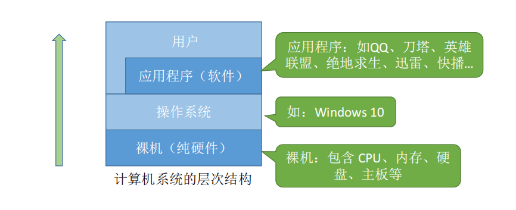

## 操作系统的组成

## 操作系统的特征

### 并发

并发：指两个或多个事件在同一时间间隔内发生。这些事件宏观上是同时发生的，但微观上是交替发生的。 

并行：指两个或多个事件在同一时刻同时发生

操作系统的并发性指计算机系统中“同时”运行着多个程序，这些程序宏观上看是同时运行着的，而微观
上看是交替运行的。
操作系统就是伴随着“多道程序技术”而出现的。因此，操作系统和程序并发是一起诞生的。
注意：
单核CPU同一时刻只能执行一个程序，各个程序只能并发地执行
多核CPU同一时刻可以同时执行多个程序，多个程序可以并行地执行
比如Intel 的第八代 i3 处理器就是 4 核CPU，意味着可以并行地执行4个程序

?> _Tips_  即使是对于4核CPU来说，只要有4个以上的程序需要“同时”运行，那么并发性依然是必不可少的，因此并发性是操作系统一个最基本的特性

### 共享

共享即资源共享，是指系统中的资源可供内存中多个并发执行的进程共同使用

生活实例：
互斥共享方式：使用QQ和微信视频。同一时间段内摄像头只能分配给其中一个进程。
同时共享方式：使用QQ发送文件A，同时使用微信发送文件B。宏观上看，两边都在同时读取并发送文件，
说明两个进程都在访问硬盘资源，从中读取数据。微观上看，两个进程是交替着访问硬盘的

并发和共享的关系

并发性指计算机系统中同时存在着多个运行着的程序。
共享性是指系统中的资源可供内存中多个并发执行的进程共同使用。
通过上述例子来看并发与共享的关系：
使用QQ发送文件A，同时使用微信发送文件B。

1. 两个进程正在并发执行（并发性）
2. 需要共享地访问硬盘资源（共享性）

!>  并发性和共享性互为存在条件

### 虚拟

虚拟是指把一个物理上的实体变为若干个逻辑上的对应物。物理实体（前者）是实际存在的，而逻辑上
对应物（后者）是用户感受到的

### 异步

异步是指，在多道程序环境下，允许多个程序并发执行，但由于资源有限，进程的执行不是一贯到底的，
而是走走停停，以不可预知的速度向前推进，这就是进程的异步性。

由于并发运行的程序会争抢着使用系统资源，而系统中的资源有限，因此进程的执行不是一贯到底的，而是走走停停的，以不可预知的速度向前推进如果失去了并发性，即系统只能串行地运行各个程序，那么每个程序的执行会
一贯到底。**只有系统拥有并发性，才有可能导致异步性**